# Famous Cyber-attacks and Cyber-crimes

## March 1999 : The Melissa Virus

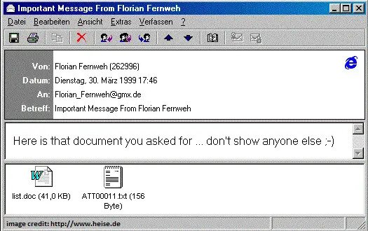

On 26th March 1999, David Lee Smith launched Melissa, one of the fastest-spreading mass-mailing macro virus.  
It was designed to target systems running Microsoft Word and Outlook.

The Melissa virus was a Visual-Basic macro included in a Word file called List.doc, and executed when the file is open.  
It was attached to a social engineering email with title `Important message from [sender]` and body `Here is that document you asked for... don't show anyone else ;)`  
When a user opened it, the VB macro executed, deactivating some safeguards in Microsoft Word 97 and 2000, and sent itself to the first 50 contacts in the Outlook address book.

The virus did not destroy any file or steal any data, but it caused an email flood that crippled many networks, causing an estimated $80M of damage.  
According to the FBI, it overloaded email servers in over 300 corporations, and infected thousands of computers.

David Lee Smith was arrested on April 1st 1999, cooperating with authorities and claiming it was intended as a joke.  
He was sentenced to 20 months in federal prison and a $5000 fine.

## 2006 : WikiLeaks

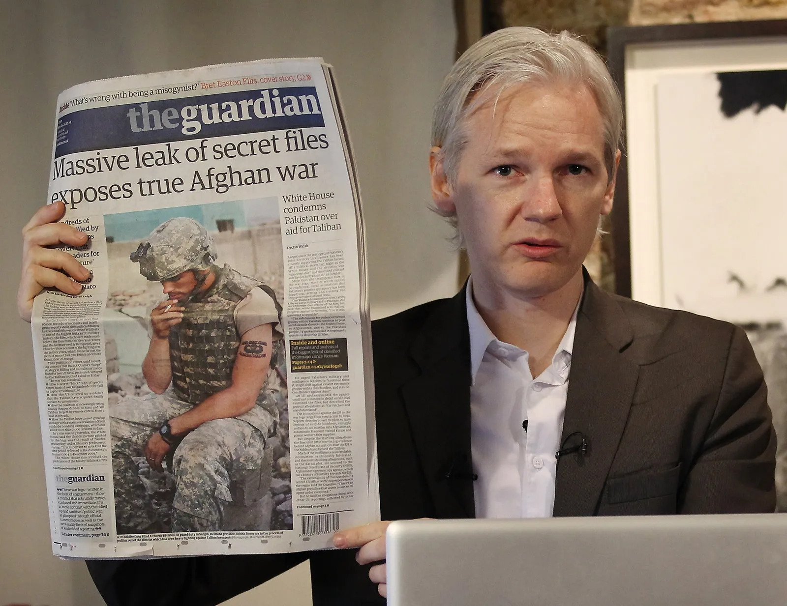

In 2006, the Australian Julian Assange founded the Wikileaks website, where journalists can publish news leaks.  
WikiLeaks works using a dropbox where whistleblowers can drop leaked documents anonymously.  
These documents are checked for authenticity, and published on the WikiLeaks website.

WikiLeaks is technically not breaking any US law, but many governemnt officials tried to shut it down.  
Many financial organizations (Visa, Paypal, Western Union) stopped funding WikiLeaks.  
It is now funded by donation in bitcoins.

Wikileaks has released millions of documents, exposing serious violations of human rights and civil liberties.  
In 2007, WIkileaks released the **Collateral Murder** showing a US helicopter crew shooting civilians and 2 Iraqi Reuters journalists.  
In 2010, it released the **Iraq and Afghan War Logs** revealing US operations and human rights violation during the Iraq and Afghanistan conflicts.  
It also published documents exposing surveillance by the CIA or the NSA.

In 2010, Lassange faced allegations for sexual misconduct in Sweden and sought asylum in the Embassy of Ecuador in London, where he continued to oversee the WikiLeaks operations.  
In 2019, his asylum status was revoked and he was arrested by the British authorities.  
The US government wanted his extradition to charge him with espionnage act violation.

## 2007 - Stuxnet

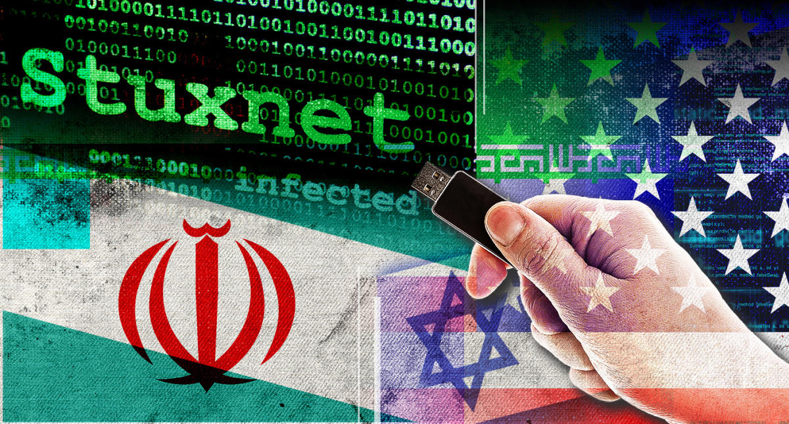

Stuxnet is known as the world's first cyber-weapon.  
It targetted the Natanz nuclear facility, the headquarters for Iran's nuclear program, where they were building a nuclear bomb.  

Stuxnet is a worm created by the CIA and Israel to sabotage the Iranian nuclear program.  
It has been in developement since 2005, and was designed to damage hardware without being noticed.

The US knew the model of centrifuges used in the Iran nuclear facility, so they created an entire replica in Tenessee to create a malware that attacks it.  
Stuxnet was using 4 zero-day exploits, and was preventing the centrifuges to release the pressure, slowly destroying them.

The first version was deployed in 2007, it slowed down Iranian's nuclear program, and wasted their uranium supplies.

The main problem with the attack was that the nuclear facility was on a totally independent network.  
The malware had to be physically connected by USB drive onto a machine.  
In 2009, Stuxnet V2 was developed, much more infectious than the original version, and able to propagate to any connected device.  
It quickly infected all machines in the nuclear facility, and personal laptops of the facility staff.  
Some of those machines were brought outside and connected to other networks, leading to the quick propagation of Stuxnet to the entire country and the world.

## 2011 : PSN Hack

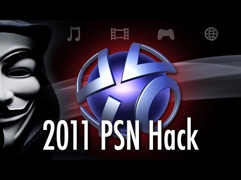

The PlayStation Network (PSN) is Sony's social gaming platform, first released with the PS3 in 2006.

In January 2010, George Hotz (born in 1989, nickname "geohot") hacked the PS3 using the OtherOS feature, and managed to get Read and Write access to the machine.  
He released the exploit to the public, that allowed the installation and execution of any pirated software.  
Sony quickly reacted by releasing a firmware update removing the OtherOS functionality of the PS3.

In January 2011, Hotz successfully jailbroke the PS3 firmware, and distributed the jailbreak through his website.  
Sony filed a lawsuit against Hotz, and demanded to access his PayPal account and the IP of all visitors of his website.

The Anonymous hacker group threatened Sony for suing Hotz and started the "Operation Sony" attack.  
From April 4th to 7th 2011, Anonymous coordinated multiple DDoS attacks, preventing gamers to login, play or stream.

On April 20th, Sony suspended all PSN and Qriosity services worldwide.  
They detected an intrusion on April 19th, and their team was working on understanding the impact and fixing the security issues.

On May 1st, Sony revealed that personal information of 77M PSN users (names, passwords, addresses, emails, credit card info, ...) were compromised, due to some known vulnerabilities that were not patched.

As an apology for the data breach, Sony offered 1 month of PSN+ and free games to all their users.  
Sony estimated the cost of the attack to $171M.

The authors of the attack are still not identified.  
The Anonymous group is the main suspect, but they deny any involvment and they have never been stealing personal data in the past.

## 2011-2013 : Silk Road

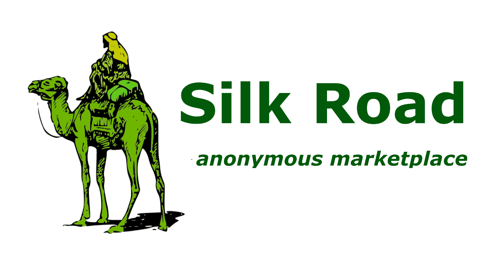

Silk Road was the most successful darknet market.  
It was launched in 2011 by the American Ross Ulbricht (born in 1984) under the pseudonym "Dread Pirate Roberts" (from the Princess Bride).   
All transactions on Silk Road were settled in Bitcoin to protect users identity.

Silk Road operated as a hidden service on the dark web on the Tor network.  
It was originally designed to sell some mushrooms, but many sellers quickly used Silk Road to offer all kinds of illegal products (drug, weapons, fake IDs, credentials...).

Ross Ulbricht was arrested by the FBI in a library in San Francisco in 2013.  
His identity was discovered because the FBI investigated the first references of Silk Road on the dark web, and found his early promotion posts.   
He was using the nickname "altoid", but was looking for staff and used his real name in the email address to contact.  

His computer was taken by the FBI, who got access to all his conversation history.  
They seized 26.000 bitcoins, worth around $3.6M dollars at the time.  
2 agents of the FBI have been prosecuted because they were making illegal business on Silk Road.

Ross was charged for engaging in a criminal entreprise, distributing narcotics, computer hacking, money laundering and false identity document.  
He also ordered and paid for the assassination of some Silk Road users who tried to steal money, but the murders were never actually executed so he was not prosecuted for them.  
He was sentenced to a lifetime in prison.

## 2013 : Edward Snowden's NSA Secret Files Leaks

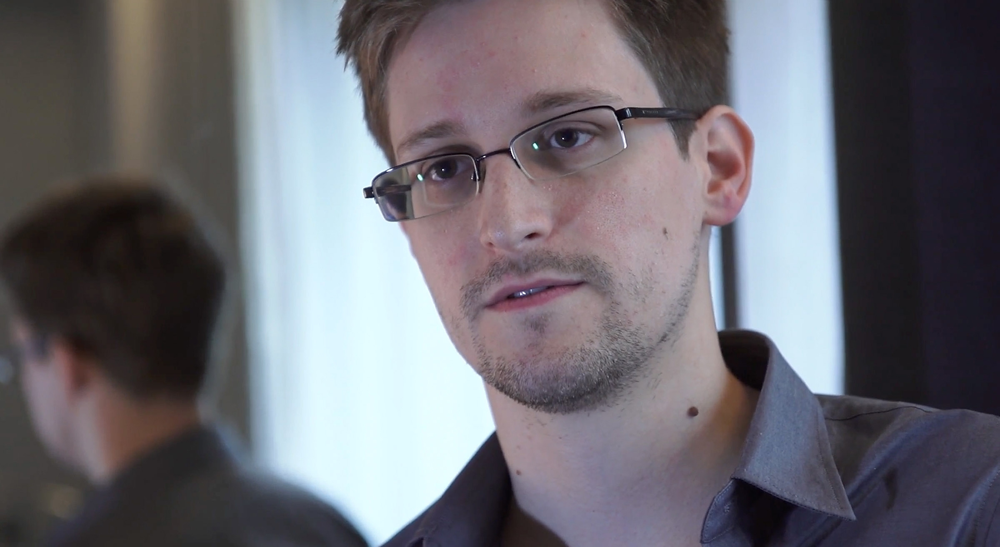

Edward Snowden (born in 1983) was an American computer intelligence consultant who worked for Dell, the CIA and the NSA.

Snowden gradually became disillusioned with the programs he worked on, and was ignored when he raised his ethical concerns.   
He stole over 1.7M top-secret documents while working for the NSA.  
He flew to Hong-Kong in May 2013, leaving his job at the Hawaii facility of the NSA.  
In June 2013, he met some journalists from The Guardian and The Washington Post in the Mira hotel, and revealed thousands of classified NSA documents.

Publications started on June 6th, revealing that Verizon allowed the NSA to collect data on millions of Americans.  
Soon after, the existence of the PRISM surveillance programme was leaked, exposing that the NSA tapped directly into the servers of 9 major internet firms, including Facebook, Google, Microsoft and Yahoo.  
Snowden also revealed that 38 embassies have been targeted by US spying operations. 

On June 9th, The Guardian published a video where Snowden confesses to be the source of the leaks, becoming the most wanted man on the planet.  
On June 21st, US authorities charged Snowden with espionage and theft of government property.  
On June 23rd, Snowden arrived in Moscow, accompanied by the Wikileaks journalist Sarah Harrison.  
They were planning to go to Ecuador, the country that offered asylum to Julian Assange (Wikileaks founder), but the US government revoked Snowden's passport.  
They stayed in the airport transit lounge for 40 days, before Snowden was granted the right of asylum in Russia and received a 1-year visa.  
His visa was renewed multiple times, and he was granted the Russian citizenship from Vladimir Putin in 2022.

Edward Snowden's case is controversial, and he is seen as a hero by some and as a traitor by others.  
His revelations have started debates and led to new regulations in many countries regarding mass surveillance, government secrecy and information privacy.

## 2013-2014 : Yahoo! Data Breaches

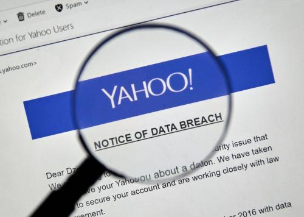

In 2016, Yahoo! revealed that some data breaches were detected, that exposed all 3 billion user accounts in 2013, and another 500 million user accounts in 2014.  
Compromised data include user names, dates of birth, emails, phone numbers, security questions and hashed passwords and "Nonce" values.  
This is regarded as the largest data breach in cybercrime history. 

Hackers managed to access the network by using spear fishing, getting some Yahoo! employees to click a link and execute a malware.  
They got access to the user database content, and used the "Nonce" value (number used to create user session cookies) to access user accounts without the need of the password.

The US Intelligence suspects Russians to be the perpetrators of the attack, due to some similarities with previous data breaches.  
4 men were charged for the 2014 breach, 2 of them working for the FSB (Russian Federal Security Service).

## November 2014 : Sony Pictures Hack

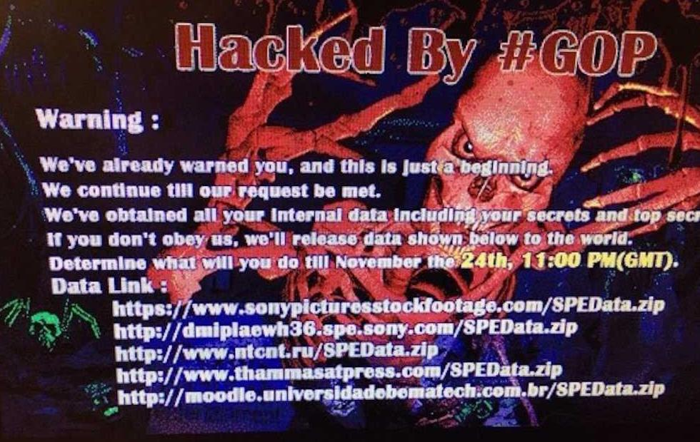

On November 24th 2014, the Lazarus Group (calling themselves the "Guardians of Peace") hacked into Sony Pictures's internal network.  
Sony's network was down for several days, then the attackers leaked to the public and to journalists some internal emails, employees personal information, salaries, unreleased movies...

The motive of the hack was the release on December 25th of "The Interview", a comedy about 2 American journalists who assassinate North Korean leader Kim Jong Un.  
North Korea government contacted the US governement to ask for the ban of this release, judged as sponsoring terrorism, but the US did not ban it.  

The attackers threatened to commit terrorist attacks against movie theaters that would show the film.  
Following the threat, many theater owners decided to drop the release of the movie.

The Interview was only shown in 331 independent movie theaters, and released to online video on-demand platforms. 

The NSA announced that it has evidence that the attack was orchestrated by North Korea, but those evidence were not made public for security reasons.  
North Korea declined any responsibility in the attack, but considered the attack righteous.

## 2014-2018 : Carbanak Money Heist

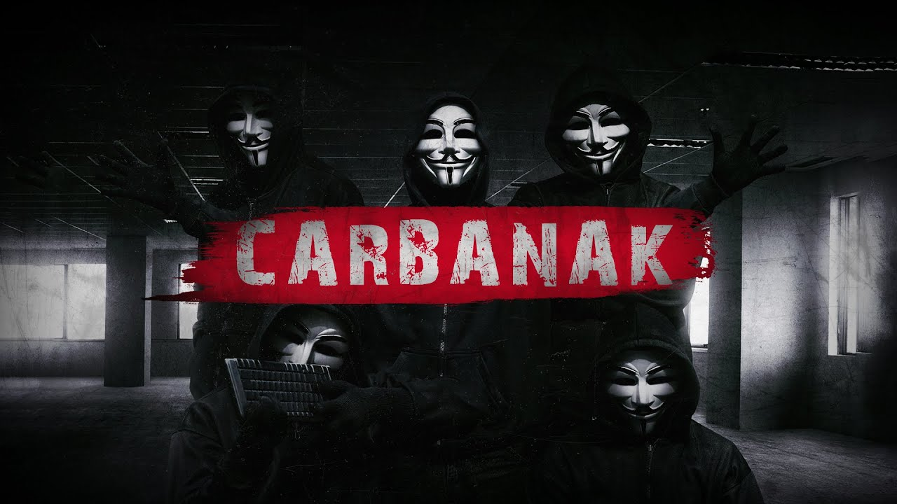

In 2014, the "Carbanak" hacker group coordinated the biggest cyber-heist in cyber-crime history, stealing over $1B from financial institutions.   
The main targeted bank was the Kaspersky Russian bank, but it was discovered later that over 200 institutions were victim of the same attack.  
Many intelligence organizations teamed up to track the hackers (FBI, CIA, JCAT, FSB...).

**Phase 1**  
The hackers sent a spear fishing email to a bank employee.  
When the malicious attachment was open, a malware installed a VNC backdoor (Virtual Network Computing) on the machine.  
From this infected machine, the hackers infected other machines on the network and looked for the admin machine.  

**Phase 2**  
They slowed down the admin machine by running as many programs as possible, so someone calls IT support to check it.  
When IT support came, they entered the admin password on the machine, which was recorded by a keylogger.  
The hackers just gained access to the admin machine of the bank.

**Phase 3**  
They spied on employees for months to know exactly how they operated daily.  
Once they got a perfect knowledge of how they operated, the robbery started.  
They impersonated high-level banking employees and sent money transfer SWIFT requests.  
They used the bank e-payment system to transfer this money to some other accounts in the US and in China.  
Then some "Money Mules" were hired to withdraw the money from ATMs.  
They got remote control over the ATMs and were able to make them spit out cash when they wanted.

**Investigation**  
In the Kaspersky bank, an employee noticed an unusual behavior of the domain server.  
After a security audit, the bank realized that the VNC screen sharing software was installed on multiple machines.  
An employee opened a text file and typed "Hello", and the computer replied "Hello, you won't catch us.", confirming that they were being hacked.  

In 2016, the Carbanak group made an important mistake in Taipei.  
2 money mules were withdrawing money from an ATM.  
As a Taiwanese man approached, they left in a hurry and forgot over $2M in the ATM.  
The Taiwanese man alerted the police, who identified them and tracked them using CCTV footage, which led to the identification of 22 suspects from Russia and Eastern Europe.  
3 of them were still in Taipei and were arrested by the local police.

In 2018, an investigation on a criminal money laundering organization in Spain led to the identification of Denis K, a Ukrainian computer specialist, as one of their client.   
He is believed to be the mastermind of the operation, he was involved with the Russian and Moldavian mafias and coordinated some cyberattacks for them.  
He was arrested, and the Spanish police found at his place several boxes of jewellery and over 15.000 bitcoins.

## Avril 2015 : TV5 Monde 

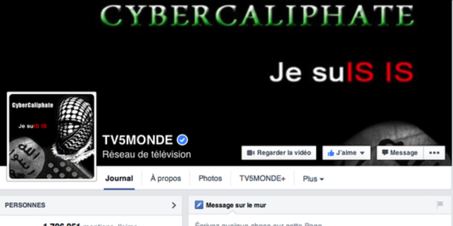

TV5 Monde is the biggest French public TV network, broadcasting 11 channels in French in over 200 countries.

On April 8th 2015, the hacker group called "CyberCaliphate" attacked the headquarters of TV5 Monde TV Network in Paris.  
All 11 channels were interrupted for over 20 hours, showing a black screen.  
The hackers published on the social medias of TV5 Monde some messages from IS.

The attack was started on January 23rd, only 2 weeks after the Charlie Hebdo terrorist attack in Paris.  
Hackers scanned TV5 Monde public IP addresses, and gained access to the live-stage cameras (using default credentials).  
For months, they discovered the internal network, and gained access to more and more machines and accounts.  
Finally, they gained access to the 2 main multiplexers in charge of broadcasting all 11 channels (main one and backup one).

<table>
<tr>
  <td><b>19:57</b></td>
  <td>Multiplexers parameters changed to make them impossible to reboot.</td>
</tr>
<tr>
  <td><b>20:58</b></td>
  <td>TV5 Monde social network accounts show some messages from IS.</td>
</tr>
<tr>
  <td><b>21:48</b></td>
  <td>The 2 multiplexers are down, causing all 11 channels to stop broadcasting.</td>
</tr>
<tr>
  <td><b>22:40</b></td>
  <td>The internal messaging system is down.</td>
</tr>
<tr>
  <td><b>Night</b></td>
  <td>TV5 Monde disconnects their entire network from the public internet. 
They calls the ANSII (Agence Nationale de la Sécurité des Systèmes d'Information) for help. 
The ANSII tracks the hackers operation and rebuilds a network by changing all the machines.</td>
</tr>
<tr>
  <td><b>10:00</b></td>
  <td>Channels can broadcast pre-recorded programs (not live yet) 
Broadcast on all channels of a speech from Yves Bigot (TV5 Monde CEO) to explain the attack.</td>
</tr>
<tr>
  <td><b>18:00</b></td>
  <td>First live broadcast.</td>
</tr>
</table>

The attack has taken down all 11 channels for 22 hours, and costed over 10M€ to TV5 Monde.

The investigation led to the suspicion of a russian hackers group called "APT 28".  
They possibly worked for IS, or were using IS as a cover to collect data for the Russian government.  
The Ministry of Foreign Affairs took over the investigation, and there were no later official update. 

## May 2017 : WannaCry

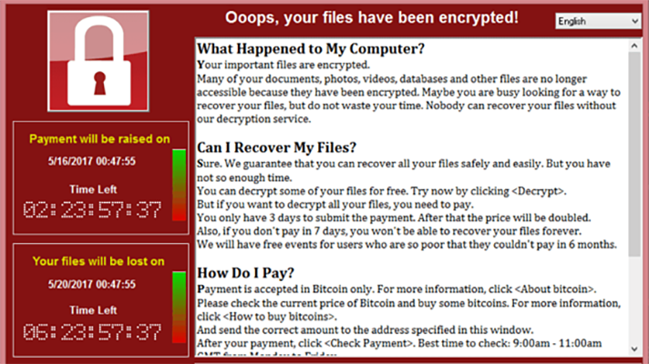

WannaCry is a ransomware launched on May 12th, 2017.  
It propagated very quickly and affected over 230,000 Windows machines over 150 countries.  
It affected all sectors of the economy : companies, banks, schools, hospitals, ISPs...

WannaCry encrypted most files on the victim machines.  
Victims were requested to pay $300 in bitcoin for the decryption key.  
If not paid within 3 days, the price doubled to $600.  
If not paid within 7 days, the files would be lost.  

The 2 exploits behind WannaCry are "EternalBlue" and "DoublePulsar".  
They were both originally found by the NSA, and leaked in 2017 by a group of hackers called the Shadow Brokers.  

EternalBlue (CVE-2017-0144) exploits a vulnerability in the SMBv1 network protocol on Windows machines (Vista, XP, Windows 7, 8 and 10).  
It allows remote code execution on the victim machine.  

DoublePulsar is an exploit to implant a backdoor in victim machines for later code execution.

Microsoft released a security patch to fix the vulnerability, but many machines were still running an unpatched Windows version.

WannaCry was sent to the victim machines using the DoublePulsar backdoor.  
When WannaCry executed, it propagated to all machines reachable via SMBv1 using EternalBlue, and installed a copy of itself to these machines using DoublePulsar.  
It then ran the ransomware program to encrypt victim files. 

Researcher Marcus Hutchins discovered a kill switch domain by running the malware in a sandbox.  
WannaCry tries to connect to a hardcoded unregistered domain name, and executes the ransomware only if the connexion fails.  
Marcus Hutchins registered the domain, which stopped the malware for all victims.  
The domain was attacked by DDoS to resume WannaCry's attack, but Hutchins managed to increase
its availability by using a cached version of the site to protect the domain from the DDoS attack.

The perpetrators of the WannaCry attack are not clearly identified.  
The main suspect is the Lazarus Group, a cybercrime group from North Korea.  
Some code similarities were found with previous of their malwares, and the analysis of the WannaCry language file revealed that the machine that created it had Hangul installed and was on timezone UTC+09:00.
