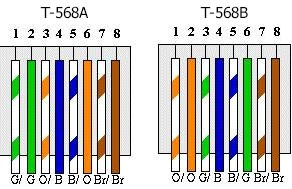
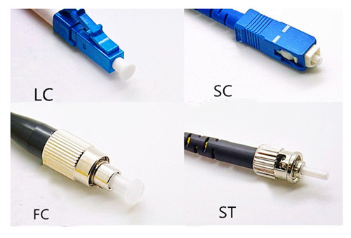
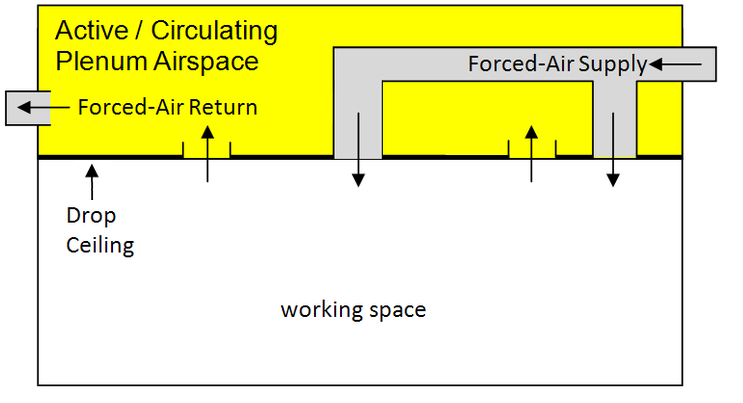
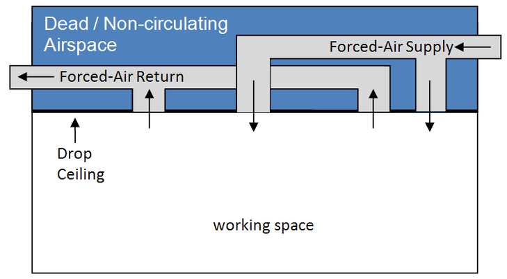
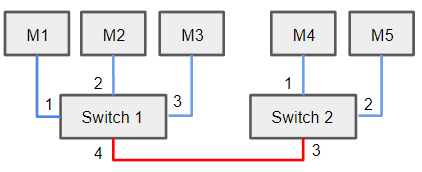
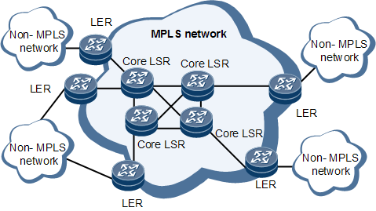

# CompTIA Network+

## Network Models

### OSI Model (Open System Interconnection)

The OSI model was adopted in 1984 as the first standard model.  
It is made of 7 layers describing how computers communicate over a network.

| Layer |     Name     | Role                                                                                                                                                                         |
|:-----:|:------------:|------------------------------------------------------------------------------------------------------------------------------------------------------------------------------|
|   7   | Application  | Human/Computer interaction layer where applications can access the network services (web browser, mail client...).<br/>Protocols : HTTP, HTTPS, SMTP, POP3, IMAP, DNS, FTP... |
|   6   | Presentation | Translate data into a format that can be understood by the receiving system (encryption, compression, encoding...)                                                           |
|   5   |   Session    | Create communication channels (sessions) between devices.<br/>Can create checkpoints during data transfer for example.                                                       |
|   4   |  Transport   | Break messages into segments, flow control, error control, adapt send rate to target's connection speed.<br/>Protocols: TCP, UDP                                             |
|   3   |   Network    | Break segments into network packets, and route the packets by discovering the best path across the network using the target IP address.<br/>Protocols: IP, ICMP, ARP...      |
|   2   |  Data Link   | Break network packets into frames and establish/terminate the connection between 2 nodes.<br/>Protocols: Ethernet, TokenRing...                                              |
|   1   |   Physical   | Physical connector sending a series of 1 and 0 signals (cable or wireless connection)                                                                                        |


The Data Link layer is further split into 2 sub-layers :
- LLC layer : logical link control, identify network layer protocols and encapsulate them + flow control
- MAC layer : define how packets are placed on the media + error detection (CRC) + physical address

A **PDU** (Protocol Data Unit) is a single unit of information managed by a protocol.  
At application level, a PDU is **a payload**.  
In TCP, a PDU is **a segment**.  
In UDP, a PDU is **a datagram**.  
In IP, a PDU is **a packet**.  
In Ethernet, a PDU is **a frame**.  
At physical level, a PDU is **a bit**.


### TCP/IP Model

The TCP model was designed by the Department of Defence (DoD) in 1960.  
It is a concise version of the OSI model with only 4 layers.

| Layer |    Name     | Role                                                                                                                        |
|:-----:|:-----------:|-----------------------------------------------------------------------------------------------------------------------------|
|   4   | Application | Group layers 7, 6 and 5 of the OSI model.<br/>Protocols : HTTP, HTTPS, SMTP, POP3, IMAP, DNS, FTP...                        |
|   3   |  Transport  | Layer 4 of the OSI model, manage end-to-end communication and reliable data delivery between hosts.<br/>Protocols: TCP, UDP |
|   3   |  Internet   | Layer 3 of the OSI model, handle packet forwarding and routing to deliver data across interconnected networks.              |
|   2   |    Link     | Layers 2 and 1 of the OSI model, control the hardware-level communication between devices on the same network segment       |


## Protocols

|   Protocol   |   Port(s)   |  TCP / UDP  |                          Name                           | Layer | Role                                                                                                                                                                                                                                                 |
|:------------:|:-----------:|:-----------:|:-------------------------------------------------------:|:-----:|------------------------------------------------------------------------------------------------------------------------------------------------------------------------------------------------------------------------------------------------------|
|     STP      |      -      |      -      |                 Spanning Tree Protocol                  |   2   | Build a loop-free logical topology of an Ethernet network to decide switch ports to set to active                                                                                                                                                    |
|      IP      |      -      |      -      |                    Internet Protocol                    |   3   | Use an IP address (IPv4 or IPv6) for the source and destination of each packet to decide the best route through the networks.                                                                                                                        |
|     ICMP     |      -      |      -      |            Internet Control Message Protocol            |   3   | Transmission error control, sent by a host when a transmission error occurred.<br/>An ICMP packet is wrapped in an IP packet (it has an IP header).                                                                                                  |
|     TCP      |      -      |      -      |              Transmission Control Protocol              |   4   | Connection oriented reliable transport protocol that guarantees reception.<br/> It waits for a reception ACK of each segment and resends them if no ACK is received.<br/>It is reliable but has an overhead due to the connection and ACK mechanism. |
|     UDP      |      -      |      -      |                 User Datagram Protocol                  |   4   | Connection-less transport protocol with no ACK and no guarantee of reception.<br/>It is less reliable than TCP but has no overhead (used for streaming, video games...).                                                                             |
|     FTP      |   20 / 21   |     TCP     |                 File Transfer Protocol                  |   7   | Transfer files from a server to a client on a network.<br/>Port 20 is used for data transfer (upload or download).<br/>Port 21 is used for control (commands and responses).                                                                         |
|     SSH      |     22      |  TCP / UDP  |                      Secure Shell                       |   7   | Open a secure channel to a remote host over an unsecure network.<br/>The traffic is encrypted, and SSH supports authentication with a password or with public/private keys.                                                                          |
|     SFTP     |     22      |     TCP     |                         SSH FTP                         |   7   | Secure variant of FTP using SSH for encryption (so the traffic goes to SSH port 22)                                                                                                                                                                  |
|    Telnet    |     23      |  TCP / UDP  |                    Teletype Network                     |   7   | Open a virtual terminal TCP or UDP connection to a remote machine.<br/>Developed in 1969 and deprecated for security reasons, replaced by SSH.                                                                                                       |
|     SMTP     |     25      |     TCP     |              Simple Mail Transfer Protocol              |   7   | Send emails to a mail server.<br/>The secure version using TLS encryption uses port 587.                                                                                                                                                             |
|    WHOIS     |     43      |     TCP     |                          WHOIS                          |   7   | Request and response protocol to send WHOIS records for domain names, the WHOIS server listens on port 43.                                                                                                                                           |
|   TACACS+    |     49      |     TCP     | Terminal Access Controller<br/> Access Control System + | 7 | Cisco-proprietary alternative to RADIUS for an AAA Server controlling access to a network.<br/>It uses TCP while RADIUS uses UDP.                                                                                                                    |
|     DNS      |     53      |  TCP / UDP  |                   Domain Name System                    |   7   | Get the IP for a given hostname.<br/>It uses UDP for its transport layer so DNS servers do not need to keep connections.                                                                                                                             |
|     DHCP     |   67 / 68   |     TCP     |           Dynamic Host Configuration Protocol           |   7   | Automatically assign an available IP to machines joining a network.<br/>Port 67 is used by the DHCP server.<br/>Port 68 is used by DHCP clients.                                                                                                     |
|     TFTP     |     69      |     UDP     |                       Trivial FTP                       |   7   | Simpler version of FTP over UDP with no authentication, no connection and basic error handling.<br/>Convenient for simple file transfer with no security concern.                                                                                    |
|     HTTP     |     80      |     TCP     |              Hyper Text Transfer Protocol               |   7   | Client/server communication between web browsers and web servers on the Internet.                                                                                                                                                                    |
|   Kerberos   |     88      |  TCP / UDP  |                        Kerberos                         |   7   | Network authentication using a ticketing system inside a Windows domain (both UDP and TCP)                                                                                                                                                           |
|     POP3     |     110     |     TCP     |                  Post Office Protocol                   |   7   | Alternative to IMAP to retrieve messages from a mail server.<br/>The secure version using SSL uses port 995.                                                                                                                                         |
|     NNTP     |     119     |     TCP     |             Network News Transfer Protocol              |   7   | Protocol to read and post Usenet news articles between news servers, largely replaced by web forums.                                                                                                                                                 |
|     NTP      |     123     |     UDP     |                  Network Time Protocol                  |   7   | Use UDP for clock synchronization between machines over a network.<br/>In 2015, NTPsec was developed to add security to NTP.                                                                                                                         |
|     RPC      |     135     |  TCP / UDP  |                  Remote Procedure Call                  |   7   | Protocol allowing a program to execute code or call functions on another remote computer or server, as if they were local procedures or functions.<br/>It uses both UDP and TCP.                                                                     |
|   NetBIOS    |   137-139   |  TCP / UDP  |            Network Basic Input/Output System            |   7   | Old protocol for Windows-based networks for file and printer sharing.                                                                                                                                                                                |
|     IMAP     |     143     |     TCP     |            Internet Message Access Protocol             |   7   | Used by a mail client to retrieve messages from a mail server, replacing POP3.<br/>The secure version using SSL uses port 993.                                                                                                                       |
|     SNMP     |  161 / 162  |     UDP     |           Simple Network Management Protocol            |   7   | Collect and organize info about managed devices on the network (watchdog of the network) using UDP.<br/>SNMP uses port 161 and SNMP traps use port 162.                                                                                              |
|     LDAP     |     389     |  TCP / UDP  |          Lightweight Directory Access Protocol          |   7   | Access and maintain distributed directory information services.<br/>The secure version LDAPS with SSL encryption uses port 636.                                                                                                                      |
|    HTTPS     |     443     |     TCP     |                       HTTP Secure                       |   7   | HTTP variant with SSL/TLS encryption of the communication between the browser and the server.                                                                                                                                                        |
|     SMB      |     445     |     TCP     |                  Server Message Block                   |   7   | Protocol used for file and printer sharing in modern Windows networks (better security and encryption than NetBIOS)                                                                                                                                  |
|   SMTP-SSL   |     465     |     TCP     |                    SMTP over SSL/TLS                    |   7   | Original port used for SMTP over SSL, was deprecated and replaced by port 587, but port 465 is still widely used.                                                                                                                                    |
|    Syslog    |     514     |     UDP     |                 System Logging Protocol                 |   7   | Centralize, persist and manage logs of networking devices in a central place                                                                                                                                                                         |
|   SMTP-SSL   |     587     |     TCP     |                    SMTP over SSL/TLS                    |   7   | Secure version of SMTP using SSL/TLS encryption.                                                                                                                                                                                                     |
|   LDAP-SSL   |     636     |  TCP / UDP  |                    LDAP over SSL/TLS                    |   7   | Secure version of LDAP using SSL/TLS encryption.                                                                                                                                                                                                     |
|    iSCSI     |     860     |  TCP / UDP  |        Internet Small Computer System Interface         |   7   | Protocol linking data storage facilities over IP.                                                                                                                                                                                                    |
|     FTPS     |  989 / 990  |     TCP     |                    FTP over SSL/TLS                     |   7   | Secure variant of FTP using a SSL/TLS encryption layer above normal FTP.<br/>Port 989 is used for data transfer.<br/>Port 990 is used for control.                                                                                                   |
|   IMAP-SSL   |     993     |     TCP     |                    IMAP over SSL/TLS                    |   7   | Secure version of IMAP using SSL/TLS for encryption.                                                                                                                                                                                                 |
|   POP3-SSL   |     995     |     TCP     |                    POP3 over SSL/TLS                    |   7   | Secure version of POP3 using SSL/TLS encryption.                                                                                                                                                                                                     |
|  SQL Server  |    1433     |     TCP     |                   SQL Server database                   |   7   | Microsoft SQL server database                                                                                                                                                                                                                        |
|    SQLnet    |    1521     |     TCP     |                     Oracle database                     |   7   | Oracle database                                                                                                                                                                                                                                      |
|     L2TP     |    1701     |     UDP     |                 Layer 2 Tunnel Protocol                 |   7   | Underlying VPN protocol with no inherent security                                                                                                                                                                                                    |
|     PPTP     |    1723     |  TCP / UDP  |             Point to Point Tunnel Protocol              |   7   | Underlying VPN protocol with built-in security                                                                                                                                                                                                       |
|    RADIUS    | 1812 / 1813 |     UDP     |    Remote Authentication<br/>   Dial-In User Service    |   7   | Protocol allowing authentication and authorization (1812) and accounting (1813).<br/>An alternative set of ports for RADIUS are 1645 / 1646.                                                                                                         |
|     FCIP     |    3225     |  TCP / UDP  |                    Fiber Channel IP                     |   7   | Protocol to encapsulate Fiber Channel frames inside TCP/IP packets                                                                                                                                                                                   |
| iSCSI Target |    3260     |     TCP     |                 Target of iSCSI message                 |   7   | Listening port for iSCSI targeted devices when linking data storage facilities over IP.                                                                                                                                                              |
|    MySQL     |    3306     |     TCP     |                     MySQL Database                      |   7   | MySQL database                                                                                                                                                                                                                                       |
|     RDP      |    3389     |  TCP / UDP  |                 Remote Desktop Protocol                 |   7   | Microsoft-proprietary protocol to provide a GUI to connect to a remote machine.</br>Client and server exist for Linux and MacOS as well.                                                                                                             |
|   Diameter   |    3868     |     TCP     |                        Diameter                         |   7   | More advanced AAA protocol that is a replacement for RADIUS.<br/>Diameter is based on RADIUS, it addresses several of its weaknesses but is not compatible with RADIUS.                                                                              |
|     SIP      | 5060 / 5061 |     TCP     |               Session Initiation Protocol               |   7   | Voice + messaging + video real-time sessions.                                                                                                                                                                                                        |
|     mDNS     |    5353     |     TCP     |                      Multicast DNS                      |   7   | Alternative to DNS to resolve hostnames into IP addresses on local networks                                                                                                                                                                          |
|     VNC      |    5900     |     TCP     |                Virtual Network Computing                |   7   | Protocol to provide a GUI to connect to a remote machine (cross-platform equivalent of RDP)                                                                                                                                                          |
|  Syslog-SSL  |    6514     |     TCP     |                   Syslog over SSL/TLS                   |   7   | Secure version of Syslog using SSL/TLS encryption, and TCP instead of UDP.                                                                                                                                                                           |

Ports can take values from 0 to 65535, and are split in 3 groups :
- **well-known ports** : 0 to 1023, assigned to very common protocols by the IANA (for ex 23 for Telnet)
- **registered ports** : 1024 to 49151, registered to IANA for proprietary protocols (for ex 3389 for RDP)
- **dynamic ports** : 49152 to 65535, used freely with no registration for outbound ports when reaching out to a server


### Syslog

Syslog is a protocol used to gather all logs from network devices into one centralized Syslog server (on port 514/UDP ot 6514/TCP).  
Logs can be monitored, searched and archived from this Syslog server.  
It simplifies troubleshooting network issues on network devices.  
It also allows data retention of the logs (otherwise not persisted by Cisco devices storing logs in RAM).  
Syslog messages have a timestamp, a facility (message domain), a severity, a mnemonic (message type) and a description.

There are 8 different severity level for Syslog messages.  
They can be remembered with the sentence : _Every Awesome Cisco Engineer Will Need Ice-cream Daily_.

| ID  |   Severity    | Usage                            |
|:----|:-------------:|:---------------------------------|
| 0   |   Emergency   | System is unusable               |
| 1   |     Alert     | Immediate Action required        |
| 2   |   Critical    | Critical condition               |
| 3   |     Error     | An error occurred                |
| 4   |    Warning    | A Warning was generated          |
| 5   |    Notice     | Expected but significant message |
| 6   | Informational | An informative message           |
| 7   |     Debug     | Debug-level message              |

Modern implementations of Syslog called **Syslog-ng** improve the original design :
- TCP can be used instead of UDP in congested networks  
- TLS is used for in-transit encryption
- MD5 or SHA-1 is used for authentication and integrity


### DHCP

DHCP is a network management protocol used to automate the configuration of devices on IP networks.  
A DHCP server automatically assigns an IP address and other network configuration to each new device on the network.  

The steps of the DHCP workflow is **DORA** (Discover - Offer - Request - Ack) :
- a device joins the network and broadcasts a DISCOVER request to identify DHCP servers (with IP address 0.0.0.0)
- the DHCP server responds with an available IP address OFFER
- the device responds with a REQUEST for this IP
- the DHCP server responds with a ACK

The provided IP is available for a limited amount of time called the **DHCP lease**.  
To keep its IP address, the device must send a renewal request before the end of the lease to extend the lease duration.

The OFFER message contains options with network information to use : default gateway, lease time, DNS server...

A **DHCP relay** can be setup to allow the DHCP server broadcasts to cross a router (usually setup in the router itself) so several networks can use the same DHCP server.


### DNS

DNS is responsible for the resolution of domain names into IP addresses.  

When a browser needs to access _www.mysite.com_, it first checks the machine's local cache.  
If the local cache does not have the corresponding IP address, it queries the **recursive DNS server** (from the ISP).    
If the recursive DNS server does not have it configured or in cache, it will ask the **root DNS server**.  
The root DNS server replies with the IP of the **top-level domain DNS server** in charge of the `com` domain.  
The DNS server will ask the top-level domain DNS server, that will provide the IP of the **authoritative DNS server** in charge of `mysite.com`.  
The DNS server will ask the authoritative DNS server, that will provide the IP of `www.mysite.com`.  
The DNS server will cache this IP address and return it to the browser.

**DNSSEC** (Domain Name System Security Extensions) is a suite of extensions adding security to the DNS.  
DNSSEC addresses vulnerabilities in the DNS and provides a means to authenticate the origin and integrity of DNS data.

#### Types of DNS Records

- **A / AAAA** : convert a domain name into an IPv4 or IPv6 address
- **CNAME** (Canonical Name) : define an alias for a domain name
- **NS** (Name Server) : identifies the IP of the authoritative DNS server for a domain
- **PTR** (Pointer) : reverse DNS lookup, it maps an IP to a domain name
- **MX** (Mail Exchange) : IP of the mail server responsible for receiving emails on behalf of a domain
- **TXT** (Text) : free text value, sometimes used to verify ownership of the domain
- **SOA** (Start of Authority) : administrative info about the zone (name, TTL, administrator...)


#### mDNS (multicast DNS)

mDNS is an alternative to traditional DNS on the local network operating on port 5353.  
Instead of relying on a DNS server, it uses multicast traffic to resolve hostname to IP address.  
The client sends the mDNS request to multicast address `224.0.0.251` for IPv4 or `ff02::fb` for IPv6.  
Every host on the local network will receive it.  
The target host will respond with a multicast as well, to inform all other hosts on the local network.

To use mDNS on the local network, we should use the `.local` suffix :
```shell
ping mymachine.local
```

The hostname of a machine can be specified in `/etc/hostname`, and must be also updated in `/etc/hosts`.  

Some implementations of mDNS are :
- **Bonjour** : Apple implementation used to easily connect printers
- **Avahi** : open-source implementation often used in Linux
- **DNS-SD** : mDNS implementation on Windows 10+


### SNMP

SNMP is used to collect information and metrics about all devices in a network.  
It is heavily used by network engineers to monitor the networking equipment (switches, routers, firewalls, APs...).  

SNMP follows a client/server application model : 
- the **SNMP Manager** (server) is a software component gathering data by sending queries to SNMP agents
- the **SNMP Agents** (clients) are software components running on each networking device sending data about the device to the SNMP manager

Each device that supports SNMP has a local **MIB** (Management Information Base).  
It is a hierarchical database storing information about the device as key/value pairs.  
The keys in the MIB are called **OID** (Object ID).  
The SNMP manager can request specific OIDs to a device, and its SNMP agent will retrieve their value in its local MIB.  
OIDs are referenced by name or ID (each level in the tree structure has a name and an ID), for ex 1.3.6.1.  
Some OIDs are standard and common across devices, others are vendor-specific for a given device.  

Most SNMP operations expect a poll, and the SNMP manager constantly needs to query the agents for monitoring.  
We can configure **SNMP traps** on some devices (over UDP/162) so the agent sends an alert to the manager when a 
specific condition is met or a threshold is breached.

**SNMPv1** used clear data in both the request and the response and all traffic used UDP.  
**SNMPv2** introduced new types of data to query, allowed multi-OIDs queries and support for both UDP and TCP, but still sends in clear text.  
**SNMPv3** adds security with encryption, authentication and message integrity check.

The SNMP messages exchanged between the SNMP server and the SNMP agents should be on a separate **out-of-bound network**.  
Keeping the management packets separated from the data network improves security and prevents users to see this traffic.

SNMPv1 and SNMPv2 use a **community string** to access the statistics in the device, defaulting to `public` for most devices.  
This community string should be changed as a good practice to prevent unauthorized access to the device's information.  
SNMPv3 uses user/password authentication and an encryption key instead.

SNMP vulnerabilities can be identified using tools like **SNMPwalk** or **SNMPenum**.

### Telnet

Telnet is a protocol based on TCP used to connect to a remote host's command line interface.  
A telnet server runs on port 23 and offers a shell when connected to.

Telnet does not use encryption, so it is not secure and was replaced by SSH for remote management.  
Telnet is still used by system administrators to test connectivity to remote services using TCP.

With telnet, we can simulate a browser and send plaintext HTTP requests to a web server.

```shell
telnet <machine name or IP> 23        # open a connection to a telnet server

telnet <machine name or IP> 80        # open a connection to an HTTP web server
GET / HTTP/1.1                        # send an HTTP request to it
HOST: www.example.com
```

**netcat** is a more powerful tool to open connections to UDP or TCP ports and send requests.

### SSH (Secure Shell)

SSH is a protocol to create a secure channel between 2 computers or network devices and enable one device to control the other device.  
It was originally used in Unix, but it is now used in Windows as well as a text-based remote control method (Windows servers, routers, switches...).  
SSH2 fixes issues with SSH1, and uses Diffie-Hellman for key exchange.

SSH authentication can be performed by user/password or by RSA keys.  

When using RSA keys, a public/private RSA key pair can be generated with `ssh-keygen`, and can be encrypted with a passphrase.  
The private key should never leave the local machine and should be kept in a secure location.  
The public key can be sent to the server with `ssh-copy-id`, and added to `~/.ssh/authorized_keys` for the server to allow SSH access.

When an attacker gains access to a server using a reverse shell, he can upgrade his shell by dropping an SSH key in this `authorized_keys` file.  
This will create a backdoor, by providing access via SSH, instead of the reverse shell with fewer functionalities.  

### FTP (File Transfer Protocol)

FTP is a protocol designed to exchange files between two machines.
An FTP server listens on port 21 by default. 

We can interact with a FTP server with the `ftp` command-line client : 
```shell
ftp 10.10.35.121            # opens an FTP connection to the FTP server (request username + password)
ls                          # list available files on the FTP server
type ascii                  # switch to ASCII mode to retrieve text files
get test.txt                # retrieve a file from the FTP server
```

When checking with Wireshark the actual network traffic, we see that the client sends the following instructions :
- `USER myuser`
- `PASS mypassword`
- `LIST` : enumerate files on the FTP server
- `TYPE A` : text mode
- `RETR test.txt` : get a file from the FTP server


### SMTP (Simple Mail Transfer Protocol)

SMTP is used by a client to communicate with a mail server to send an email, and by mail servers to communicate with each other.  
It uses ports **25** (unencrypted) and **465** (SMTPS - SSL encrypted).

An SMTP client uses the following instructions in its SMTP message to the mail server :
- `HELO` : initiate the SMTP session
- `MAIL FROM` : set the sender mail address
- `RCPT TO` : set the recipient mail address
- `DATA` : set the content of the email
- `.` : mark the end of the email

For example, we can manually communicate with a SMTP server listening on port 25 with telnet :
```shell
telnet 10.10.35.121 25
HELO myname
MAIL FROM: <aaa@example.com>
RCPT TO: <bbb@example.com>
DATA
From: aaa@example.com
To: bbb@example.com
Subject: Telnet email test

This email is sent via telnet!
.
```

### STARTTLS

STARTTLS is a protocol extension that can be used above SMTP to add SSL/TLS encryption.  
It is an optimistic encryption method : it starts with a plaintext SMTP connection, and then upgrades to a secure TLS 
or SSL encrypted connection if both the sending and receiving email servers support STARTTLS.  
It is more flexible than SMTPS and is slowly replacing it.  
If a secure connection is established, it uses port **587**.

### POP3 (Post Office Protocol)

POP3 is used to retrieve emails from a mail server.  
Unlike IMAP, there is no sync process between the POP3 clients and the mail server.  
When an email is fetched from the mail server, it is deleted from the mail server (so other clients will not see it).  
POP3 uses ports **110** (unencrypted) and **995** (SSL encrypted).

The POP3 instructions are :
- `USER myuser` : identify the user
- `PASS mypassword` : provide the user's password
- `STAT` : request the number of messages and the total size
- `LIST` : list the ID and size of all messages
- `RETR 13` : retrieve the message with ID 13
- `DELE 13` : delete the message with ID 13
- `QUIT` : ends the POP3 session

Usually these instructions are set by the mail client (Thunderbird, Outlook...).  
Similarly to the SMTP example above, it can also be done manually with telnet :
```shell
telnet 10.10.35.121 110
USER myuser
PASS mypassword
STAT                    // get number of available messages
LIST                    // get the ID of all messages
RETR 4                  // retrieve message with ID 4
QUIT
```

### IMAP (Internet Message Access Protocol)

IMAP is an alternative to POP3 to retrieve emails from a mail server.  
It allows synchronization between multiple client devices accessing the same mail address on the mail server.  
Every action on a mail from a client (read/delete a mail) is performed on the server, and other clients will sync.  
It allows to use multiple clients (phone and laptop for example) and to see a common state on all of them.  
It is more recent and more convenient than POP3 for users that check emails on multiple devices.  
IMAP uses ports **143** (unencrypted) and **993** (SSL encrypted).

IMAP can be manually used with telnet.  
Every command needs to be prefixed with a random string to identify the messages (here we use A, B, C...).
```shell
telnet 10.10.35.121 143
A LOGIN myuser mypassword
B SELECT inbox
C FETCH 4 body[]                  // get the headers and body of message with ID 4
D LOGOUT 
```

### SSL (Secure Socket Layer) and TLS (Transport Layer Security)

SSL and TLS are cryptographic protocols allowing authentication and encryption for traffic between a web server and HTTPS clients.  
SSL2 (1995) and SSL3 (1996) were replaced by TLS in 1999 to address security issues with SSL.  

Both use certificates that are not protocol-dependent, so they can be used both with SSL and TLS.

SSL and TLS are also used for instant messaging, email, VoIP, and many other services.  
In every case, a TLS tunnel is established using PKI to secure the communication.

A common attack against TLS is the **downgrade attack**.  
The attacker forces the use of an older TLS version that has security flaws that can be exploited.  
If the attacker's browser doest not support TLS 1.3, it will negotiate with the server to use an older TLS version.  
This older TLS version can have known vulnerabilities that the attacker will exploit.  
To defend against it, we can configure the server to not accept downgrade.

**SSL stripping** is an attack combining an on-path attack and a downgrade attack.  
The attacker is in the middle of the traffic between the victim and a web server (proxy, rogue Wi-fi AP...).  
It communicates with the victim in clear traffic (HTTP) and with the web server in encrypted traffic (HTTPS).  
The attacker controls all the communication and can modify messages or steal data.  
To the victim, it is transparent except HTTP is used instead of HTTPS.


### LDAP (Lightweight Directory Access Protocol)

LDAP is a database used to centralize information about clients and objects on the network.  
LDAP is cross-platform, and Microsoft created a proprietary version of it called **AD** (Active Directory).  
LDAP is a lightweight implementation of the **X.500 standards** defining a framework for directory services.

## Types of Networks

- **PAN** (Personal Area Network) : very small network, usually a single room (USB, Bluetooth devices, IR, NFC...)

- **LAN** (Local Area Network) : uses switches and routers, usually connected with Ethernet

- **SAN** (Storage Area Network) : dedicated high-speed network of storage devices providing access to large amount of data and allowing sharing data as if it were a drive attached to a server.

- **WLAN** (Wireless LAN) : LAN with wireless access points and devices connecting to it.

- **CAN** (Campus Area Network) : network connecting some LANs together, covering several buildings.

- **MAN** (Metropolitan Area Network) : covering an entire city.

- **WAN** (Wide Area Network) : global network connecting multiple locations in the world, like the Internet.


## TCP 3-ways Handshake

TCP guarantees reception and integrity of messages by establishing a connection and sending segments until it gets a reception ACK, called a PAR (Positive Acknowledgment with Retransmission).  
The connection is established by 3 segments exchanged between the client and the server, sending to each other their sequence ID :
- The client sends a SYN segment including its sequence ID seq=X
- The server sends a SYN/ACK segment including its sequence ID : seq=Y, ack=X+1
- The client sends a ACK : ack=Y+1


## Layer 1 and Cables


### Ethernet Cable Categories

- **Category 3** (obsolete) : Original Ethernet standard  
10-BASE-T over 100m (10 Mbps)  


- **Category 5** (obsolete) : 10x and 100x faster than the original Ethernet standard  
100-BASE-TX over 100m (100 Mbps)  :   **Fast Ethernet**   
1000-BASE-T over 100m (1 Gbps) :  **Gigabit Ethernet**
 

- **Category 5e** : Enhancement of Cat5 cables, most common cable for home networks   
1000-BASE-T over 100m (1 Gbps) **Gigabit Ethernet**  
   

- **Category 6** :  Cable connecting floors together in buildings  
10G-BASE-T over 37 to 55m (10Gbps)


- **Category 6A** :  Improvement of Cat6 cables with thicker copper conductors and jackets  
10G-BASE-T over 100m (10Gbps)


- **Category 7** :  Similar specs as Cat6A, only exists in shielded version and mostly used in data centers  
10G-BASE-T over 100m (10Gbps)


- **Category 8** : Thicker and more expensive than Cat7, used in data centers  
40G-BASE-T over 30m (40Gbps)

  
### 802.3 Ethernet standards

- **10-BASE-5** _[Deprecated]_ : 10Mbs over 500m using RG-8 coaxial cables with vampire tap connectors.  
First available cable standard, called "Thick Ethernet".


- **10-BASE-2** _[Deprecated]_ : 10Mbs Ethernet, max length of 125m using RG-58 coaxial cables.   
Physical bus topology with BNC connectors with 50 Ohm terminators.  
RG-58 cables are thinner than RG-8 cables so 10-BASE-2 is called "Thin Ethernet".


- **10-BASE-T** : LAN standard for 10Mbs Ethernet using UTP cables (sometimes STP).  
Max length 100m, use RJ-45 connectors with Cat 3/4/5 cables.  
Physical star topology, support full-duplex, up to 1024 machines in the network.


- **10-BASE-FL** _[Rare]_ : 10Mbs Ethernet over fiber-optic cables, max length 2km.  
Rarely used due to the existence of faster fiber-optic standards.

  
- **100-BASE-TX** : 100Mbs Ethernet (Fast Ethernet) using UTP (sometimes STP) with Cat 5/5e cables.  
Max length 100m, allow full duplex.  
It is the most common Ethernet standard in today's networks.


- **100-BASE-T4** _[Rare]_ : 100Mbs Ethernet allowing the use of Cat 3/4/5 cables, max length 100m


- **100-BASE-FX** : 100Mbs Ethernet over fiber optic cables, usually used for network backbones.  
With multi-mode, max length 412m in half-duplex and 2km in full-duplex.  
With single-mode, max length 10km.  
Often uses SC or ST connectors.


- **1000-BASE-SX** : Short-wavelength laser using multi-mode fiber optic cables.  
Max length 275m in half-duplex, 550m in full-duplex.


- **1000-BASE-LX** : Long-wavelength laser using fiber optic cables, more expensive but longer distance than 1000-BASE-SX.  
In half-duplex, max length 316m in both multi-mode and single-mode.    
In full-duplex, max length 550m in multi-mode and 5km in single-mode.  


- **1000-BASE-CX** _[Rare]_ : 1Gbs Ethernet using shielded copper cable (STP) on very short distance (25m)


- **1000-BASE-T** : 802.3ab standard, 1Gbs Ethernet over copper cable with Cat5e/6 cables over 100m.  
It allows full-duplex using the 4 pairs of the UTP cable.


- **10G-BASE-SR/SW** : 10Gbs Ethernet over short wavelength multi-mode fiber.  
Max length 300m, used for LAN and MAN.


- **10G-BASE-LR/LW** : 10Gbs Ethernet over long wavelength single-mode fiber.  
Max length 10km, used for LAN, MAN and WAN.  


- **10G-BASE-ER/EW** : 10Gbs Ethernet over extra-long wavelength single-mode fiber.  
Max length 2km to 40km.


- **10G-BASE-T** : 802.3an standard, 10Gbs Ethernet using Cat6/6a copper cables with RJ-45 connectors.  
Max length 55m for Cat6 and 100m for Cat6a.


- **40G-BASE-T** : 40Gbs Ethernet using Cat8 copper cables with max length 30m.


### Twisted-Pair Cables

Twisted-pair cables contain multiple pairs of smaller copper cables twisted together to prevent interference and sending opposite signals.  
Each pair is twisted with a different twist rate (distance between two twists).  
Almost all twisted cables have 4 pairs of cables inside.

All Ethernet cables (Cat5e, Cat6, Cat7, Cat8...) are twisted-pair cables.

Twisted pair cables can be either unshielded (UTP) or shielded (STP).  
**UTP cables** only contain the twisted pairs inside the outer PVC jacket of the cable.  
**STP cables** have an additional shield around the twisted pairs, and sometimes even around each individual pair, and a ground wire.  
STP cables provide an extra protection against electro-magnetic interferences (EMI) and are used in manufacturing environments.


### T568A and T568B

T568A and T568B are two different standards for connecting the wires inside the RJ-45 connector of an Ethernet cable.  
They define the order in which the individual 8 wires are arranged and connected to the pins of the connector.  
Both standards are widely used, and they are compatible with each other as long as both ends of the cable follow the same standard.

<p align="center">

</p>

Between a computer and a switch, we need a **straight-through cable**, with the same standard at both ends.  
Between 2 computers or 2 switches, we need a **cross-over cable**, with a different standard at both ends.

**Auto-MDX** is a technology supported by most recent machines that automatically detects if the cable used is straight-through or cross-over, and adapts at software level, so it no longer matters which type of cable is used.


### Coaxial cables

Coaxial cables are still in use sometimes, for example for old TVs or to bring internet to a modem.  
They contain a wire covered by an insulated layer, covered by a metal layer, and finally the plastic jacket.  
Coaxial cables use the **BNC connector**.  

Some common standards are **RG59** (low-cost, short-distance, for cable TV) and **RG6** (cable TV or modem).


### Rollover cables

A rollover cable (or console cable) is a specialized type of serial cable used to connect a computer or terminal to 
the console port of networking equipment like routers, switches, and firewalls.   
Network administrators use rollover cables to configure and manage the settings of networking devices directly without
needing network connectivity.


### Punch-down Blocks

Punch-down blocks are a type of electrical connection used in telephony or to bring Ethernet cables to user's desks.  

A RJ45 cable goes from the desk to the punch-down block in the closet, where individual 8 wires are punched down individually to the block.  
On the other side of the block, another cable brings it to the desired switch.  
This makes it much easier to set up, as only the part from the block to the switch needs to be updated when the user changes desk.

The main punch-down block types are :
- **66 block** : old analog phone
- **110 block** : voice and data traffic, in data centers and network wiring closets
- **Krone block** : european alternative to the 110 block
- **BIX block**


### Wired connectivity issues

- **Attenuation** : the signal loses its strength, causing a max length for the cable


- **Latency** : delay between sending and receiving the packets


- **Jitter** : deviation from the average behavior  
For ex, if some packets arrive in 10ms and others in 100ms, there is a big jitter causing issue in the communication.


- **Crosstalk** : interference of the signal in a cable with the signal in another cable (for ex between pairs of an UTP)  
For UTP, the crosstalk is avoided by design, as the number of twists for each pair is different.  
Cables indicate their NEXT rating (Near-End Crosstalk).


- **EMI** (Electro-Magnetic Interference) : disturbance of the signal from external sources, also avoided by twists in UTP


- **Open/Short** : when there is no connectivity between both ends of a cable, it is called open.  
When there is an unintended connectivity between cables, it is called a short.  
Open and short cable issues can be checked with a cable tester.


- **Duplex mismatch** : both connected devices must use the same duplex config (half or full)  
Recent devices use full-duplex, and often can use automatic duplex negotiation to avoid mismatch.  
This is usually a consideration for old devices : for ex, if we connect an old camera to a switch, the camera may
support only half-duplex and a speed of 10Mbps, so we need to configure the port of the switch accordingly.


### Fiber Optic Cables

Unlike copper cables using electrical signals to transmit data, fiber optic cables use pulses of light.  
This allows the data to travel further than with copper cables before fading, and it is easy to regenerate.  

There are 2 types of fiber optic cables :
- **Single Mode Fiber** (SMF) : small, using glass core, long distance, expensive, high bandwidth (yellow cable)  
- **Multi-Mode Fiber** (MMF) : thick, using plastic core, shorter distance, cheaper, lower bandwidth (orange or aqua cable)  

All fiber optic cables have 2 lines : one receive connector (Rx) and one transmit connector (Tx).  
Fiber cables are used to connect buildings, campuses, even countries (like under the Atlantic ocean).  

There are many connector standards for fiber cables, many vendors have their own connectors, some try to group the 2 lines together :  
- **ST** (Straight Tip) : Round bayonet-style connector, relatively large, used in older networks
- **LC** (Lucent Connector) : Small, square-shaped with a short latch mechanism, popular in modern networks
- **SC** (Subscriber Connector) : square-shaped push-pull design, popular in modern networks
- **FC** (Ferrule Connector) : threaded screw-on design with a metal ferrule at the end, mostly used with single-mode fiber for industrial applications
- **MT-RJ** (Mechanical Transfer Registered Jack) : group both Rx and Tx lines in a single small cable

<p align="center">

</p>

A **fiber splicer** is a box used to extend a fiber cable (repeating the signal).  

A **fiber optic transceiver** (transmitter-receiver) is a device plugged to a switch / firewall / router to convert the electrical signal into light pulses.  
It contains a light source for transmission and a photo-diode semiconductor for reception.  
- **SFP** (Small Form-factor Pluggable) : used for 1 Gbps Ethernet
- **SFP+** (Enhanced SFP) : used for 10 Gbps Ethernet, backward compatible with SFP slots
- **QSFP** (Quad SFP) : for 40 and 100 Gbps Ethernet


#### Bidirectional Wavelength Division Multiplexing (WDM)

Bidirectional WDM is the support of multiple optical wavelengths sent simultaneously in a single optical fiber cable.  
This allows several channels of communication within the same fiber by using different colors (wavelengths) of light.

- **Course WDM** : up to 18 channels from 1310nm to 1550nm, up to 70km
- **Dense WDM** : more than 80 channels, higher speed than Course WDM, channels are much closer (0.8nm against 20nm)

The wavelengths used by fiber optic cables are not in the visible spectrum (purple 380nm to red 780nm).


#### SONET (Synchronous Optical NETwork)

SONET is a communication protocol to transmit data over fiber optic mostly used in the US.  
In the rest of the world, an equivalent protocol called **SDH** (Synchronous Digital Hierarchy) is used instead.

In SONET, standard transmission rates are called **Optical Carrier** (OC) :
- OC-1 = 51.84Mbs
- OC-3 = 3 x OC-1 = 155Mb


### Plenum space

A plenum is the part of a building that facilitates air circulation for heating and air conditioning systems, providing pathways for heated/conditioned air flow.   
It is a space between the structural ceiling and the drop ceiling.  
If instead there is a dedicated duct work for the forced air return flow as well, then there is no plenum. 

<div style="display: flex;">
    
    
</div>

Building with a plenum have the network cables in the plenum, along with potential water pipes and the forced-air return inside the open space above the ceiling.  
This raises concerns in case of fire, so network cables must not be toxic to human beings when they burn.  
To limit the toxicity, a special material can be used (FEP, or "low-smoke PVC") which is not as flexible as normal cables.

### Power over Ethernet (PoE)

PoE is a way to power devices connected with Ethernet cables without an additional power source.  
The same cable is used for network and for power (it requires a Cat5 cable or higher).  
It is used for IP video cameras, wireless APs, IoT devices, Cisco phones...  
Many recent switches support PoE, otherwise we can use a **power injector** to inject power in the Ethernet cables. 

PoE (2003) is defined by **IEEE 802.3af** standard and allows 15.4W and a current of 350mA.   
PoE+ (2009) is defined by **IEEE 802.3at** standard and allows 25.5W and a current of 600mA.


### CSMA/CD and CSMA/CA (Carrier-Sense Media Access with Collision Detection/Avoidance)

CSMA/CD is a medium access control method used in local networking to let several machines in the same broadcast domain communicate with each other without speaking at the same time.  
If a machine detects that another machine speaks at the same time, it stops sending and waits for a random time before sending again.  
It was used with bus topology or with hubs, but it is no longer needed now that we use switches instead.

CSMA/CA is an alternative to CSMA/CD that determines first if the channel is idle before emitting.  
It is used mostly for wireless networks where CSMA/CD is not possible.


## Layer 2, Switch and MAC Address


### MAC Address (Media Access Control)

The MAC address is also called physical address, Ethernet address, layer 2 address or hardware address.  
It is a unique identifier assigned to each network interface cards (NIC) that uniquely identifies a machine on a local network.  
It is made of 48 bits (6 bytes) and represented as a sequence of 12 hexa digits, for example _00:0c:29:17:1b:27_   
The first 3 bytes of the MAC address represent the Organization Unique Identifier (OUI).   
The MAC address can be displayed with `ifconfig` on Linux and `ipconfig` on Windows. 


### Switch

A switch is a layer 2 device to route traffic within a local network.  
It listens to incoming traffic, and at each received message it uses the source MAC address in the message to update its MAC table, to associate that MAC address to the receiving port of the switch.  
When a message is received, if the destination MAC address is in its MAC table, the switch sends the message only to that port.  
Otherwise, it broadcasts the message on all ports except the receiving port.


### Port mirroring

Some managed switches allow to configure port mirroring.  
All dataframes sent to a given port of the switch will also be sent to another port, usually for monitoring purpose.


### Spanning Tree Protocol (STP)

STP was developed by DEC in 1983 and standardized in 1990 by the IEEE as the **IEEE 802.1d** standard.  
In 1998, **RSTP** (Rapid STP) is developed to speed up the convergence from 1min to less than 10s as **IEEE 802.1w**.

STP is a layer 2 network protocol used to build a loop-free logical topology on an Ethernet network.  
It prevents bridge loops in a network that has redundant paths (physical loops).  
It selects a root node and builds a spanning tree connecting all nodes with no loop, and all switch ports out of 
this spanning tree are disabled.  
Each port has a state in : Blocking / Listening / Learning / Forwarding / Disabled.  
If the network changes (a segment fails or a new machine joins), the spanning tree is recalculated.  

**Convergence** is the process to decide for each port if it should be blocking or forwarding.

STP avoids **broadcast storms** where frames loop infinitely inside a network.

Messages sent between switches for the STP protocol are called BPDUs (Bridge PDUs).  
Blocked ports do not transmit frames, but still transmit BPDUs for the STP mechanism.  


### Virtual LAN (VLAN)

A VLAN is a logical separation of the ports of one or more switches into groups that cannot communicate with each other.  
If we have machines M1, M2, M3 and M4 on ports 1 to 4 of a switch, we can create a VLAN with M1 and M2, and another VLAN with M3 and M4 by specifying on the switch that ports 1 and 2 are in a VLAN and 3 and 4 in another.  
A broadcast message is limited to the VLAN of the port it was received from, so a VLAN defines a layer 2 broadcast domain.  
VLANs can be created in **managed switches** only (unmanaged switches do not have a management interface).


### Access Port VS Trunk Port

Each port on a managed switch is either an access port or a trunk port.  
An access port is connected to a machine and can be part of a VLAN.  
A trunk port is connected to a switch and can be used by multiple VLANs to reach other machines of that VLAN.  

<p align="center">

</p>


If we want M1, M2 and M4 in the same VLAN 1 and M3 and M5 in the VLAN 2, ports 4 of switch 1 and port 3 of switch 2 are trunk ports.  
Both VLANs need to use these ports to reach other machines of the VLAN.   
Protocol **802.1q** is used to add a tag with the VLAN ID to each message going through the trunk port.  
The receiving switch will remove the tag and send the message only to ports in the target VLAN.  

Some recent switches also support another VLAN called the **Voice VLAN**.  
It allows both voice and data traffic to come from the same switch port and be treated differently.  
The data packets are tagged with the regular VLAN ID while the voice packets are tagged with the voice VLAN ID.  
This allows QoS to prioritize voice traffic over data traffic.


### Switch Native VLAN

Switches have access ports and trunk ports.  

A message entering an access port belongs to a specific VLAN, and has no tag with a VLAN ID.    
The switch will tag this message with the VLAN ID before sending it to a trunk port.

A message entering a trunk port is expected to have a tag specifying its VLAN ID, according to 802.1Q standard.  
The switch can only send this message to the ports on the same VLAN.

The **native VLAN** is the VLAN represented by the absence of a VLAN tag (usually VLAN 1).  
It should NEVER be used, as it is more vulnerable to **VLAN hopping** attacks.


### VTP (VLAN Trunking Protocol)

VTP is a protocol used between switches over trunk ports to manage the VLAN config across the network.  
It provides consistent VLAN config across switches, tracking and monitoring of VLANs.  
When a VLAN is added to a switch, VTP reports it to all other switches.  

All switches must have the same **VTP domain name**, **VTP version** and **VTP password** to exchange VLAN config with each other.  
One of the switches must be the **VTP server**.

VTP is Cisco-proprietary, comparable IEE standards used by other vendors are :
- **GVRP** (GARP VLAN Registration Protocol)
- **MVRP** (Multiple VLAN Registration Protocol) more recent and replacing GVRP


### Switching Modes

Switching modes are techniques used to forward and process data packets within a network switch (or router).  

- **Store-And-Forward** : the switch waits to receive the entire packet before it decides to forward it.  
When an entire package is received, the CRC is calculated and checked against the FCS field in the Ethernet header.  
If the CRC does not match, the packet is dropped.


- **Cut-Through** : the switch sends every frame it receives right away before all the packet is received.  
Only the first 6 bytes are checked to know the target MAC address.  
It is much quicker than Store-And-Forward, but can send invalid frames because no CRC check is performed.


### Switch Uplink Port 

An uplink port is a specific port of a switch designated for connecting to an upstream network or a higher-level 
network device, such as a core switch, router, or an upstream switch.  
For example an access switch will use an uplink port to connect to a distribution switch.  
It usually has a higher bandwidth than the normal downlink ports.  
The uplink port is connected to a normal downlink port of the higher-level device with a straight-through cable.


### Switch Port Protection

- **STP** : STP disables automatically some ports when loops are detected between switches


- **Port Security** : hardcode the allowed MAC addresses on a port (on breach drop the frame and block the port)


- **BPDU Guard** : limit the ports that can receive BPDUs messages (sent by switches for STP).  
This prevents a rogue switch to trigger a new STP discovery.  
Ports blocked for BPDUs cannot be connected to a switch, only to an end device (PC, printer...).  
Ports blocked for BPDUs are shutdown if they receive a BPDU.
 

- **Root Guard** : in STP, the switch with the lowest switch ID (priority or MAC if same priority) is the root switch.  
When a BPDU is received from a switch with a lower switch ID, the spanning tree is re-evaluated using it as the root.  
The root guard prevents a switch port to become the STP root port.  
It protects the STP topology against rogue switches. 


- **MAC Flood Guard** : prevent MAC flood attacks by limiting the number of MAC addresses on a given port.


- **DHCP Snooping** : specify which ports of the switch are allowed to respond to DHCP requests.  
It prevents rogue DHCP servers on other switch ports.  
The switch will build an IP/MAC mapping table from the DHCP messages it receives.


- **Dynamic ARP Inspection (DAI)** : use the DHCP Snooping database to check the IP/MAC mapping of all incoming ARP packets.  
ARP packets that do not match this mapping are dropped.  
This prevents on-path attacks (Man in the Middle).  
This requires the DHCP Snooping functionality to be enabled.


### Traffic Shaping

Traffic shaping is a congestion management method to regulate network data transfer by delaying the flow of less important packets.  
It analyzes the application of each packet and sets a bandwidth to that application packets.  
For example, it may prioritize VoIP traffic on the network.  
It is a technique used to guarantee **QoS** (Quality of Service) operating at layers 2 and 3.


### DiffServ (Differentiated Services)

DiffServ is a technique for implementing QoS at the network layer (layer 3) by marking each packet entering the network.  
DiffServ adds a 6-bits field called DSCP (DiffServ Code Point) in the IP header.  
This code point is used to indicate the desired treatment of the packet within the network.


### Port Bonding (or Link Aggregation)

Port bonding is a method to use multiple connections simultaneously between 2 switches to increase the bandwidth, provide fault tolerance and load balancing.  
It is defined by standard **IEEE 802.3ad** and uses **LACP** (Link Aggregation Control Protocol) for orchestration.


### Switch Stacking and Switch Clustering

**Cisco StackWise** is a technology of **switch stacking** allowing to turn multiple physical switches in the same rack into one logical switch.  
It uses a special stacking cable to connect switches to each other in a loop (so it still works if one switch goes down).  
A single switch is the **master** used for management, other switches are **members** and receive updates from the master.  
Switch stacking supports up to 9 switches, and they all share the same IP.

**Switch clustering** is an alternative to switch stacking.  
It connects cluster-capable switches together and manages them as a single entity.  
Clustered switches communicate with the **CMP** (Cluster Management Protocol).  
One switch is the cluster **commander** used for management, and the cluster has its IP.  
Management is more complex because each switch is managed separately, but no limitation in the number of switches in a cluster.


### Ethernet Jumbo frames

Usual Ethernet frames accept a payload up to 1500 bytes.  
Jumbo frames allow a payload up to 9216 bytes (usually set to 9000) for file transfer for example.


### Pause Frames

If a switch receives a lot of traffic and its receive buffer reaches a threshold, it sends a pause frame to the sender to stop it from sending more frames temporarily.  
It is part of standard **IEEE 802.3x**.


## Layer 3, Router and IP address


### Routing Types

Routers forward traffic to a next node based on the target IP of each packet.  
Each router maintains a **routing table** that indicates how to reach each network.  

Routers use the **Administrative Distance** (AD) to evaluate the best route to a network (metric between 0 and 255).  
- AD = 0 for directly connected networks
- AD = 1 for static routes
- each routing protocol assigns an AD, for ex AD = 90 for EIGRP and AD = 120 for RIP
- AD = 255 for forbidden routes

To decide where to forward each packet, there are 3 possible types of routing :

- **static routing** : every reachable network has an explicit routing rule.  
  This is the most secure option, but it is not scalable to big networks, as the admin must set all rules in every router.  


- **default routing** : configure a default route for packets which target IP is not part of a directly connected network.  
  This is used for stub routers that route all outside traffic to the same target.


- **dynamic routing** : routers communicate with each other to find the optimal path through the network for each packet.  
  This is used for large interior networks and on the Internet.


### Dynamic Routing Protocols

Dynamic routing saves a lot of admin time, as there is no need for manual routes setup.  

In networks with dynamic routing protocol configured, there are 2 types of packets sent by routers :
- data packets (IPv4, IPv6...) for user data
- route updates packets (RIP, EIGRP, OSPF...) to build and maintain routing tables on each router

Routing protocols generate additional traffic on the network, due to inter-routers communication to reach convergence (agreement on best routes).  
Routers should use only one routing protocol and stick to it, not enable them all, to avoid network overload.  

**IGP** (Internal Gateway Protocol) are used within an AS (Autonomous System) that we control.  
**EGP** (External Gateway Protocol) are used to connect multiple AS, for example on the Internet.  

Routing Protocol can use different strategies :

- **Distance Vector** : minimize the number of hops (routers) to a given network.  
Each router knows only about the reachable networks on each of its ports, and how many hops away it is.  
Each router shares its routing table with its connected neighbors.  
RIP and IGRP are popular distance vector routing protocols.  
Distance vector protocols use the **split horizon** technique to avoid routing loops : they do not advertise a route
to the node from which this route was received.


- **Link State** : minimize the bandwidth/delay to a given network.  
Each router knows the entire topology of the network (so more traffic between routers).  
Each router maintains 3 tables : direct neighbors, network topology and routing table.  
It has a better knowledge of the network than distance vector protocols and converges quicker on network change.  
It requires more memory on each router and more communication between routers (usually not an issue these days).  
OSPF and IS-IS are popular link-state routing protocols.

The main routing protocols are :

- **RIP** (Routing Information Protocol) : oldest protocol in use, limited to small networks with up to 15 hops.  
RIP only supports classful routing (the subnet mask is inferred from the network class).  
Each router sends its table every 30sec, very slow to converge.


- **RIPv2** : evolution of RIP that supports classless routing (it sends the network mask with each route).  
It supports **VLSM** (Variable Length Subnet Mask) so several networks can use different subnet masks.  
Each subnet uses a mask fitting its size, for example a WAN subnet has only 2 addresses so mask /30.  
It supports MD5 authentication.  
Each router also sends its routing table every 30sec (like RIP) but uses multicast (instead of broadcast).  
It supports discontinuous subnets, for ex 172.16.10.0/24 and 172.16.20.0/24 (in the same B class network) on 2 different sides of the WAN.


- **EIGRP** (Enhanced Interior Gateway Routing Protocol) : Enhanced version of the old CISCO protocol IGRP regarded as a hybrid protocol.  
Like distance vector protocols, it sends to its neighbors the distance to all its neighbors.  
Like link-state protocols, it syncs the routing table at startup and on any change (not every X sec).  
It supports both IPv4 and IPv6.  
It has efficient neighbors discovery, is easy to set up, and it keeps track of more info than distance vector protocols.  


- **OSPF** (Open Shortest Path First) : most popular interior gateway protocol and main alternative to EIGRP.  
It has always been open and is available on any router hardware in the market.  
It is a link-state protocol using bandwidth as a metric.  
It supports IPv4 and IPv6, classless routing (VLSM) and has the fastest convergence among IGPs.  
It is more difficult to set up than EIGRP, it requires a hierarchy of routers with a "Area 0" root.


- **IS-IS** (Intermediate System to Intermediate System) : link state IGP similar to OSPF.  
It is preferred by ISPs because it does not require a different DB for IPv4 and IPv6.


- **BGP** (Border Gateway Protocol) : main routing protocol of the Internet.  
Unlike RIPv2, OSPF and EIGRP, BGP is an EGP to exchange routes between separate AS that we have no control over.  
It can be used by enterprises on the Internet edge connecting to the ISP to allow fail-over if an ISP is down (which is not possible with a static default route to the ISP).


### Routers High Availability

We can use **FHRP** (First Hop Redundancy Protocols) to configure multiple physical routers to appear as if they were a single router (with an IP and a MAC address).  

The 2 main protocols in the FHRP family are :

- **HSRP** (Hot Standby Router Protocol) : developed by Cicso and mainly used in Cisco networks.  
It uses several routers in a standby group sharing the same IP and MAC, only the active router is in use and a router 
from the standby group takes over if the active one goes down.  
It uses a virtual MAC address and HSRP timers (hello/hold/standby/active) to monitor the health of the active router 
and switch if needed.  


- **VRRP** (Virtual Router Redundancy Protocol) : vendor-neutral open standard implementation of HSRP.


### GRE Protocol (Generic Routing Encapsulation)

The GRE protocol encapsulates data packets using one routing protocol inside packets of another protocol.  
It uses a **GRE tunnel** between 2 routers that will encapsulate and decapsulate data packets.  
For ex, it can encapsulate IPv6 packets inside IPv4 messages to cross an IPv4 only network.

GRE does not encrypt the encapsulated message.  
To use as a VPN, it is often used together with an encryption protocol like IPsec. 


### Network Classes

- **Class A** : 1 byte for the network, 3 bytes for the host.  
A class A network contains 2^24 - 2 = 16 777 214 hosts.  
The binary address of a class A network always starts with `0`  
There are 2^7 - 2 = 126 class A networks, from 1.x.x.x/8 to 126.x.x.x/8 (0 is for all routes and 127 for diagnostic). 


- **Class B** : 2 bytes for the network, 2 bytes for the host.  
A class B network contains 2^16 - 2 = 65 534 hosts.  
The binary address of a class B network always starts with `10`  
There are 2^14 = 16 384 class B networks, from 128.0.x.x/16 to 191.255.x.x/16.


- **Class C** : 3 bytes for the network, 1 byte for the host.  
A class C network contains 2^8 - 2 = 254 hosts.  
The binary address of a class C network always starts with `110`  
There are 2^21 = 2 097 152 class C networks, from 192.0.0.x/24 to 223.255.255.x/24.


- **Class D** : special class for multicast addresses, first byte between 224 and 239.  


- **Class E** : special class for scientific purpose, first byte between 240 and 255.


### Private IP Address Ranges (RFC 1918)

Private IP addresses are a set of reserved IP address ranges that are not routable on the public Internet.  
They enable devices on a private network to communicate with each other without requiring a unique public IP addresses for each device.  
Devices using a private IP address can communicate with the Internet using a NAT.

|     Network     |  Class  | # Addresses | Last Broadcast Address | Usage                    |
|:---------------:|:-------:|:------------|:----------------------:|:-------------------------|
|   10.0.0.0/8    |  A x 1  | 16'777'214  |  10.255.255.255        | Large networks           | 
|  172.16.0.0/12  | B x 16  | 1'048'544   |  172.31.255.255        | Medium networks          | 
| 192.168.0.0/16  | C x 256 | 65024       |  192.168.255.255       | Home and office networks |


### APIPA (Automatic Private Internet Protocol Addressing)

APIPA is a mechanism that allows an OS to assign to itself an IP address when the DHCP server cannot be reached.  
It uses the IP range **169.254.0.0/16** that is reserved for APIPA.  
If a host has an IP in this range in a corporate network, it suggests an issue with the DHCP server.

**169.254.169.254** is a special address in the APIPA range.  
It is used by most cloud providers (AWS, GCP...) to provide metadata on the running instance.


### Subnets

Subnetting is the division of one big network in multiple smaller networks.  
For example, IPv4 network 10.0.0.0/8 contains 2^24 addresses (-2 for network and broadcast addresses).  
To create multiple subnets, we sacrifice N bits of the host section to create 2^N subnets.   
Each subnet has 2^k-2 host addresses, where k is the number of 0 in the mask.

If we need 12 subnets, we sacrifice 4 bits (2^4 = 16 is the min power of 2 bigger than 12).  
The network masks of the subnets is 255.240.0.0.  
The subnets are 10.0.0.0/12, 10.16.0.0/12, ..., 10.240.0.0/12.  


### Multicast IPv4 Traffic

Multicast traffic uses specific multicast IP addresses, from 224.0.0.0 to 239.255.255.255.   
A multicast source (video camera, streaming source...) can send traffic to a multicast address.

Clients can register to a multicast group using **IGMP** (Internet Group Management Protocol).  
IGMP lets routers know which interface has multicast receivers, and allows clients to join a multicast group.  
IGMP is encapsulated directly in an IP message (no transport layer) just like ICMP.  

The routing of multicast traffic uses **PIM** (Protocol-Independent Multicast).  
PIM is a protocol that helps routers determine the most efficient path to deliver multicast traffic to members of a multicast group.


### IPv6

With the global use of Internet and the expansion of IoT, we are running out of 4-bytes IPv4 addresses.  
To solve this issue, IPv6 was created as the successor of IPv4, with 16-bytes addresses.

IPv6 supports unicast, multicast and anycast addresses (no broadcast in IPv6).

IPv6 addresses are represented as 8 blocks of 2 bytes in hexa : `2001:0db8:3c4d:0012:0000:0000:0024:56ab`  
Leading zeros can be removed, and successive blocks of zeroes can be replaced with `::` (only one in the address).  
The above address can be simplified to : `2001:db8:3c4d:12::24:56ab`

The first 6 bytes (3 blocks) represent the global routing prefix, assigned by the ISP or a regional Internet registry.  
The next 2 bytes (1 block) is the subnet, decided by the network administrator.  
The last 8 bytes (4 blocks) are the interface ID identifying the device on the network.

#### IPv6 Host auto-config

With IPv6, a host can assign to itself a unique IPv6 address using the network ID and the interface ID.

The network ID is obtained by sending a multicast of type RS (Router Solicitation - ICMP 133) to the "all routers" multicast address `ff02::2`.  
The router replies with a multicast of type RA (Router Advertisement - ICMP 134) containing the network ID to the "all nodes" multicast address `ff02::1`.    
This replaces the DHCP mechanism in IPv4.

The interface ID is derived from the physical MAC address of the device using the **EUI-64** format.  
EUI-64 (Extended Unique Identifier) is a 8-bytes (64 bits) identifier constructed by :
- taking the 6-bytes MAC address
- insert the 2-bytes sequence `FFFE` in the middle of the MAC address
- add 1 to the 7th bit of the first byte

#### NDP (Neighbor Discovery Protocol)

NDP replaces the ARP broadcast mechanism in IPv4.

In IPv6, all machines have a **link-local IPv6 address** that is only used on a local link and not routable on the Internet.  
It is generated by using the prefix `FE80::/64` and the EUI-64 of the machine (based on its MAC address).  
This mechanism is called **SLAAC** (State-Less Address Auto-Configuration).  
It is the equivalent of APIPA in IPv4.

Hosts exchange their link-local IPv6 address (replacing the MAC address in ARP) with NDP :
- **neighbor solicitation** (ICMP 135) : ask for link-local address and giving its own
- **neighbor advertisement** (ICMP 136) : giving its link-local address

#### Tunneling

Tunneling is used to transport IPv6 traffic over an IPv4 only network, by encapsulating it inside an IPv4 message.  
There are several tunnelling technologies : **GRE**, **6to4**, **ISATAP**, **Teredo** ...

#### IPv6 Routing Protocols

Routing protocols are updates of the ones used for IPv4 : 

- **RIPng** (next-gen) : very similar to RIP, distance-vector protocol with 15 hops max
- **EIGRPv6** : similar to EIGRP, advanced distance-vector protocol with link-state features, using multicast instead of broadcasts
- **OSPFv3** (the v2 is actually the IPv4 one) : similar to OSPF, link-state protocol with hierarchy 


### NAT and PAT (Network / Port Address Translation)

NAT/PAT is a mechanism to hide the local IP address of a machine behind a public IP.  
It is usually performed by a router or a firewall.  
Traffic from private IPs for the outside go through the NAT device, that replaces the source IP by its public one.  
PAT is used to allow several machines with private IPs to request some resources on the same port through the same NAT.  
The NAT device replaces the IP with its public one, and the port with any unused one, and keeps the mapping in a table to send the response coming to that port to the right private machine.  
The private IPs of machines behind a NAT are not visible from outside the network, and can be in the private IP address ranges.  

NAT is a 1-to-1 mapping, for example for a publicly accessible web server in a DMZ.  
PAT is a N-to-1 mapping between private IPs and one public IP.  
Routers can do both NAT and PAT for different machines in the local network.


### Router Access Control List (ACL)

ACLs are a set of rules to control network traffic going through the router and mitigate attacks :
- stateless decision to PERMIT / DENY (does not know previous traffic)
- can use fields from the packets for the decision : source/destination IPs, protocol, ...
- can filter incoming and outgoing traffic
- ACLs are applied at the router interfaces (can have different ACLs for each interface)


### Firewall

A firewall is a network security device that monitors and controls incoming and outgoing network traffic.  
It is often used between a trusted network and an untrusted network (the Internet).  
It serves a similar purpose as the router ACLs but offers more control on the filtering.  
Some firewalls also provide more features like intrusion detection, antivirus...

#### Stateless firewall

A stateless firewall operates on layer 3 and 4 of the OSI model.  
It filters packets using predetermined rules based on the packet content : source/dest IP, port, protocol...  
It is very similar to router ACLs, and it does not take into consideration any previous packet in its decision.  
This means that it does not know if the packet under inspection is part of an ongoing connection or not.  
This makes it limited but quicker than other types of firewalls.

#### Stateful firewall

A stateful firewall also operates at layer 3 and 4 of the OSI model.  
It goes beyond the simple filtering based on predetermined rules of the stateless firewall.  
It also keeps track of ongoing connections in a state table.  
This allows to deny or allow all subsequent packets for a connection that was already accepted or denied.

#### Proxy firewall

A proxy firewall, also called application-level gateway, operates at layer 7 of the OSI model.  
It acts as an intermediary between a private network and the Internet, and inspects the content of each packet.  
It replaces the IP address of the internal machines by its own (acting like a NAT).  
Some application-level rules can be configured to filter the traffic.  

#### Next-generation firewall (NGFW)

A next-gen firewall is the most advanced type of firewall, operating from layer 3 to layer 7 of the OSI model.  
It offers deep packet inspection and an intrusion prevention system blocking malicious traffic in real-time.  
It has SSL/TLS decryption capabilities, so it can inspect encrypted traffic and correlate it with threat intelligence.  

#### Host-based firewall

A host-based firewall is a software installed on a computer to protect this computer only.  
Common examples are the Windows Defender host-based firewall pre-installed on Windows or the "Zone Alarm" 3rd party firewall.


### IP Address Management (IPAM)

IPAM is a method of IP scanning, IP address tracking and managing information associated with a network's IP address space.  
An IPAM software avoids using spreadsheets to keep track of the IP address of each machine.

- track free and assigned IP addresses
- monitor the size and the users of subnets
- monitor the status, the hostname and the hardware for each IP address
- integrate with DHCP to show DHCP reservations
- integrate with DNS, creating A records so machines can be accessed by their hostname

There are free and paid IPAM software.  
A popular one is **SolarWinds IP Address Manager**, and its free version **IP Address Tracker**.


### Layer 3 Switch

A Layer 3 switch has all functionalities of a layer 2 switch, but also offers routing capabilities.  
Its main purpose is to allow communication between different VLANs without the need of a router.  

With a standard layer 2 switch with 2 VLANs, machines from one VLAN cannot communicate with machines from another VLAN directly.  
We need a router connected to both VLANs on the switch to pass the traffic from a VLAN to the other.  

A variant is the **router on a stick** configuration, where a router is connected to the layer 2 switch with a single trunk port used by both VLANs, using the 802.1q standard.

With a layer 3 switch, the switch itself can route traffic from a VLAN to the other by IP.

A layer 3 switch is more expensive than a layer 2 switch but is easier to set up than a switch and a router for multi-VLAN networks.


### DMZ (Demilitarized Zone)  

A DMZ, or **screen subnet**, is a subnet containing all publicly available servers (web, FTP, jumpbox, email relay...).  
The DMZ separates the internal network from the Internet.

It has 2 routers :
- the **exterior router** between the DMZ and the outside world
- the **interior router** between the DMZ and the internal network


## Wireless Networks

### Wi-fi standards

**IEEE 802.11** is the set of standards for wireless LAN commonly called Wi-Fi.


| Wi-fi | Standard  |  Freq (GHz)  | Year |  MIMO                       | Max Throughput per stream | Max Throughput total |
|:-----:|:---------:|:------------:|------|-----------------------------|---------------------------|----------------------|
|   2   |  802.11a  |  5           | 1999 | -                           | 54Mb/s                    | 54Mb/s               |  
|   1   |  802.11b  |  2.4         | 1999 | -                           | 11Mb/s                    | 11Mb/s               | 
|   3   |  802.11g  |  2.4         | 2003 | -                           | 54Mb/s                    | 54Mb/s               | 
|   4   |  802.11n  |  5 / 2.4     | 2009 | 4 x MIMO                    | 150Mb/s                   | 600Mb/s              | 
|   5   |  802.11ac |  5           | 2014 | 8 x MU-MIMO (download)      | 867Mb/s                   | 6.9Gb/s              |
|   6   |  802.11ax |  5 / 2.4     | 2021 | 8 x MU-MIMO (bidirectional) | 1201Mb/s                  | 9.6Gb/s              |


The latest Wi-fi standard is Wifi 6 (802.11ax) operating both in the 2.4 and 5 Ghz bands and allowing 1.2Gb/s throughput per channel.

**MIMO** (Multiple Input Multiple Output) is a wireless technology allowing the use of several antennas on receiver side and transmitter side to increase the data speed.  
- **SU-MIMO** (Single User MIMO) allows only 1 client device at a time to communicate with the router
- **MU-MIMO** (Multiple User MIMO) allows several clients in parallel

**Channel Bandwidth** : Frequency width of the communication channel, usually ~20Mhz.  
We can use **channel bonding** to use several non-overlapping channels to create a bigger bandwidth channel.  
802.11n can use 2 channels to contiguous channels to create a 40Mhz channel.  
802.11ac and 802.11ax extend it to 80Mhz, 160MHz and 80+80MHz (2 non-contiguous 80MHz channels).  


### Wi-fi 2.4GHz and 5GHz Bands

Old routers use Wifi in the 2.4GHz frequency band, which covers a large range (entire house).  
It causes interferences with other devices also using the same frequencies, like microwaves, cordless phones, Bluetooth devices...  
It only offers 11 channels, and only 3 non-overlapping channels.

Most modern routers are dual-band, so they can transmit and receive both in the 2.4GHz and in the 5GHz bands.  
The 5GHz band is twice quicker (frequencies are twice higher) but it has shorter range and does not go through walls.  
No other device uses these frequencies, so it  usually doesn't cause interferences.  
It contains 25 non-overlapping channels.

A channel is a band of frequencies (usually around 20MHz wide) used for wireless communication.    
2.4GHz routers have 11 channels, centered from 2412MHz (channel 1) to 2462MHz (channel 11).  
When using the 2.4GHz, we should use a different band from our neighbor to minimize interferences.  
The router can usually assign automatically the optimal channel.

2.4GHz and 5GHz frequency bands are unlicensed by the FCC (Federal Communication Commission).  
They are dedicated to public use, so manufacturers can use them on any product.
- the 2.4 GHz band is the **ISM Band** (Industrial, Scientific and Medical)
- the 5 GHz band is the **U-NII Band** (Unlicensed National Information Infrastructure)


### Wireless Service Sets

A **service set** is a group of wireless network devices communicating with each other on a same LAN using the same AP.  
A service set has a unique identifier called the SSID.

There are multiple types of service sets :

- **IBSS** (Independent Basic Service Set) : created by peer-to-peer devices connected with each other without network infrastructure.  
  An example is a temporary network to share a laptop's connection with a smartphone.   
  An IBSS is also called an "adhoc network".

- **BSS** (Basic Service Set) : created by an infrastructure device called Access Point (AP) for other devices to join.  
  A BSS is also called "infrastructure mode".

- **ESS** (Extended Service Set) : physical subnet containing multiple APs communicating with each other to allow authenticated users to roam between them (for example in a hotel or an airport). 


### AP isolation

AP isolation (or client isolation) is a technique to prevent mobile devices connected to an AP from communicating directly with each other.  
AP isolation is enabled or disabled in the settings of the wireless APs or router.  
It is often used in public Wi-fi networks or company guest networks.


### WPS (Wifi Protected Setup)

WPS allows to join a Wifi network with a PIN or a button press instead of the full passphrase.  
It is very unsecure and should be disabled.  
The 8-digit PIN is checked in 2 halves of 4 digits, making it easy to brute-force.  
It just takes a few minutes to crack on a modern computer if no lockout after X failed attempts.


### WLC (Wireless LAN Controller)

A WLC is a network device controlling multiple wireless APs of the network.  
It allows centralized management and configuration of multiple APs.

A WLC is used for seamless connectivity when moving from one AP to another (roaming).  
It provides statistics and performance information on each AP's usage.  

To communicate with the APs, a WLC uses one of :
- Cisco-proprietary protocol **LWAPP** (Light-Weight AP Protocol)
- non-proprietary protocol **CAPWAP** (Control And Provisioning of Wireless AP) for modern controllers 


### Internet of Things (IoT)

System of mechanical or digital devices that have a unique ID and the ability to transfer data over a network without the need for human intervention.  
This includes smart homes, heart monitor implants, animal bio-chip transponders, car sensors, drones...  
IoT devices are used increasingly in enterprises to generate data and monitor the business more efficiently.  
Usually IoT devices send data to an **IoT Gateway** (or "IoT Hub") that will send the data for processing to the cloud.

IoT raises some challenges, like security concerns, management of large amount of data and numerous IoT standards.

IoT technologies include :

- **Wifi** : IEE 802.11 standard

- **IR** (Infrared) : TV remote controllers for example, require direct line of sight

- **Bluetooth** : headphones, health trackers, wireless speakers... (part of **IEEE 802.15** standard for PAN)

- **NFC** (Near-Field Communication) : very close wireless communication (up to 10cm), used by Apple Pay, contactless payment cards, commuter pass...

- **RFID** (Radio-Frequency Identification) : method to store and retrieve data by using RFID tags.  
   RFID tags are microchips with an antenna to reply to RFID readers.  
   RFID can be used for theft protection, pet identification, warehouse logistics improvement, barcode replacement...  

- **Z-Wave** : Radio protocol created for home automation, mesh network using low-energy radio-waves to communicate between devices.  
  It is used for lightning control, security systems, swimming pools, garage doors...

- **Zigbee** : low power and low data rate short-range wireless ad-hoc networks (competitor of Z-Wave)

- **ANT+** : wireless sensor network technology mainly used for health and activity trackers


#### MQTT (Message Queuing Telemetry Transport)

MQTT is a lightweight messaging protocol widely used in IoT applications (home automation, vehicle tracking, industrial IoT...).  
It is designed for resource-constrained devices, offering efficiency and adding minimal overhead.  
It is based on a **publish/subscribe model** : client devices public messages to a broker on a given topic, and other clients can subscribe to a topic.

It supports 3 quality of service levels for delivery :
- **QoS 0** : at most once (fire and forget)
- **QoS 1** : at least once
- **QoS 2** : exactly once

MQTT brokers include Mosquitto, HiveMQ, AWS IoT Core, and RabbitMQ (with the MQTT plugin).

MQTT traffic on the network can be captured and analyzed with Wireshark.


### Wireless Site Survey

A wireless site survey is the process of planning and designing a wireless network.  
Its goal is to provide a wireless solution delivering the required coverage, data rates, roaming capability and QoS.

- **Information gathering** : scope of the network, apps, areas, device types to support...
- **Pre-deployment site survey** : use live APs to check optimal distance and find interference sources
- **Post-deployment site survey** : confirm all works well and plan adjustments if needed


### TKIP (Temporal Key Integrity Protocol)

TKIP is an encryption protocol part of **IEEE 802.11i** for wireless LAN designed to improve the security in WEP.  
It is used in WPA and did not need any hardware upgrade to run, as it uses the same logic as WEP with a longer and changing key.  
It uses a per-packet 128 bits key, dynamically generated for each packet, preventing classic WEP attack.

TKIP is considered deprecated and is replaced by AES in WPA2, which is more secure and approved for governmental use.


### WPA2 Authentication and Authorization

#### WPA2-PSK (pre-shared key)

This is the solution for home or small company networks.  
A secret phrase is used to access the network, all users must know it.  
It is not scalable to many users.

#### WPA2-Enterprise (or WPA2-802.1X)

This solution requires a RADIUS server on the network.

**PAP** (Password Authentication Protocol) is the oldest and less secure authentication protocol.  
The client sends its credentials again and again in clear text to the server until it gets a response.  
The server responds with an authentication success or failure.

**CHAP** (Challenge Handshake Authentication Protocol) is an upgrade of PAP.  
It still uses a username and a password, but the client does not send the password to the server.  
Instead, it sends the username and a MD5 hash of the password and an OTP (One-Time Password) provided by the server.  
Therefore, it is safe against replay attacks.  
However, it still sends the username and hash in clear, and the server needs to store the password (not a hash).

**MS-CHAP** is the Microsoft implementation of CHAP that adds security features.  
It is used in PPP VPN implementations to secure the authentication process between the client and the server.  
It supports mutual authentication, its latest version is MS-CHAP v2.  
It is much better than CHAP but less secure than EAP.

**EAP** (Extensible Authentication Protocol) is a framework allowing more complex authentication mechanism for RADIUS.  
EAP has multiple flavors depending on the vendor :

- **EAP-MD5** uses a simple password for one-way authentication (similar to CHAP)
- **PEAP** (Protected EAP) co-created by Microsoft/Cisco/RSA.  
  It allows user/password or domain membership authentication.  
  A certificate is used to identify the RADIUS server to the client.
- **EAP-FAST** is Cisco-proprietary and simplifies PEAP to not use certificates.
- **EAP-TLS** uses certificates both to identify the RADIUS server and the clients (all clients need a certificate).
- **EAP-TTLS** uses a certificate to identify the server and a password to identify the client


## Cellular Standards

Cellular standards define the technologies for communication using mobile phones.  
Geographical areas are split into cells with antennas where cells meet.

#### 2G

**GSM** (Global System for Mobile) is the original 2G technology developed in 1991.  
It was initially created in Europe and now represents 90% of the market.  
GSM phones allow to switch the SIM card and use another GSM device.  
GSM uses multiplexing, so multiple users can communicate with a tower with the same set of frequencies.

**CDMA** (Code Division Multiple Access) is the competing technology for 2G, only used in the US.  
Instead of multiplexing, it uses a code for each call and the receiver side filters based on that code.  
The 2 main CDMA-based carriers are Verizon and Sprint.  

#### 3G

Introduced in 1998, 3G improves 2G by increasing speed and allowing to send voice and data at the same time (2Mbs).  
It was used for GPS, mobile television, VoD, video calls...  
It allowed communication via smartphone apps instead of only SMS/MMS available with 2G.

#### 4G

4G merged the 2 different standards GSM and CMDA into a common standard.  
It supports up to 150Mbs download speed.  
It uses Diameter for AAA functionalities.  
**LTE-A** (Long Term Evolution - Advanced) improves this download rate to 300Mbs.

#### 5G

5G was released in 2020 and provides significant performance improvement using higher frequencies.  
With up to 10Gbs speed, 5G allows efficient use of IoT.  
Unlike 4G, 5G no longer identifies users by their SIM card ID.  
4G devices cannot connect to 5G networks.

5G covers 3 frequency ranges :
- **lowband** : 250Mbs, very long range
- **midband** : 900Mbs, good range (mostly used today)
- **highband** : several Gbs, very small range


## Network Configuration Steps

- If we want to use VLANs, define the VLANs on the switches and define which port is in which VLAN.
- Configure IP addresses for layer 3+ devices (routers, firewalls, layer 3 switches, PCs, L2 managed switches...)
- Configure routing in each router, either manually or dynamically (with RIPv2 for ex).
- Configure the DHCP server to allow machines to dynamically receive an IP address if needed
- Configure a NAT instance (dedicated NAT instance or router)


## Networking Diagnostic Steps

When a host cannot access a distant server through the network :
- **ping the loopback address** : `ping 127.0.0.1`  
If OK, then the IP stack is initialized, else need to reinstall TCP/IP
- **ping the localhost IP address** : `ping <localhost IP given by ipconfig>`  
If OK, the NIC (Network Interface Card) is working, else issue with the NIC
- **ping the default gateway IP address** :`ping <gateway IP given by ipconfig>`  
If OK, the NIC can communicate on the local network, else physical issue between host and router.
- **ping the remote server IP address** : `ping <target server IP>`  
If OK, IP communication works, else issue between router and remote server.  
- **ping the remote server machine name** : `ping <target server name>`  
If OK, then the network is correctly configured, else DNS issue converting the name to IP address


## 7-steps Network Troubleshooting

1 - Identify the problem  
2 - Establish a theory of probable cause  
3 - Test the theory  
4 - Establish a plan of action and identify its potential effects  
5 - Implement the plan or escalate  
6 - Verify full system functionality  
7 - Document findings, actions and outcome


## IDS / IPS (Intrusion Detection/Prevention System)

Both IDS and IPS monitor the traffic on the network against a database of known attacks.

IDS only observe the traffic and alert in case an attack is detected.  
They are usually connected to a switch and get a copy of the traffic on another port using port mirroring.  
They alert the administrator when an anomaly is detected.  
**Snort** is a popular open-source IDS.

IPS can prevent attacks to reach the network.  
They are placed between the network to protect and the outside, and block suspicious packets.  

Both IDS and IPS can use 2 types of monitoring techniques :

- **Signature-based** : check traffic against the fingerprints of known attacks (vulnerable to zero-day attacks)
- **Behavior-based** : also called anomaly-based IDS, establish a baseline of the normal behavior on the network and detect deviations from this baseline 
- **hybrid IDS** : combine both signature-based and behavior-based techniques

There are **host-based IDS and IPS** (HIDS and HIPS) that monitor and analyze the activity of individual hosts.


## Proxy Server

A **forward proxy server** is a device that sends queries on behalf of its client machines.  
Instead of sending their traffic to the Internet, clients send the traffic to the proxy server.  
**Hide.me** and **ProxySite** are 2 popular proxy services.

Proxy servers have multiple benefits :
- **anonymity** : the IP of the client is no longer in the queries on the Internet, only the proxy knows it
- **content filtering** : can prevent employees or children to access specific sites
- **speed** : the frequently accessed resources can be cached to speed up retrieval
- **bypass geographic restrictions** : queries are run from the location of the proxy
- **activity logging** : allows to keep track of what websites were visited

A proxy server does not encrypt the data sent to the Internet (unlike a VPN).

A **reverse proxy server** intercepts traffic coming into the network.  
It forwards the traffic from the Internet to specific servers inside the network.  
A reverse proxy increases security on a private network by hiding the IP addresses of the internal servers.  
It also allows load-balancing to distribute incoming traffic across multiple servers.  
A reverse proxy can be equipped with WAF capabilities to inspect incoming traffic for security threats.   
**Nginx** is a popular open-source reverse proxy.


## VPN (Virtual Private Network)

A VPN allows users to create a tunnel over an untrusted network to connect remotely and securely to the corporate network.  
This type of VPN is called **Client-to-Site VPN** or **Remote-Access VPN**.  
A VPN can also be used to connect a satellite office to the main office, this is a **Site-to-Site VPN** to avoid purchasing a dedicated lease line.  

On both sides of the VPN, the traffic is encrypted with an encryption key and decrypted at reception.  
This is done by the VPN client (on end-user machines) and by the VPN concentrator on the corporate network side.


### VPN Concentrator

A VPN Concentrator is a specialized networking hardware device that aggregates multiple VPN connections from remote clients.  
It simplifies and centralizes the management of VPN connections, to allow access from remote users or branch offices to the main network.  
It is placed at the forefront of the network, next to the firewall.  
It comes with dedicated software to support VPN connections.


### VPN Protocols

#### PPTP (Point-to-Point Tunnelling Protocol)

**PPTP** is a protocol encapsulating PPP packets and sending data as encrypted traffic.  
It can use CHAP-based authentication, which is vulnerable to attacks, we must configure a different authentication protocol 
like EAP-TLS (relying on PKI and digital certificates).

#### L2TP (Layer 2 Tunnelling Protocol)

**L2TP**  : Connection between 2 or more devices that are not on the same private network.  
  It provides no encryption and no confidentiality by itself.  
  The security is usually provided by IPsec.

#### IPsec

IPsec is a suite of TCP/IP protocols used together to set up encrypted connections between devices on a public network.  
IPsec provides confidentiality (encryption), integrity (hashing) and authentication (key exchange).  
IPsec is often used to set up a VPN, encrypting IP packets and ensuring the authenticity of the source.

The method used by IPsec to exchange keys is called **IKE** (Internet Key Exchange).  
It creates a tunnel by encrypting the connection between authenticated peers.

A **SA** (Security Association) is the establishment of secure connections and shared security information using
certificates or cryptographic keys.

- **AH** (Authentication Header) : IPsec protocol adding a hash of the message for authenticity check (no encryption)
- **ESP** (Encapsulating Security Payload) : encryption with a symmetric algorithm (DES or AES for ex),
checksum for data integrity, anti-replay service to protect against reception of a copy of a previous valid message.

**ISAKMP** (Internet Security Association Key Management Protocol) is often used in conjunction to IPsec.  
It secures the key exchange during the establishment of a client to server VPN connection.

IPsec has 2 possible modes :
- **transport mode** : encryption of the payload of an IP packet but not the IP header.  
  The ESP header goes after the original IP header.  
  The message shows the source and target in clear, so it should only be used within a private network.  
- **tunnel mode** : the original IP packet is encrypted (header + payload) and a new IP header is used.  
  It is commonly used for transmission over an untrusted network like the Internet.


### Split Tunnelling

Split tunnelling is a functionality of a VPN allowing to use the VPN only for a part of the traffic.  
It allows access to the local network without going through the VPN.

Split tunnelling can be specified :
- by application : use the VPN, except for a list of apps
- by URL : use the VPN except for a list of URLs
- by inverse split tunnelling : use the VPN only for a list of apps and URLs

Split tunnelling can be a risk to organizations, as it creates an alternative path from the internal network to the internet.


## RADIUS (Remote Access Dial-In User Service)

RADIUS is a client-server networking protocol to centralize user access authorization.  
It is part of the **802.1x** framework standard.  

RADIUS clients are networking devices that need to authenticate users (VPN concentrator, router, switch...).  
A RADIUS server is a process running on a UNIX or Windows server that maintains user profiles in a central database.  

RADIUS clients contact the RADIUS server using the RADIUS protocol everytime they need to authenticate a user.

If users are already setup in Active Directory, we can enable **LDAP** and configure the RADIUS server to be a client
using the LDAP server, so users are setup only in Active Directory.
 
All RADIUS servers have **AAA capabilities** (Authentication / Authorization / Accounting).


## TACACS+ (Terminal Access Controller Access Control System Plus)

TACACS+ is another AAA protocol used to control access to network devices and services.  
It is the main alternative to RADIUS, and was developed by Cisco, so it is popular in Cisco networks.  
It can perform authentication on behalf of APs, RAS servers (Remote Access Service), 802.1x enabled switches...

TACACS+ uses TCP, while RADIUS uses UDP.  
TACACS+ encrypts the entire session, while RADIUS encrypts only the password.  
It separates authentication and authorization, offering more granular control on command-level authorization.  
It is regarded as more stable and secure than RADIUS.


## Kerberos

Kerberos is an AAA protocol developed by the MIT offering **SSO** (Single Sign-On) to centralize authentication.  
It is used a lot in enterprise environments, especially when using Microsoft Active Directory.

Kerberos relies on a **KDC** (Key Distribution Center) that is trusted and shares a key with all services on the network.  
The KDC has 2 roles :
- **Authentication Service** : receive the user/password and return a **TGT** (Ticket Granting Ticket)
- **Ticket Granting Service** : receive a TGT and return a ticket for a specific application

The user/password are never sent to any app, instead we send the TGT provided by the KDC authentication service.


## NAC (Network Access Control)

NAC is an approach to computer security restricting unauthorized users and devices from gaining access to a network.  
It defines a policy to secure access to the network by devices when they initially try to join the network.  
A machine is not allowed to access the network until it is compliant (credentials, config, antivirus, updates...).

- **IEEE 802.1X** : standard protocol for NAC providing an authentication mechanism for devices to attach to a LAN/WLAN.
  - the **supplicant** is the external machine trying to access the network
  - the **authenticator** (switch, AP, VPN concentrator) is the link between clients and the network, communicating with the auth server.
  - the **auth server** is the trusted server in the network that can respond to network access requests, it is a AAA server (RADIUS for example)


- **Captive portals** : before being granted access to the network, clients first reach a page requesting to accept a policy or identify themselves.  
These are used on wireless APs in cafes, hotels, airports...  
They are implemented using HTTP, ICMP or DNS Redirect.


## SIEM (System Information and Event Management)

SIEM are software and services providing real-time view and analysis of the activity on networks or machines.  
They can receive and monitor metrics and data from network hardware and applications.  
SIEM help correlate events that occurred on a monitored network.  
They generate alerts and notifications on potential issues for continuous monitoring based on configured rules.  
SIEM systems can present the data that were ingested in dashboards.

A SIEM system ingests logs from multiple sources using several ingestion technics :
- agent installed on the endpoint capturing logs and sending them to the SIEM
- Syslog protocol sending logs in real-time
- manual upload
- port forwarding (the SIEM listens on a given port and the endpoint sends to this port)

Popular SIEM solutions are :
- **Splunk** : big data information gathering and analysis tool, installed locally or as a cloud-based solution
- **ELK** (Elastic Stack) : collection of open-source SIEM tools for storage, search and analysis
  - **Elasticsearch** : search engine for query and analytics
  - **Logstash** : log collection and normalization
  - **Kibana** : dashboard for data visualization
  - **Beats** : endpoint collection agents 
- **ArcSight** : SIEM log management and analytics software for compliance reporting (HIPAA, SOX, ...) 
- **Graylog** : open-source SIEM with enterprise edition focused on compliance, IT operations and Devops 


## VoIP (Voice over IP)

VoIP is a technology to transmit voice calls using the IP network instead of the traditional phone network.  
VoIP does not use dedicated physical lines, but breaks the voice into IP packets to transmit via Internet.  
It is much cheaper than the traditional phone lines and usable anywhere with Internet access.

A **PBX** (Private Branch Exchange) is a hardware used in a private network to provide phone connectivity to the users of the network.  
Machines connect to the IP-PBX via the LAN, it allows multiple call functionalities : extension dialing, business hours settings to route calls off-hours, customer waiting queues, conference calls...

VoIP can be used by IP phones (like Cisco) or by phone software or computers.  

VoIP service providers perform routing of outgoing and incoming calls.  
If the recipient also uses VoIP, the call stays entirely on the IP network, it is an **on-net call**.  
Otherwise it is an **off-net call**, the IP packets are converted to a regular voice call and sent to the **PSTN** (Public Switched Telephone Network).  
A **VoIP gateway** is used to connect the internal VoIP network (with the PBX) with the outside PSTN.  


## RTP (Real-time Transport Protocol)

RTP is a protocol used for transmitting real-time data, such as audio and video, over networks.  
RTP is commonly utilized in communication and entertainment systems that require low-latency delivery of multimedia content.  
This includes Voice over Internet Protocol (VoIP) calls, video conferencing, and streaming applications.  

RTP is often used in conjunction with **RTCP** (Real-time Transport Control Protocol).  
RTCP provides control information about the ongoing session, such as feedback on the quality of the transmission.  

**SRTP** and **SRTCP** are the secure version of RTP and RTCP.  
They provide confidentiality, integrity, and replay protection for the transmitted information.


## VDI and DaaS

**VDI** (Virtual Desktop Infrastructure) is the use of virtual machines to provide and manage virtual desktops.  
Virtual desktops are hosted on a centralized server and deployed on request.  
They can be accessed from any location using a dedicated software-based gateway.  
VDIs are managed internally by a company using them.  
**Persistent VDIs** are customizable with apps/files/settings saved on restart (similar to physical desktops).  
**Non-persistent VDIs** do not save changes so all desktops are the same at startup. 

**DaaS** (Desktop as a Service) is a virtualization technique similar to VDI but provided by an external vendor.  
With DaaS, all desktops are entirely on the cloud, for example AWS WorkSpace.


## VNC (Virtual Network Computing)

VNC is a graphical desktop sharing technology allowing to remotely control a computer, similar to RDP.  
VNC is platform independent (RDP has clients for MacOS and Linux but can only control a Windows machine).  

VNC uses the **RFB** (Remote FrameBuffer) protocol framework.  
RFB defines how the graphical representation of the desktop must be sent to the VNC client, and how the user input from
the client should be sent back to the remote server. 


## Hypervisor

A hypervisor is a software for the creation and management of virtual machines running an OS.  
The hypervisor runs on the **host machine** and each VM it manages  is a **guest machine**.

There are 2 types of hypervisor :
- **Type 1 - Bare Metal** : the hypervisor runs directly on the hardware (no OS)  
  &rarr; Microsoft Hyper-V, Oracle VM Server, VMware vSphere...
- **Type 2 - Hosted** : the hypervisor is an application running on the OS of the host machine  
  &rarr; Oracle VirtualBox, VMware Workstation...

With the hypervisor, we can create virtual machines, virtual hard disks, virtual switches...


## Network Storage

Network storage is useful to store large amount of data independently of a machine.  
For example a VM can be created in network storage, so in case of hypervisor failure it can be restarted from another hypervisor.

### NAS (Network-Attached Storage)

NAS is a **file-level** data storage server providing data access to its files to machines in its network.  
It provides file access via network file-sharing protocols like NFS, exposing a shared network drive.  
NAS servers do not have a keyboard or a display, they are managed via a browser over the network.  
A NAS server contains one or more hard-disk drives, often arranged into logical redundant storage (RAID).

A NAS server is commonly used in homes or small businesses to have a central redundant storage device shared by multiple machines.

### SAN (Storage Area Network)

A SAN is a specialized high-speed network that provides **block-level** access to storage.  
It is composed of interconnected hosts, switches and storage devices.  
It presents storage devices to a host so the storage appears as a local drive (not a shared network drive like NAS).  

A SAN can use multiple protocols :
- iSCSI (Internet Small Computer System Interface) : encapsulates SCSI commands within IP packets over the network
- FC (Fiber Channel) : higher speed but requires a dedicated FC network (not IP compatible)


## WAN (Wide Area Network)

A WAN connects networks across locations.  
Lease providers lend some cables and network infrastructure to communicate across offices or countries.

Transmission methods can be :
- **copper cables** : low cost, mid-range bandwidth of 10Gbs (Cat6A)
- **fiber optics** : high cost, high bandwidth
- **satellite** : low/mid cost, low bandwidth
- **WISP** (Wireless Internet Service Provider) : low/mid cost, mid-range bandwidth with interferences  
  renting towers in cities, pointing dishes to a given point and beaming a laser to that point.


### WAN Types

- **Dedicated Lease Line** : connect 2 sides via a connection not shared with other customers (for ex T1, T3, E1, E3)
- **Circuit-switched connection** : a dedicated connection is made only when needed (the PSTN is the most well-known circuit-switched WAN)
- **Packet-switched connection** : most common WAN type today, shared bandwidth between customers, use SLA to guarantee bandwidth (MPLS, Frame Relay, 4G/5G...)


### MPLS (Multi-Process Label Switching)

MPLS is a routing technique in telecommunication networks that directs data from one node to the next based on short path labels rather than long network addresses.  
It is one of the most popular WAN protocols.

MPLS can encapsulate packets of various protocols (Ethernet, ATM, DSL...).  
MPLS only uses the label in the MPLS header, no need to examine packets or to use routing tables.  
MPLS is regarded as a level 2.5 protocol.  

<p align="center">

</p>

An MPLS server changes the label to the next label before sending the packet to the next MPLS server.  
LER (Label Edge Router) are the entrance/exit of the MPLS domain.  
LSR (Label Switch Router) are servers inside the domain routing packets.


### DSL (Digital Subscriber Line)

DSL is a WAN technology providing Internet access via the telephone line.  
It uses a higher frequency than voice (10kHz VS 300Hz for voice) so faster and can be used at the same time as voice.  

DSL requires good quality phone lines and proximity to a central office to work well.  
DSL uses a modem connected to the phone wall jack.  
The modem sends its data to a **DSLAM** (DSL Access Multiplier) acting as a central hub.  

- **SDSL** (Symmetric DSL) has the same download and upload bandwidths.  
- **ADSL** (Asymmetric DSL) has more download bandwidth than upload.  
- **VDSL** (Very high speed DSL) offers higher speeds than DSL : 52Mbs download and 16Mbs upload  
- **RADSL** (Rate Adaptive DSL) can adjust its transmission speed based on the line condition


### T-Carrier

T-Carrier system are used by ISPs to provide Internet to homes and companies.  
It is old and getting replaced by faster technologies like fiber optics, but still used in some countries.  

The most popular T-carrier line types are :
- **T1** : 1.544Mbs debit and 24 channels
- **T3** : combination of 28 T1 lines, 44Mbs and 24x28 channels


## Compliance and Operations

**MTTR** (Mean Time To Recovery) : how long does it take a system to be back up after a failure ?

**MTBF** (Mean Time Before Failure) : how long does it take before a system fails ?

**SLA** (Service Level Agreement) : Commitment for uptime and connectivity


### Data Loss Prevention (DLP)

DLP is a strategy to prevent sensitive data to leak outside the corporate network.  
It includes content inspection and contextual analysis of emails, DMs, data at rest on the cloud... 

Multiple strategies can be used to prevent sensitive data to be exposed :
- **tokenization** : replace data by a random token, and the token/data mapping is stored in a vault
- **minimization** : only keep the strict minimum info required for the system to work
- **anonymization** : remove from the data all info that could identify people
- **data masking** : replace sensitive data by `***` or `XXX` 


### Defense in Depth

Defense in Depth is a strategy leveraging multiple security measures to protect the organization's assets.  
If one line of defense is compromised, others are in place as backup.

It includes security at multiple levels :
- **physical** : locks, ID cards, security guards...
- **technical** : firewalls, passwords, encryption...
- **administrative** : least privilege, role-based policy, security awareness trainings, mandatory vacation...


### Power Supply Redundancy and UPS (Uninterruptible Power Supply)

User computers usually have a single power supply connector, but servers have 2 to allow redundancy in case one fails.  

Potential issues with power sources include :
- **surge** : unexpected increase in the amount of voltage provided
- **spike** : short transient in voltage due to short circuit, power outage, lightning strike...
- **sag** : unexpected decrease in the amount of voltage (opposite of a surge)
- **brownout** : voltage drops low enough to cause the lights to dim and computers to shut off (opposite of a spike)
- **blackout** : total loss of power for a prolonged period of time

A UPS is a device with a battery attached that can supply power to devices in case of a power outage.  
It combines the functionality of a surge protector and a battery backup, usually providing power for 30min to an hour.  
Beyond that, we should use a backup generator to generate power in case of outage of the regular electric grid power.  

The **UPS runtime** is the amount of time the UPS can supply power at a given power level.  
The **UPS capacity** is the max amount of power the UPS can supply at a given time.  

Some UPS can perform **automated graceful shutdown** when they detect a power outage.  
They can shut down servers in a pre-determined order to avoid data loss and maintain data integrity.

A **PDU** (Power Distribution Unit) is a device used in electrical and data centers to distribute electric power to
multiple devices such as servers, networking equipment, and other connected devices. 


## NetFlow / sFlow / IPFIX

NetFlow is a feature on Cisco routers and L3-switches to collect and analyze IP network traffic data.  
NetFlow-enabled routers collect IP statistics and later export them as NetFlow records to a **NetFlow collector**.  
The NetFlow collector stores and pre-processes flow data received from NetFlow exporters.

We can configure a **NetFlow sampler** to only process one out of X IP packets in Netflow (X can be configured).  
This is useful in networks with high forwarding rates, to decrease the CPU utilization.

The network admins can use an analysis application to analyze NetFlow data for intrusion detection, traffic profiling...

**IPFIX** (IP Flow Information Export) is an evolution of NetFlow v9.  
It provides a template-based structure for defining the fields to be exported.

**sFlow** (Sample Flow) uses a statistical sampling technique to collect data from network flows.  
Instead of sending all flow records, sFlow samples a subset of packets.

NetFlow analysis can be conducted using the **SiLK suite** (System for Internet-Level Knowledge).  
It can read, filters and extract statistics from NetFlow/IPFIX/sFlow data.


## Network Architecture

### MDF and IDF

The MDF (Main Distribution Frame) is the primary hub or demarcation point between the internal network and the public Internet.  
It is located in the data center, and all the traffic of the company goes through it.

The IDFs (Intermediate Distribution Frame) are auxiliaries to the MDF and are directly connected to the MDF.  
There may be one IDF per floor, and each workstation of that floor is connected to it.


### 3-Planes Network Architecture

- **Data Plane** : carries user traffic (also called forwarding plane)
- **Control Plane** : carries signaling traffic from and to routers, allowing to build routing tables 
- **Management Plane** : for router administration

### Cisco 3-Tiers Data Center Network Model

- **Core layer** : backbone of the network, biggest and fastest routers
- **Distribution layer** : middle layer implementing security / access control / redundancy
- **Access layer** : access switches connected to end devices (computers, printers, servers...)

### 2-Tiers Spine/Leaf Data Center Network Model

This model is used for smaller data center for simplicity and cost reduction.

- **Spine layer** : set of core switches interconnected in a mesh topology
- **Leaf layer** : access switches, each connected to every core switch


## SDN (Software-Defined Networking)

SDN is an approach to network management that allows network administrators to manage network resources through
software applications, abstracting the underlying hardware. 

The control plane is no longer managed on each device individually, but centralized through a **SDN controller** that
controls the config of all other devices.  
SDN adds an **application plane** above the control plane : applications can tell the SDN controller their requirements
via an API.

**SDV** (Software Defined Visibility) is the concept of using software-defined networking (SDN) principles to enhance
and manage network visibility.  
This is important in large network environments for monitoring and analyzing network traffic for security, performance
optimization, and troubleshooting.


## SCADA System (Supervisory Control and Data Acquisition)

SCADA is a control system architecture for industrial networks.  
It manages computers, machines, GUI for machine data supervision, sensors, data acquisition servers...


## BOOTP (Bootstrap Protocol)

BOOTP is the ancestor of DHCP.  
It is a protocol to assign dynamically an IP address over the network.  
To assign an IP address, BOOTP looks for the entry with a given MAC address in a reference database.  
BOOTP required manual assignment of an IP for each MAC address in the reference database.


## CATV (Cable TV / Community Antenna TV)

CATV is a service that delivers television programming to subscribers' homes via coaxial cables.  
It uses fiber optic on provider's end and coaxial cable on customer's end.  
The customer uses a coaxial cable to plug either a TV or a cable modem (DOCSIS modem) to the cable service.  

Most ISPs offer cable television, Internet access and phone services over the same CATV lines.  


### Useful CLI Tools

- **PowerShell** : task automation and configuration management tool for Windows, with a shell and its scripting language

- **ping** : check if a machine is up and responding to ICMP requests  

- **hping** : enhanced version of `ping` offering more control over the packet crafting and target port 

- **nping** :  improvement of `hping` from the creators of Nmap, supporting IPv6

- **traceroute / pathping** : check the path in the network to a given device (`tracert` on Windows)

- **ipconfig** : check network configuration of the connected network devices (IP address, MAC address, default gateway...)

- **arp** : view and edit the ARP table (IP/MAC mapping)

- **nslookup / dig** : query DNS records (get domain name IP, reverse DNS, MX server...)

- **route** : edit the route table on a host or server (by default, all traffic goes to the default gateway)

- **netstat** : show open connections to and from a server (`-ano` to list open connections and identify backdoors)

- **ss** : more recent, simpler and faster alternative to netstat

- **netcat** : read from and write to network connections using TCP or UDP, used by applications and scripts.   
  Netcat can be used for banner grabbing by sending a request to a web server.  
  It can also be used to create a shell connection and remotely control a machine.

- **ncat** : improvement of `netcat` included inside the Nmap

- **tcpdump** : packet sniffer in terminal for Linux (similar to WireShark but without GUI)

- **tcpreplay** : utility to edit and replay previously captured network traffic

- **nmap** : discover devices and open ports on a network

- **pdfinfo** : Linux command to read the metadata of a PDF document

- **logger** : Linux command providing an easy way to log data under the `/var/log/syslog` file

- **dd** : command-line utility to create a bit-by-bit copy of a disk image

- **ddcfldd** : enhanced version of `dd` offering multi-file output and built-in integrity check using a hash

- **memdump** : command-line utility to dump the system memory to the standard output stream