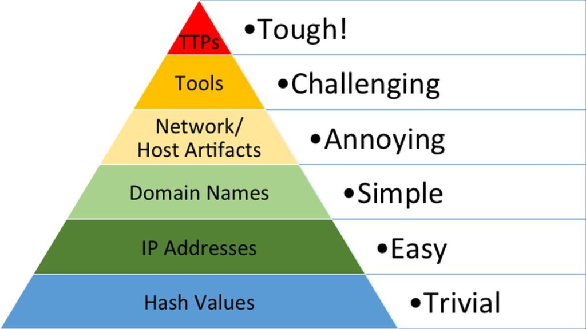
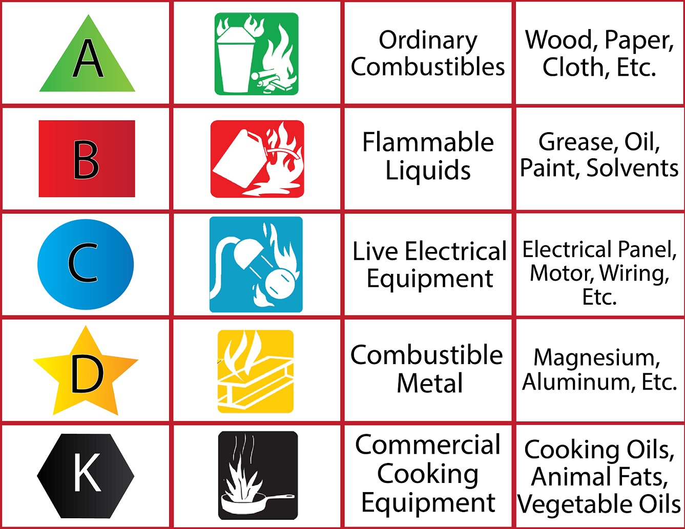

# CompTIA Security+


## Hacking Methodology

### DAD Triad

Cyber-security aims at protecting the CIA Triad.  
Hacking aims at breaking it, making the DAD Triad :

- **Disclosure** : break confidentiality by gaining access to resources that should not be accessed
- **Alteration** : break integrity by modifying the content or behavior of resources
- **Denial** : break availability by preventing legitimate users to access resources


### Hacking steps

- **Reconnaissance / Fingerprinting** : Gather info about the target, can be either passive or active  
- **Exploitation** : Take advantage of vulnerabilities to gain access via phishing, social engineering, weak passwords, unpatched software...  
- **Privilege escalation** : Use the gained access to get higher permission (create accounts, get admin access...)  
- **Establish persistence** : create a backdoor for later remote access control
- **Attack** : data extraction, data corruption, malware injection
- **Avoid detection** : ICMP tunnels, delete logs, erase command history

We call **pivot** the ability of an attacker to move from machine to machine in a target network.


### Attack frameworks

- **Lockheed Martin's Cyber Kill Chain** : linear framework in 7 steps :  
  - Reconnaissance : Gather Intel
  - Weaponization : Build a deliverable payload including an exploit with a backdoor
  - Delivery : Deliver the executable to the target
  - Exploitation : Execute the code on the target's device
  - Installation : Malware is installed on the OS
  - Command and Control : A C2 channel is created for remote access
  - Actions : Attackers can remotely carry out any action

- **AlienVault Cyber Kill Chain** : variation of Lockheed Martin's Cyber Kill Chain adding more flexibility.  
  It considers a broader range of adversary behavior (for example retreat).  

- **MITRE pre-ATT&CK and ATT&CK matrices** : Adversarial Tactics, Techniques and Common Knowledge  
  Free framework using matrices showing different tactics for reconnaissance and attack.  
  It lists a lot of categories of attacks, with documentation, prevention techniques and external references.  

- **Diamond model of intrusion analysis** : model using relations between 4 core features :
  - Victim
  - Capacity
  - Adversary
  - Infrastructure


## Malwares

### Virus

A virus infects a computer and can replicate and spread to other computers.  
It attaches its code to legitimate programs or files.    
It gets executed when the infected program is run or the infected file is opened.

Main types of viruses :
- **boot-sector** : stored in first sector of hard drive and loaded in memory at boot (before OS startup)
- **macro** : virus code embedded inside another document started at document open (Word, Excel, Powerpoint)
- **program** : infects an executable or application and executes when the program runs
- **multi-partite** : combination of boot-sector and program virus, it is attached to a system file and recreated at boot
- **encrypted** : virus encrypting its content to avoid detection by signature-based antivirus
- **polymorphic** : virus altering its content to avoid detection by signature-based antivirus
- **metamorphic** : advanced version of polymorphic virus rewriting itself entirely before propagation
- **stealth** : category of viruses hiding themselves to avoid detection
- **armored** : virus with mechanism to make detection by antivirus harder
- **hoax** : virus that propagates by making users believe they need to install it to clean up their machine

### Worm

A Worm is similar to a virus, it infects a computer and spread to others, but it is self-replicating.  
It does not need a host program or file, nor human interaction to replicate and propagate.  
It is used to create botnets, due to its capacity to propagate very quickly.

### Trojan

A Trojan is a malware disguised as a legitimate and useful software.  
A **RAT** (Remote Access Trojan) opens a backdoor for hackers to remotely access and control the machine.  
An **info-stealer trojan** steals user data, for example with the use of a keylogger.  
A **trojan downloader** downloads new versions of malwares.  

**ProRat** is an example of RAT that allows an attacker to create a "server" (an infected file) that gives remote 
control when executed on the victim's machine.  
The attacker can take many actions from the ProRat GUI (see system info, send message, take screenshot, keylogger ...).

A **banking trojan** is a popular attack on Android devices.  
A trojan app is installed (a game for instance) and runs in the background.  
It detects when a real banking app is open on the phone, and adds an overlay above it that the user cannot see.  
When the user enters his credentials, it is captured by the trojan app and sent to the criminal.  
The **AceCard** banking trojan was able to overlay over 30 banking apps.

To avoid being flagged as malware by Google Play or App Store, some trojans use **staged payload**.  
The app itself looks normal, but once installed and launched it downloads the actual malware.


### Adware

An adware is a software displaying ads, and can also hijack the browser search page.

### Spyware

A spyware is a software tracking the activity on a victim's machine.  
It can monitor web usage for targeting ads, or use a keylogger to steal credentials.

### Ransomware

A ransomware is a software encrypting data on the victim's machine and selling the decryption key against a ransom (usually in crypto-money).  
**Doxing** is a special ransomware type, where the victim should pay a ransom, or their stolen info will be disclosed to the public (customer data, salaries, secret documents...).

The **FBI MoneyPak ransomware** (also known as **Reveton virus** or **police virus**) was a ransomware released in 2012.  
It locked the files on the victim's machine, pretended to be from the FBI and requested the payment of a fine to unlock the files.

### Rootkit

A rootkit is a malware hiding its presence and providing unauthorized access to a computer.  
It is activated before the machine boots.  
It usually requires to wipe the hard disk to get rid of it.

A rootkit can act at multiple levels :
- **kernel level** : highest privilege, can inject code in the OS
- **application level** : can modify the behavior of applications
- **library level** : can hook system calls with malicious code
- **hypervisor level** : load itself in a hypervisor
- **firmware level** : override the BIOS of the machine

Rootkits make use of **DLL injection** and/or **driver manipulation**.

Driver manipulation can also be performed by **shimming**.  
A shim is a small library which transparently intercepts an API, changes the parameters passed, handles the operation itself,
or redirects the operation elsewhere.  
Shims can also be used for running programs on different software platforms than they were developed for.

### Spam

Spam is the abuse of electronic messaging systems to send unsolicited emails, usually containing ads.  
Most spammers make use of **email relays** from other organizations to send emails anonymously. 

We call **spimming** the spam using IM chat (Whatsapp, Messenger, SMS...).

### Malware Delivery Methods

Malware can be delivered to the victim in multiple ways :
- **autorun** on external media mount : USB / CD / Floppy Disk
- **phishing link** : drive-by installation, download links...
- **auto-execution** of downloaded executables : (py, vbs, bat, exe)
- **VBA macro** triggered when a Word/Excel document is open

Modern malware are often fileless : they either attach to an existing executable, or store their file in a 
temporary directory and then remove the files.  
This makes it harder for antivirus to detect them by signature.

### Malware Analysis

Malware can be either **targeted** (like StuxNet against Iran nuclear plant) or **mass campaigns** (like the Wannacry ransomware).

Malware usually perform 4 steps to infect a system :
- **Delivery** : the malware enters the target system (USB, PDF attachment...)
- **Execution** : the malware runs to execute the malicious code
- **Persistence** : the malware maintains its persistence to survive reboot and hide its presence
- **Propagation** : the malware propagates to other machines

A malware infection leaves some evidence in the infected system, that security analysts identify to understand the malware behavior.  
Malware are classified based on the evidence they leave on each step of their life cycle.  

Malware can leave 2 types of evidence :
- **host-based signatures** : encrypted files, installed programs, modified services, registry values, environment variables...
- **network-based signatures** : networking communication during delivery, execution and propagation

There are 2 types of malware analysis :
- **static analysis** : high level analysis without executing the program (signature, strings check...)
  - MD5 checksum (against VirusTotal for example)
  - SysinternalsSuite `strings` command to identify suspicious strings
- **dynamic analysis** : detailed analysis by executing the program in a controlled environment and analysing its behavior


## Attack Types

### Web Attacks

#### Directory Traversal

Attack trying to access unauthorized files by manually setting a parameter of a URL to a specific file path.  
Web servers that can serve user-specified files must validate and restrict the user input to protect from it. 

#### Buffer Overflow

A buffer overflow is the allocation of memory exceeding the size of the buffer used to receive it.  
It is used by attackers to override the return pointer in the execution stack.  
For example, they can redirect to a malicious code that runs a shell, so they have a remote code execution.

Buffer Overflow can be avoided by the use of ASLR (Address Space Layout Randomization) in most OSes.  
ASLR is a technique to use random addresses for the stack, library code, heap and program code during execution.  
This makes it much harder for an attacker to guess the address of the next instruction.

Buffer overflows can easily be detected using static code analysis tools (like Sonar).

#### SQL injection

SQL injection is the execution of custom SQL commands by using un-sanitized user input in SQL query.  
It is one of the most common attacks on websites and is part of the OWASP 10.  
SQL injections allows **stacked queries** by ending the intended query and running a new one in the same execution call.  

SQL injections can offer a RCE (Remote Code Execution) if the database server has a way to execute code.  
For example on Microsoft SQL Server, we can stack a `xp_cmdshell` procedure to execute shell commands within SQL Server.

SQL injections are prevented with user input sanitization and prepared statements.

**Havij** is a tool that can detect SQL injection vulnerabilities of a website.

**SQLmap** is another penetration tool that detects SQL injections in web applications.  
It can infer the DB version and exploit the SQL injection vulnerabilities to list databases, tables, columns and rows.


#### Cross-Site scripting (XSS)

XSS is another OWASP 10 attack on websites.  
It exploits the trust that a user has in the web server.  
The hacker executes malicious JS code on the browser of the victim by including it inside the code that is dynamically 
served to the victim (for ex in a post comment).  

The 3 types of XSS attacks are :
- Stored and Persistent : get the malicious code saved in the DB by the web server
- Reflected : malicious code executed when the victim clicks on a link on the site
- DOM-based : exploit the victim's web browser, using in the script functions like `document.write` or `document.cookie`

XSS allows the attacker to run custom JS code in the victim's browser by pretending it comes from the trusted website.  
It is a delivery mechanism used to steal the victim's data, intercept the communication or install malware on his system.


#### XSRF or CSRF (Cross-Site Request Forgery)

Unlike XSS, XSRF exploits the trust that the web server has in his user.  
The attacker forces a user to execute actions on the website for which he is already authenticated.  
This is done by making the user click on a URL to that site, so his session cookie will be attached to the request.  

XSRF can be avoided by using anti-XSRF tokens in the HTML templates.  
The token is sent with each request and validated on receive, so the forged URL would not have it.


#### IDOR (Insecure Direct Object Reference)

An IDOR is a reference to an object without proper validation of the object ownership.  
This allows a malicious user to access data that he should not have permission to access.  

A common example is a user-specific page access with an ID in its URL (user ID, product ID, order ID...).  
The backend needs to properly validate that the requested page is allowed for the logged user, otherwise it is an IDOR.


### RCE (Remote Code Execution)

Attack that allows the attacker to run any arbitrary command on a system from a remote location.  
That is one of the most dangerous types of security issue, and the goal of any attacker.  

### Wireless attacks

#### Wardriving

Wardriving is the act of searching for Wi-fi networks, usually from a moving vehicle (car with antenna).  
It usually uses a smartphone or a laptop, looking for weakly protected networks to crack.

#### De-authentication attack

If we know the wireless network SSID and the MAC address of a machine connected to it, we can send to the Wi-fi AP 
a **de-authentication frame** with the spoofed MAC address of the victim to force the disconnection of the machine.  
This can be used to crack WEP or WPA passwords, as we need to sniff some connection traffic to infer the password.  
De-authentication lets us force the user to reconnect while we sniff the traffic.

#### Evil Twin

An evil twin is a fraudulent Wi-fi AP that appears legitimate but is set up to eavesdrop on wireless communications.  
It is an AP setup with a name similar to an existing valid one.  

Once the evil twin is set up, the attacker de-authenticates all connected clients to force them to reconnect.  
When they connect again, they may use the rogue AP instead, and the attacker has a man-in-the-middle attack giving 
access to all the victim's traffic.  
It is often used in places offering a public Wi-fi (cafés, airports...).

#### Karma attack

A karma attack is a variant of the evil-twin attack.  
It exploits the behavior of a wireless client trying to connect to its preferred network list.  
The client beacons to determine if its preferred networks are within range, including the preferred network SSID.  
In a karma attack, the attacker's machine receives this beacon and dynamically sets up a Wi-fi with this SSID.

#### Bluetooth Attacks

**Blue-jacking** is the action of sending unsolicited messages to Bluetooth enabled devices.

**Blue-snarfing** is the unauthorized access of information from a wireless device over a Bluetooth connection.  
It can be avoided using link-level security.

**Blue-sniping** is a form of blue-snarfing using specialized equipment to reach the device from further away.

**Blue-bugging** is an attack to gain a back-door access to a Bluetooth device.


### Authentication Attacks

#### Spoofing

Spoofing is a software-based attack where the attacker assumes the identity of a user or process.  
It is used to bypass authentication by pretending to be a trusted party.  
It is also used to establish a Man-in-the-Middle attack by sitting in the middle of 2 machines communicating,
and pretending to both of them to be the other machine.

#### Credentials Stuffing

Credentials stuffing happens after some user/passwords leak from a website.  
An attacker can use these credentials on other websites and services to access accounts of people using the same password.

#### Password Spraying

A brute-force password attack tries to find a user password using all combinations or a list from a dictionary.  
Password spraying instead just tries 1 or 2 popular passwords on all user accounts.  
It avoids account lockout, and is more efficient to detect weak passwords if we know many usernames.

#### Cognitive Password Attack

A cognitive password is a personal question used to reset the password (name of pet, first model of car...).  
By accessing this info (from social media or social engineering) an attacker can reset the password and control the account. 

#### Broken Authentication

Broken authentication is a generic type of attacks exploiting a vulnerability in the application design.  
It can be weak password policy, weak password recovery policy, easily guessable session keys, hardcoded passwords...


### Phishing

Phishing is a social engineering technique to lure someone into willingly providing critical information (credentials, credit card numbers...).    
It is often using fake URLs in phishing emails redirecting to fake login pages :
- **Vishing** : phishing by phone
- **Smishing** : phishing by SMS 
- **Sextortion** : obtain compromising pictures/videos, then used to blackmail the victim
- **Insider** : the attacker applies for a job in the target company and gets hired to gain access to the internal network

Phishing campaigns use some common social engineering principles :  
- **Urgency / Scarcity**: create a false sense of urgency to get the victim to act in a rush (limited offer...)  
- **Social Proof / Consensus** : convince the victim that other people trust them (fake reviews...)  
- **Authority / Intimidation** : pretend to be a superior or a government entity (high risk as it gets often reported)  
- **Familiarity / Trust** : pretend to be from a company the victim knows well (Bank of America) or have a friendly innocent talk  


### Botnet

A botnet is a group of computers (bots) controlled remotely by the attacker.  
The attacker issues commands to the C2 server (Control and Command), that gives instructions to the bots.  
A victim machine becomes a bot usually after installing a trojan horse.

A famous botnet is the **Mirai botnet** that infects IoT devices running the ARC processor.  
It is able to infects IoT devices that are using the default credentials.  
The Mirai botnet code is open-source, so cyber-criminals can copy it and enrich it.

The **Zeus botnet** discovered in 2007 was a botnet targeting Windows machine.  
It controlled more than 3 millions machines infected with the Zeus trojan called **Zbot**.  
The Zeus trojan was installed by drive-by download or phishing emails.


### DoS / DDoS (Distributed Denial of Service)

DoS is an attack aiming at preventing a system to perform its task.  
DDoS is identical, but performed by multiple machines at the same time (usually a botnet) for higher impact.

#### Flood Attack

Flood attack is a common form of DoS, trying to overwhelm a network or machine.  
It consists in sending a heavy load of traffic to a victim to prevent it to serve regular users.  

Multiple types of flood can be used :
- **ICMP flood** (ping)
- **Smurf attack** : similar to ICMP flood but send the pings to a network's broadcast address spoofed with the victim IP as source to amplify the traffic
- **SYN flood** : initiate many TCP sessions with different spoofed source IPs and never send the ACKs
- **XMAS attack** : messages have FIN, URG and PSH flags set, which is an unexpected combination that made many servers crash
- **HTTP flood** (for web servers)
- **CharGEN flood** : setup a CharGEN server and send it messages with the victim's spoofed IP, the CharGEN server responds with a random number for each received message

#### Ping of Death

Send a malformed and oversized packet to a victim server, causing some machines to crash on reception.  
It was one of the first DoS attacks, but modern OSs are no longer vulnerable to this attack.

#### Teardrop attack

Attack breaking an IP packet into fragments and modifying them, so they overlap and go beyond the max size.  
Some machines crash or reboot when trying to re-assemble these fragments.

#### Fork Bomb

Attack creating a large number of processes on the victim machine to use up all available processing power.

#### DNS Amplification

Common DDoS attack sending a very small request to a DNS server with the spoofed source IP of the victim.  
The DNS server responds with a large message to the spoofed IP, amplifying the quantity of data received by the victim.

### Hijacking

Hijacking is the exploitation of a computer session in an attempt to gain unauthorized access to data, services or other resources.  

- **Session Theft** : the attacker steals or guesses the session ID of a web session, and takes over the already authorized session.


- **TCP/IP Hijacking** : the attacker takes over an ongoing TCP/IP session between 2 computers without the need of cookies.  
TCP/IP sessions authenticate only in the TCP 3-way handshake, so the attacker can control the session if he guesses the sequence IDs.


- **Blind Hijacking** : the attacker blindly injects data into a communication stream without knowing if successful or not.


- **Clickjacking** : use multiple transparent layers to trick a user to click on a button or link when they believe they clicked on the page.


- **Man in the Middle** : the attacker intercepts the network traffic between 2 machines and impersonates both sides.  
It is a very common attack on unsecure wireless networks.
  - **email hijacking** : the hacker gets control over an email account
  - **Wi-fi eavesdropping** : hijacking a Wi-fi connection
  - **man in the browser** : MitM attack limited to a client browser (trojan infecting the browser) 


- **Watering Hole** : the attacker puts a malware on a website that he knows the victim often uses.

### Null Sessions

A null session is an unauthenticated network connection to a Windows-based machine's **IPC$** (Inter-Process Communication Share).  
The connecting entity does not need to provide valid credentials but can still establish a limited form of access to the system.  

Null sessions are normally used with the SMB or NetBIOS protocols for machines to share with each other info about files
and printers on Windows networks. 

It may be used by an attacker as part of information gathering by :
```shell
net use \<TARGET_IP>\ipc$ "" /u:""
```

To protect against it, we should block ports 445 (SMB) and 139 (netBIOS).  
It can also be prevented with an IPS or a firewall blocking external requests on these ports.

### Supply-Chain attack

This is the attack of an external service provider of the victim, that has access to the victim's network.  
This is used when the victim has a strong defense, but the external service provider is easier to compromise.

### DNS Attacks

#### DNS Flood

Attack sending many requests to a DNS server to prevent it to serve legitimate traffic.

#### DNS Amplification

Attack sending small requests to a DNS server that generate a much bigger response.  
The requests are spoofed with the target's IP as source, so the target will receive all the responses from the DNS server.  
In 2016, the Mirai botnet launched one of the biggest DNS amplification attacks on the Dyn DNS provider, causing major outages.

#### DNS Cache Poisoning (or DNS Spoofing)

Attack modifying the name resolution information in the cache of a DNS server.  
It causes the redirection of users to fraudulent websites.  
Targets of DNS poisoning are internal DNS servers inside a network (not public DNS servers).

#### Unauthorized Zone Transfer

The attacker requests replication of the DNS information to his system for use in a future attack.  
It provides a list of all internal server names and IP addresses.

#### Altered Host Files

The host file is a text file on each machine containing a mapping of IP addresses and names.  
It is first checked when a DNS resolution is required, and the corresponding IP is used if found.  
If not found, the machine will request a DNS resolution from a DNS server.  

By poisoning this host file, the attacker can force a specific machine to redirect to a malicious site.  
This redirection to a malicious site is called **pharming**.

The host file on Windows is located under : `%systemroot%/system 32/drivers/etc`

#### Domain Name Kiting

This is not really an attack, more an abuse of the domain name registration process.  
When registering a domain name, some providers offer a 5-days grace period, and we can delete it for free.  
If we re-register it right after, we can block a domain name from real users without paying for it.

### ARP Poisoning (or ARP Spoofing)

Attack modifying the mapping between IP address and MAC address inside a local network to steal, modify or redirect frames.    
ARP Poisoning can be avoided by VLAN segmentation and DHCP Snooping.

When ran from the internal network, Nmap can discover the MAC address of every machine using an ARP scan :
```shell
nmap -PR -sn <target>  
```

ARP spoofing can then be conducted on a target machine using `arpspoof` or Metasploit :
```shell
# ARP spoofing with arpspoof
arpspoof -i eth0 -t <TARGET_IP>

# ARP spoofing with Metasploit
msfconsole
use auxiliary/spoof/arp/arp_poisoning
run                                       # need to set to mandatory params first
```


### SIM Swap Fraud

The SIM card (Subscriber Identity Module) of a mobile phone gives access to the network of the carrier and provides the phone number.  
An attacker calls the carrier of the victim pretending to be the victim, saying that he lost his phone and asking to 
transfer the phone number to a new SIM card.  
That gives the attacker access to the victim's phone number and all SMS (including codes for 2FA).  
This access allows to reset the password from GMail for example and take control over the victim's email address.

### Virtualization attacks

- **VM Escape** : attack allowing an attacker to break out of a normally isolated VM by interacting directly with the hypervisor
- **VM Sprawl** : VMs no longer used and still running, that are usually no longer patched and vulnerable to attacks
- **Data Remnant** : data left on a cloud server after the shutdown of the virtual machine, which could be stolen by an attacker
- **Privilege Elevation** : user grants himself the ability to run functions as higher-level user
- **Unencrypted VDI file** : A virtual machine is saved on the host as a VDI file that is not encrypted by default, so 
an attacker stealing the file can start the same virtual machine and access its content.  
To prevent it, we can encrypt the VM (in Virtual Box Settings > Disk Encryption).

### War Dialing

War dialing is an attack to automatically dial many phone numbers in order to identify numbers connecting to modems and other devices of interest.  
Hackers often use war dialing software, sometimes called "war dialers" to look for unprotected modems.  

War dialing is used to identify all phone numbers from a company, or identify potential vulnerable modems.   
Phone numbers can be dialed sequentially or randomly.  
The response shows if the number is connected to a modem, a fax machine, an internal phone system, a home, or a business.

Many phone companies have systems that are designed to detect war dialing.  
These systems will lock a user out of the phone system if he is attempting to war dial.

Networks that still use modems can protect against war dialing by setting a callback feature.  
Instead of opening a connection on a call, the modem hangs up and calls back to initiate a connection only if the caller ID is identified.  
The best remediation is still to get rid of modems and use SSH access for remote connection instead.

### Hashing Attacks

#### Pass the Hash

In a Pass-the-Hash attack, the attacker steals the hash and sends it directly to a server instead of the password.  
The hash can be stolen either from a database or sniffed on the network.  
It allows to impersonate the user in servers that use the hash as an authentication input.  
It usually targets **NTLM** (New Technology LAN Manager) on Windows machines.

**Mimikatz** is an open-source penetration testing tool that automates the harvesting of hashes and the Pass-the-Hash attack.

#### Birthday Attack

The birthday attack consists in finding some passwords generating collisions with existing user passwords.  
This allows to log in to the system using an incorrect password that generates the same hash.  
To prevent it, we should use a longer digest limiting the collisions (like SHA-256 over MD5 for example).


## Emails

### Protocols

**S/MIME** is the Secure Multipurpose Internet Mail Extensions standard providing cryptographic security for electronic messages.  
S/MIME can encrypt emails and their content... but also potential malwares they contain, making it harder to detect them.

**DKIM** (Domain Keys Identified Mail) is an email authentication method that helps verify the authenticity of the
sender's domain and detect email spoofing.  
DKIM allows the sender to digitally sign email messages, and the recipient can then verify the signature using the
public key published in the sender's DNS records.  
Many email services support DKIM as part of their email authentication mechanisms.


### Email tools

**Email Tracker** is a Chrome plugin to know if the recipient has opened our email.  
It integrates with most email service providers (Gmail, Outlook, Yahoo Mail...). 

**Ugly Email** is a Chrome and Firefox plugin to detect and prevent tracking on our emails.  
An eye icon appears on tracked emails, and it shows on hover the tracker type (SendGrid, Salesforce...).  
It blocks the "tracking pixel" so the tracking is prevented.   
Note that messages tracked with the Email Tracker plugin are not detected.

**guerillamail.com** is a website that lets us create a temporary disposable email address.  
It is useful for registration on random websites requiring an email address to activate the account.


## Network Scanning 

Network scanning can provide information on live devices (OS, IP address, open ports...).  
It is used to detect vulnerabilities in the target network.  

Scanning live devices can be done with a **ping sweep**, sending a ICMP echo request to all IPs in the network.  
It is also possible to use ARP requests instead of ICMP to trick machines configured to not respond to ICMP.

Port discovery helps understand what services are running on each machine (database, web server, FTP server...).

**Fingerprinting** is the identification of the OS and application versions.  
It can be either active (sending requests to the network) or passive (eavesdropping the traffic).  

**Banner Grabbing** is a popular fingerprinting technique to find the version of running web servers.

```shell
telnet 192.168.1.212 80       // use telnet on open port 80 (instead of usual 23)
HEAD / HTTP/1.0               // send a HEAD HTTP request
```
The response often contains server info like `Microsoft-IIS/8.5` or `Apache/2.0.46`.  

**netcat** is another tool that can help with banner grabbing, used just like telnet :
```shell
nc 192.168.1.212 80
HEAD / HTTP/1.0
```

The **nmap** program can be used for network scanning, ports discovery and banner grabbing (see the Tools page).   
It is a command-line tool, and it offers the **Zenmap** GUI in Kali Linux.


## Vulnerability Scanning

**Nessus** is the most popular tool to detect vulnerabilities on running machines.  
- can create custom policies and finetune a lot of parameters for host discovery, port scanning, services discovery...
- can run scan using custom policies of default scan types
- detailed report on all vulnerabilities found and how to solve them
- uses plugin regularly updated to detect vulnerabilities


## Security Applications and Devices

### Host-based Firewall

A host-based firewall is a firewall protecting an individual host.  
Most OS have one by default :
- **Windows Defender Firewall** for Windows
- **PF** (Packet Filter) for MacOS managed with the `pfctl` command
- **iptables** or its successor **nftables** for Linux distributions
- **ufw** (Uncomplicated Firewall) is a user-friendly wrapper above iptables that offers a better command-line interface

```shell
sudo ufw status                        # see status active/inactive and rules
sudo ufw status numbered               # same but also showing each rule ID
sudo ufw delete 2                      # delete a rule by ID
sudo ufw default allow outgoing        # set default allow/deny for outgoing traffic
sudo ufw default deny incoming         # set default allow/deny for incoming traffic
sudo ufw allow 22/tcp                  # allow traffic on a given port
sudo ufw deny from 192.168.100.25      # block traffic from a specific IP
sudo ufw enable                        # make the UFW firewall active
sudo ufw reset                         # reset firewall rules to default
```

Many third-party anti-malware suites also offer a software host-based firewall, like Symantec (Norton), McAfee or Zone Alarm.

### Antivirus

An antivirus is a software protecting a computer from malware.  
The most popular antivirus solutions are **Kaspersky**, **BitDefender**, **Avast**, **Norton**, **McAfee**...  

Malware can be identified by 2 main methods :
 - **by signature** : trying to match a malware signature (unique binary pattern for a known malware)
 - **by heuristic method** : sandbox testing of a file and determine if it is a virus from its behavior (risk of false positive)
            
An antivirus can scan the system on demand or on a schedule.  
Some polymorphic viruses change their code, making it hard to detect their signature.


### EPP (Endpoint Protection Platform)

An EPP is a software agent and monitoring system performing multiple security tasks at host-level.  
It can include an antivirus, data encryption, DLP, firewalls, HIDS/HIPS...  
There are many on the market, and every year Gartner makes a list of the best EPPs.  
Leaders are the solutions offered by Microsoft, CrowdStrike and Symantec.


### EDR (Endpoint Detection and Response)

An EDR is a software agent collecting system data and logs for analysis to provide threat detection.  
It can work together with an EPP to find existing threats on the host.  


### UEBA (User and Entity Behavior Analytics)

UEBA is an approach that focuses on monitoring and analyzing the behavior of users and entities (devices, applications,
and systems) within an organization's network to detect and respond to security threats.  
It is often used together with SIEM solutions to enhance threat detection and incident response capabilities.  
It makes use of ML and AI.  
Leader UEBA solutions are **Microsoft Advanced Threat Analytics** and **Splunk User Behavior Analytics**.


### UTM (Unified Threat Management)

A UTM system is also called a next-gen firewall (NGFW).  
It is a comprehensive security solution that integrates multiple security features and functions into a single
appliance or software platform.  
UTM systems are designed to protect computer networks from a wide range of security threats and vulnerabilities.  
UTM may include a firewall, a NIDS/NIPS, content filter, anti-malware, DLP, VPN...  

UTM solutions are commonly used in both small and medium-sized businesses (SMBs) and larger enterprises to simplify 
network security management and enhance protection. 

Unlike an EPP, a UTM system protect an entire network, not a specific machine.


### Honeypot and Honeynet

Those are decoy servers and networks with intentional security flaws to attract attacks.  
They keep attackers away from the real routers and servers, and allow to analyze the attacks (types, IPs, ...)

**Kippo** and **Google Hack Honeypot** are some popular honeypot solutions.

When an attacker is spotted scanning the network, we can use **fake telemetry** to return false information.


### FIM (File Integrity Monitoring)

A FIM is an application monitoring that some files are not modified, and sending an alert when they are modified.  
This can be used to ensure that the system files are never modified.

On Windows, the **SFC** (System File Checker) is a FIM utility allowing to scan and restore corrupted system files.


## Cloud Security


### SECaaS (Security as a Service)

SECaaS encompasses a wide range of security services hosted in the cloud and delivered to users over the internet.  
They can include anti-malware, firewall, IDS/IPS, identity and access management (IAM), email security, encryption...  
SECaaS follows a subscription model, so clients pay a monthly fee and do not need to buy any hardware. 

SECaaS is provided by a **MSSP** (Managed Security Service Provider). 

### CASB (Cloud Access Security Broker)

A CASB is an enterprise management solution designed to mediate access to cloud services by users across all devices.  
A CASB offers visibility on how cloud services are used within the organization.

It can provide many functionalities :
- SSO (single sign-on) for cloud services
- malware and rogue device detection
- monitor and audit user activity
- mitigate data exfiltration (DLP system)

### FaaS (Function as a Service)

FaaS is a cloud service model supporting **serverless** software architecture, provisioning a runtime container
where client code can be executed.

FaaS eliminates the need to maintain physical or virtual servers to run our code.  
It also saves cost, since we pay for the server only for the time the function has been running on the cloud.

The underlying architecture is entirely managed by the cloud provider (AWS when using AWS Lambda).

### Major cloud threats

- **Insecure API**
  - all APIs should communicate via an encrypted channel (HTTPS)
  - server-side request input validation
  - error messages not revealing internal details
  - throttling to prevent DoS (block IPs that send too many requests)
- **Improper key management**
  - all API calls should use secure authentication/authorization (like SAML or OAuth)
  - never hardcode keys in source code
  - delete unnecessary keys
- **Logging and monitoring**
  - SaaS does not let clients access logs, so logging should be done by clients
  - logs must be copied to long-term storage
- **Unprotected storage**
  - storage is usually in AWS buckets or Azure blobs
  - access control should use IAM, container policies and ACL
  - specify permissions to each storage (usually too permissive by default)


## Automation

### CI/CD

**Continuous Integration** is a software development method where code updates are tested and committed to a build server.  
It avoids merge conflicts and ensure that the latest code passes unit tests.

**Continuous Delivery** is a software development method where application is frequently tested and validated for availability.  
It ensures that the code passes all integration tests and is ready for release. 

**Continuous Deployment** is a software development method where application is frequently sent to production.


### DevOps / DevSecOps

**DevOps** is the merge of development and system integration team to work on the automation of CI/CD and smoothen the development cycle. 

**DevSecOps** adds security operations into DevOps so the security is taken into account at every step of the development cycle.

DevSecOps teams leverage **Infrastructure as Code**, they deploy resources in the cloud using deployment scripts.  
They generate consistent builds using orchestration runbooks.

## AI (Artificial Intelligence)

**AI** is the science of creating machines with the ability to develop problem-solving and analysis strategies without 
significant human intervention.

**ML** (Machine Learning) is a component of AI that enables a machine to develop a strategy for solving a task given a labeled dataset where 
features have been identified, but without further explicit instruction.  
It is very efficient for labeling and categorization when provided with a good training dataset.  

**Deep learning** is a refinement of ML where the training dataset has results but not features.  
The features need to be determined by the algorithm.


## Defence Solutions


### Password Management

Different passwords should be used for all important accounts, so one account can be compromised without impacting the others.

A **password manager** can be used to generate and manage strong passwords.  
Only the master password must be remembered, and other passwords are handled by the password manager.  
Popular password manager solutions are **LastPass**, **Dashlane**, **OnePassword**, **PasswordSafe**...


### Backup

All important data must be saved in a backup (for example Windows 10 full system backup).   
A files backup can be either on external drive or on the cloud (Google Drive, DropBox). 


### Authentication

#### MFA (Multi-Factor Authentication)

MFA is an authentication technique that requires multiple types of identity proofs :
- **what we know** : password, PIN
- **what we have** : token, access card
- **what we are** : biometrics (fingerprints, DNA, voice, gait, retina)
  - FAR (False Acceptance Rate) : how often the system accepts an unauthorized user
  - FRR (False Rejection Rate) : how often the system rejects an authorized user
  - CER (Crossover Error Rate) : rate where FAR == FRR
- **where we are** : geographical region of the authentication request
- **what we do** : writing a signature or performing any action

#### OTP (One-Time Password)

OTP is a form of MFA designed to make it harder for attackers to authenticate as a valid user.  
It consists in forcing the user to provide not only his password, but also a one-time password.  
The one-time password is provided via smartphone app, email, SMS, token...

The OTP value is generated as a hash of a **seed** and a **moving factor**.  
The seed is decided once at the creation of the user account and never changes.  
The moving factor changes everytime a new OTP is requested by the user, causing the different value everytime.  

The 2 main types of OTP are **HOTP** and **TOTP**, that differ in the moving factor they use.

**HOTP** (HMAC-based OTP) uses a moving factor based on a counter.  
Every time a HOTP is requested and validated, the moving factor is incremented.  
HOTP does not have any expiration mechanism for generated passwords.  
Yubico's Yubikey is an example of OTP generator using HOTP.

**TOTP** (Time-based OTP)  uses a moving factor based on time, with a timestep of 30 or 60 seconds.  
A given OTP is valid only during a single timestep, making it harder to brute-force than HOTP. 

#### Smart Card

A smart card is a credit-card sized token that contains a certificate, and is used for authentication together with a PIN code.  
It can require physical proximity (NFC) or may need to be inserted in a card reader.

#### Authentication methods

**Context-aware authentication** is an authentication method taking into account the location or time to allow
or deny the authentication request.

**SSO** (Single Sign-On) is an authentication method where a default user profile is created for each user and linked
with all the required resources.  
This allows a user to have a single password to memorize giving access to multiple services.  
The drawback is that compromised credentials cause a big security breach, as they give access to all services.

With **FIM** (Federation Identity Management), a single identity is created for each user, and shared with
all organizations in the federation.  
FIM is a common set of policies and standards agreed by organizations for authentication.  
The 2 main models for FIM to perform authentication and authorization are :
- **Cross Certification** : web of trust between all organizations, only works for small number of organizations.
- **Trusted 3rd Party** : all organizations place their trust in a single 3rd party
  - **SAML** (Security Assertion Markup Language) : Attestation model built upon XML to share federated identity management information.  
  It is a standardization of the SSO process.
  - **OpenID and OAuth** : Open standard and decentralized protocol to authenticate users in a FIM system.  
  Users log to an Identity Provider (for ex Google) and use that account to authenticate on cooperative websites.  
  OpenID handles the authentication, and OAuth handles the authorization.

#### SAML (Security Assertion Markup Language)

SAML is an XML-based framework for exchanging security-related information such as user authentication, entitlement, and attributes.  
SAML is often used in conjunction with SOAP.  
SAML is a solution for providing single sign-on (SSO) and federated identity management.  
A **service provider** (SP) establishes a trust relationship with an **identity provider** (IdP) so that the identity 
of a user (the principal) can be trusted by the SP without the user having to authenticate directly with the SP.  
The principal's **user agent** (typically a browser) requests a resource from the service provider (SP).  
The service provider can also be referred to as the **relying party** (RP).  

If the user agent does not already have a valid session, the SP redirects the user agent to the identity provider (IdP).  
The IdP requests the principal's credentials if not already signed in and, if correct, provides a SAML response containing one or more assertions.  
The SP verifies the signature, establishes a session and provides access to the resource.


### Zero Trust

Zero-trust is a security framework where all subjects, assets and workflows are authenticated, authorized and continuously
validated to gain access to applications or resources on the network.  

The system always behaves as if there was an intruder inside the network :
- no implicit zone trust
- devices cannot be configured by users
- all network connections are assumed insecure
- consistent security policy

Some core zero-trust principles are :
- continuous verification
- access limitation
- automation


### Access Control Models

With **DAC** (Discretionary Access Control), the access control is decided by the owner of each object (file, folder, device...).  
It is commonly used because it gives great control but is not very scalable.  
Each object must have an owner, and the owner must specify the permissions for each object he owns.

With **MAC** (Mandatory Access Control), the access control policy is decided by the computer.  
The decision is based on labels attached to each user and each object.  
MAC is used in military context, with Unclassified / Confidential / Secret and TopSecret labels.  
Each object has a secrecy label, and each user has a clearance level up to which he can access objects.  
In military, there is also the concept of **need-to-know** that decides if a user should access an object.
- **Rule-based implementation** : comparison of object and user labels (for example the clearance/secrecy)
- **Lattice-based implementation** : complex mathematics defining interactions between objects and users (for example to include need-to-know)

With **RBAC** (Role-Based Access Control), the access control policy is also decided by the computer.  
The decision is based on a set of permissions instead of a single data label.  
A role is created for each job function, and roles are assigned to users.  
The permissions are set at role level, so there is no need to maintain user-level permissions.  
RBAC is the most commonly used access control model in corporate networks.

With **ABAC** (Attribute-Based Access Control), the access control is dynamic and context aware, using IF/ELSE statements.  
It is one of the newest forms of access control and getting a lot of success recently.  
It provides the most detailed and explicit access control over a resource.  
Information such as group membership, OS, IP address... can be used to allow/deny access.


### Encryption

#### Encryption in transit

Communication sent over an insecure network must be encrypted.  
Encryption in transit usually involves a key-based encryption/decryption to turn clear text into encrypted ciphers.  
The encryption can be **symmetric** (same key for encryption/decryption) or **asymmetric** (different keys). 

**RSA** is an asymmetric encryption algorithm.  
**DES** (Data Encryption Standard) and its successor **AES** (Advanced Encryption Standard) are symmetric encryption algorithms.

#### Encryption at rest

Data encryption at rest protects data on the disk in case of theft, seize, repair.  

On Windows machines, **BitLocker** is a volume encryption feature built-in with Windows Vista and above.  
BitLocker uses AES as a symmetric key encryption mechanism, and **TPM** (Trusted Platform Module) for the key generation.  
TPM is a module inside the motherboard so the disk is readable only from this motherboard.  
For motherboards that do not support TPM, we can use a USB drive to store the encryption key, and it should always be 
plugged to read the encrypted disk.

On MacOS machines, **FileVault** is the built-in disk encryption feature, using the login password to encrypt the entire disk.

**Veracrypt** is a software available on Windows / MacOS / Linux to create an encrypted volume.  
It can encrypt a folder, an entire non-system disk (for ex a flash drive) or the entire system drive.  
When creating the volume, we set an encryption algo (AES) and a password.  
Then we can mount the volume (password required), so it appears as all other volumes.  
When we no longer need to use its content, we should unmount the volume so its content is not readable.  
If we create an encrypted volume on an external drive, it can be mounted from any other machine that has Veracrypt installed.  

A **Self-Encrypted Drive** (SED) is an external drive with built-in encryption.  
When we first use it, we need to set a password.  
When we mount it, we need to provide the password, then it can be used normally.  
When we no longer need to use it, we should unmount or eject the drive.  

There is also hardware-level encryption with **HSM** (Hardware Security Module).  
It is a hardware device providing a high level of security for cryptographic operations and key management.  
HSM are expensive and less used than software-level encryption. 


### Device Hardening

Hardening is the action to take some common sense security measures to protect a device, including :  
- change credentials
- password policy
- upgrade firmwares
- patch/update libraries and software
- use secure protocols
- disable unused ports
- use key rotation
- kill unnecessary services (ie. Telnet)
- least privilege for each user

For example on a Windows server, we can go to "Services" and stop/disable all Remote Desktop services.

A good hardening practice is to use a **TOS** (Trusted OS).  
Multiple governments (US, Canada, France...) maintain a list together of trusted OS regarded as secured enough for government critical operations.  
These TOS include Windows 8+, MacOS 10.6+, FreeBSD, Red Hat Enterprise Server...

#### Windows 10 Hardening

- Settings > Privacy > General : Set all privacy settings to off to prevent Microsoft to use ads and track our application use
- Connect to our Microsoft account > Privacy Dashboard > Personalized Ad Settings > Off
- Turn off Cortana if it is active and all data it is allowed to access
- Settings > Privacy > Location > Turn off location tracking
- Settings > Update & Security > Advanced Options > Delivery Optimization > turn off downloads from other PCs
- Settings > Network & Internet > Windows Firewall > Ensure the firewall is on
- Settings > Network & Internet > Wi-fi > Use random hardware address (if supported by the network adapter)


### Pyramid of Pain

<p align="center">

</p>

The pyramid of pain was invented in 2013 to describe that some indicators of compromise are more troubling to attackers than others.  
It shows how easy it is for attackers to bypass a defense from the victim.  

When the **hash** (MD5, SHA) of a malicious program is blocked, it is trivial to recompile the program with a different hash.  

When the attacker **IP address** is blocked, it is easy to move the C2 infrastructure to a different network server.  
If the attack is conducted via an anonymous proxy service (like Tor), the IP address of the attacker often varies.

When a **DNS domain or subdomain name** is blocked, it is simple for the attacker to register another domain name.  
Legislation standards are often lax, and a registration can be done within a day or two.

**Network artifacts** are pieces on the victim network that can identify malicious activity (URI pattern, C2 info in network protocols...).  
**Host artifacts** are pieces on a victim host that can identify malicious activity (registry of files used by malware...).  
Blocking these artifacts is annoying for the attacker, as he needs to reconfigure and recompile his tools.

**Tools** are software used by the attacker during the attack, like spear-fishing utilities, backdoors to establish C2 or password crackers.  
Preventing the attacker to use these tool is really challenging for the attacker who needs to spend time and money to build new tools.

**TTPs** (Tactics, Techniques and Procedures) are the methods used by the attacker to execute the attack.  
For example "spearfishing with a trojaned PDF file", or "dumping cached authentication credentials and re-use them in pass-the-hash attacks".  
Identifying and reacting to these TTPs is tough for the attacker, as he needs to find a new behavior to attack, not just change tools.


### Threat Intelligence

Threat Intelligence is the gathering of information about potential enemies to prepare against future attacks.

**CWE** (Common Weakness Enumeration) is a community-developed list of software and hardware weakness types that can 
lead to vulnerabilities in computer systems and software applications.  
CWE is maintained by the MITRE Corporation and is used as a classification system for vulnerabilities in software and hardware.

**CVE** (Common Vulnerabilities and Exposures) is a database of known vulnerabilities maintained by the MITRE corporation.  
It is used by security professionals to keep up to date with the latest securities issues.  
Hackers use these CVEs to craft exploits that use the vulnerability to attack a system.  
Keeping software patched prevents all these attacks.

The **Exploit Database** is a public database of exploit codes from various authors on various programs.  
Exploits can be searched by application and version.  
Some of these exploits are tested and marked as verified.

**NVD** (National Vulnerability Database) is a publicly accessible database listing CVEs and their remediation.  
It feeds from the CVE database and exposes a better navigation for the vulnerabilities with category and date filters.  
It also gives the CVSS quantitative score of all vulnerabilities.  

**CVSS** (Common Vulnerability Scoring System) is a popular free framework introduced in 2005 to score vulnerabilities.  
The score depends on how easy it is to exploit the vulnerability, and whether an exploit is publicly available.

**VPR** (Vulnerability Priority Rating) is an alternative vulnerability scoring system more recent than CVSS.  
It bases its score on the risk that each vulnerability causes, and is a better metric to prioritize vulnerabilities to fix.  
VPR is not open-source and can only be used as part of a commercial platform.

**EPSS** (Exploit Prediction Scoring System) is another vulnerability scoring system.  
Its score represents the likelihood of an exploit to be used against a given vulnerability.  
It is based on statistical models using data sources including vulnerability databases, exploit databases and RSS feeds.  
A vulnerability can have a low CVSS but a high EPSS if some exploits exist for it and are actively used by attackers.  

**AIS** (Automated Indicator Sharing) is a service the CISA (Cybersecurity and Infrastructure Security Agency) provides
to enable real-time exchange of machine-readable cyber threat indicators and defensive measures between public and
private-sector organizations.  
AIS helps to protect the participants of the service and reduce the prevalence of cyberattacks.

**STIX** (Structured Threat Information eXpression) is a standardized language that uses a JSON-based lexicon to express
and share threat intelligence information in a readable and consistent format.    
STIX includes motivations, abilities, capabilities, and response information.

**TAXII** (Trusted Automated eXchange of Intelligence Information) is the format through which threat intelligence data is transmitted.  
TAXII is a transport protocol that supports transferring STIX insights over HTTPS.

A **TIP** (Threat Intelligence Platform) is an automation tool combining multiple threat intelligence feeds, and
integrating them with existing SIEM solutions.


## Supply Chain Management

Hardening the network implies making sure all suppliers can be trusted.  

To choose suppliers, we must apply **due diligence**, and check that they have :
- cyber-security programs
- security assurance and risk management processes
- a clear product support lifecycle
- security controls for confidential data
- incident response and forensics assistance
- historical information (to be sure they won't go out of business)

### Trusted Foundry Program

As part of the supply chain management, the supply of hardware must also be reviewed.  
The **DoD** (US Department of Defense) created the **Trusted Foundry Program** for their microprocessor supply.  
It is a microprocessor manufacturing utility operated by the DoD and part of a validated supply chain.

### Hardware Root of Trust (ROT)

The Root of Trust is a cryptographic module embedded within a computer system that enables a secure boot process (for example TPM).  
It scans the boot metrics and OS files to verify their signature.  
It is a digital certificate embedded inside the hardware.  

### Trusted Firmwares

Trusted firmwares are validated to be secured, reliable and resistant to threat to prevent being compromised by firmware exploits.  
They use multiple techniques to prevent to be tampered with :
- **UEFI** (Unified Extensible Firmware Interface) : alternative to BIOS, it is a type of system firmware providing support for 64-bit CPU operations at boot.   
It has full GUI and mouse operation at boot and better boot security.  
All modern machines use UEFI and not BIOS.
- **Secure Boot** : UEFI feature that prevents unwanted processes from executing during the boot operation
- **Measured Boot** : UEFI feature gathering secure metrics to validate the boot process in an attestation report
- **Attestation** : Claim that the data presented in a report is valid by digitally signing it using the TPM's private key
- **eFUSE** (electrically programmable fuse) : type of semiconductor component used in integrated circuits for one-time programmable memory.  
They mimic traditional fuses and can be programmed or blown electronically (rather than physically).
- **Trusted Firmware Updates** : firmware update that is digitally signed by the vendor and trusted by the system before installation.


## SDLC (Software Development Life Cycle)

SDLC is an organized process to develop secure software application.  
The software goes through multiple steps in a waterfall model.  

Different companies may have different steps, the official SDLC steps for Security+ are :
- **Planning and Analysis**
- **Software and System Design**
- **Implementation**
- **Testing**
  - System testing (black-box, gray-box, white-box)
  - Static analysis (full review of the source code)
  - Dynamic analysis (testing on running system)
- **Integration**
- **Deployment**
- **Maintenance** (Versioning, Patches, Retirement...)

**Agile development** is an alternative development method based on small increments to add flexibility.  
The development is split into **sprints**, short periods of 2 or 4 weeks that focus on specific features. 


## eDiscovery

eDiscovery is the electronic aspect of identifying, collecting, and preserving ESI (Electronically Stored Info) for legal purpose.  
This info must be presented in case of an investigation or a lawsuit.

### Legal Hold

Legal hold is a preservation order sometimes issued during e-discovery to ensure that potential evidence is immutable.

Legal holds are implemented to ensure the preservation of potential evidence relevant to a legal case.  
This includes documents, emails, electronic records, hard drives, computers...

### Chain of Custody

The chain of custody refers to the chronological documentation showing the seizure, custody, control, transfer,
analysis, and disposal of physical or electronic evidence during the course of an investigation.  
The chain of custody is required to guarantee that the evidence has not been tampered with, so it is admissible in a court of law.


## Jailbreaking / Rooting / Sideloading

Jailbreaking an iPhone or an iPad is the process of hacking its software to remove restriction.  
The kernel is the core program controlling everything in the system, it is one of the first programs to load when the device is powered.  
Jailbreaking is performed by applying patches on the kernel to modify the way it operates.  
It is technically legal to jailbreak our device.  
However it implies the loss of the warranty and customer support, and official updates would break the device.

On Android, it is called **rooting** since we get root access on the device.

**Sideloading** is the practice of installing applications from sources other than the official app store of the platform,
such as the Play store or the App store.

**MDM** (Mobile Device Management) platforms can detect and restrict rooting, jailbreaking and sideloading.


## Wireless Security

Wireless access must encrypt its data and require authentication to access a network.  
The successive protocols to encrypt data over a wireless connection are WEP, WPA, WPA2 and WPA3.

#### WEP (Wired Equivalent Privacy)

WEP was the original implementation of 802.11 standard.  
It was approved in 1999, very vulnerable and abandoned in 2004 due to its security flaws.  
It uses a 40-bit pre-shared encryption key with the RC4 encryption cypher.  
Its main weakness is its 24-bit **IV** (Initialization Vector) sent in clear text.

WEP can be cracked in a few minutes by IV attack using **aircrack-ng** or other wireless crackers.  

#### WPA (Wi-fi Protected Access) 

WPA is an improvement of WEP, replacing the weak IV by the **TKIP** (Temporal Key Integrity Protocol), which is basically a 48-bit IV.  
It still uses the RC4 encryption protocol, but adds the MIC (Message Integrity Check).  
WPA was a much better standard than WEP, but it had some flaws that WPA2 replaced. 

#### WPA2

WPA2 improves WPA to add stronger encryption and better integrity.  
To check the integrity, it replaces MIC by **CCMP** (Counter-mode CBC MAC Protocol).  
For the encryption, it replaces RC4 with **AES** with a 128-bit key.

#### WPA3

WPA3 was launched in 2018 to strengthen WPA2.  
Like WPA2, WPA3 has 2 modes : **WPA3-Personal** and **WPA3-Enterprise**.

The main improvement in WPA3-Personal is the removal of the PSK (Pre-Shared Key) exchange used for encryption of all messages.  
It was replaced by **SAE** (Simultaneous Authentication of Equals) where the client and the AP use public/private keys
to agree on a one-time session key (dragonfly handshake), making it immune to brute-force attack.  

Thanks to SAE, WPA3 provides **forward secrecy** : past sessions are protected even if a future key is compromised.  
Instead of all using the same PSK (like with WPA2), each client uses a different session key. 

WPA3-Enterprise uses AES with a 256-bits key (128-bits key in WPA2), and Elliptic Curve Diffie-Hellman for the initial handshake. 

WPA3 is supported by Wi-fi 6 compatible routers.


## Domain Name Registrar

A domain name registrar is a company that allows to purchase and register domain names.   

All domain name registrars are accredited by **ICANN** (Internet Corporation for Assigned Names and Numbers), a 
non-profit organization responsible for managing domain names.

A domain name is registered for a given duration, up to 10 years.  
If it is not renewed before expiration, the domain name expires and anyone can register it.

It is possible to transfer the management of a domain name to another registrar if unhappy with the current registrar.  
This transfer cannot be done within the first 60 days after the domain name purchase.

A domain in `.com` costs around 15$ a year.

Some popular domain name registrars are :
- **Domain.com** : licensed for all top-level and many country-level extensions
- **Bluehost** : web hosting provider and WordPress partner, they offer free domain name registration when hosting a site with them
- **GoDaddy** : major registrar offering many extensions and an easy-to-use interface for domain name management

At domain registration, the registrant is required to provide accurate contact information, available publicly via WHOIS records.  
It is possible to use privacy services so the contact information do not show publicly.  
If no privacy service is used, the WHOIS records can be accessed with the `whois example.com` command.


## 5 Eyes (FVEY)

5 Eyes is an intelligence alliance between Australia, Canada, New Zealand, the UK and the US, collaborating on 
intelligence gathering, surveillance and data collection.  
The exact scope of their activities is confidential and not disclosed.  

Extended alliance including more countries were formed :
- **9 Eyes** : 5 Eyes + France + Denmark + Norway + Netherlands
- **14 Eyes** : 9 Eyes + Sweden + Germany + Belgium + Italy + Spain


## File Systems

A file system (FS) is a method used by an OS to store, organize, and manage files and directories on a storage device.  
The file system handles files creation, deletion, metadata management...

Most popular file systems are :

- **FAT32** (File Allocation Table) : old FS used by previous versions of Windows, with a 4GB file size limit  
- **exFAT** (Extended FAT) : portable Microsoft FS building on FAT32 and improving file size limit 
- **NTFS** (New Technology FS) : modern FS used by Windows, supporting file/folder permissions, compression, encryption...
- **reFS** (Resilient FS) : newest Microsoft FS used for Windows Server, offering scalability, availability and integrity
- **ext4** (EXTended) : FS commonly used on Linux and other Unix-based OS
- **xfs** (eXtended FS) : FS commonly used on some Linux distributions (like CentOS) designed to handle large files
- **HFS+** (Hierarchical FS) : old FS used by macOS
- **APFS** (Apple FS) : modern FS introduced by Apple for MacOS and iOS devices

It is possible to convert a drive using FAT32 to NTFS without data loss.  

Every FS is not supported natively with every OS.  
MacOS can read but not write to NTFS disks, and Windows does not even recognize HFS+ or APFS disks.  
When a disk is formatted, the chosen FS governs which devices can read or write to the disk.  

FAT32 and exFAT are a good choice when compatibility between OS is needed (flash drives, memory cards...). 


## Hard Drive Sanitization

Hard drive sanitization is the process of making the data inside the drive impossible to recover.  
Simply deleting the files is not enough, it can be recovered by a forensic software.

Self-encrypting drives can be sanitized by **Cryptographic Erase** (CE).  
It erases the encryption key used by the drive, so the data is no longer accessible even to forensic analysts.  
For non self-encrypting drives, they can be encrypted with VeraCrypt for example, and the key destroyed.

**Secure erase** (SE) is used to sanitize flash-based devices (such as SSDs or USB devices) when CE is not available. 

**Wiping** (also called **zero-fill**) the drive is another sanitization technic that fills the drive with zeroes.  
This is a slow process, and it does not work with defective drives.  
A popular tool for drive wiping is **DBAN** (Darik's Boot and Nuke).

**Physical destruction** of the drive makes the drive itself unusable.  
It can be done by mechanical shredding, incineration, or degaussing magnetic hard drives.

**Erasing** is the simple removal of a file from a disk.

**Clearing** (or overwriting) is preparing the disk for re-use and prevent file recovery with traditional recovery tools.

**Purging** is a more intense form of clearing preparing the drive for re-use in a less secure environment.  
It may still be recoverable with forensic tools.


## Facilities Security

### Fire Suppression

There are 5 types of fire : A, B, C, D and K :

<p align="center">

</p>

Only class A fires can be extinguished with water.  

To protect employees, buildings, machines and data from fire, there are several fire suppression techniques.

#### Handheld fire extinguisher

There are multiple types of fire extinguisher :
- **ABC extinguisher** : use dry-chemicals to extinguish fires of type A, B or C.  
It is corrosive, so should be avoided on computers.
- **BC extinguisher** : use CO2 to put off B and C fires.  
It is safe to use on computers, but must be careful as it removes the O2 of the room and prevents humans to breathe.
- **Yellow extinguisher** : put off class D metal fires

#### Water Sprinkler

A **wet-type** sprinkler contains water in its pipe at all time.  
When a fire is detected, it releases the water to put off the fire.  
It must not be used in areas where the temperature goes below zero, or the water would freeze in the pipes.

In a **dry-pipe** sprinkler system, the pipes are filled with pressurized air.  
When a fire is detected, it pushes water into the pipes to put off the fire.

A **pre-action** sprinkler system is a variation of a dry-pipe sprinkler, but it activates when heat or smoke is detected
(not only when the room is already on fire).

#### Clean Agent

In server rooms, we do not want to use a sprinkler system, as water would destroy all servers.  
Instead, we use a clean agent system, that releases gaz into the room instead of water.    
The gas (CO2, FM-200, HALON...) will replace the O2 and suffocate the fire.  
This creates an environment where people cannot breathe, so usually an alarm rings before to signal people to leave the room.


### HVAC (Heating, Ventilation and Air Conditioning)

Servers can generate a lot of heat that must be dissipated, or servers may overheat and shutdown.  
The heat generated by each server is measured in BTU (British Thermal Unit).  
Each machine has its own fan to cool the processor, but in a server room the air will get hotter and an HVAC system is required to cool it down.

The ideal temperature for the server room is between 16 and 23 degrees Celsius.

Server rooms are organized as **hot and cold aisles** : server racks are facing each other, so the aisle with the front of servers is cold, and the aisle with the back of servers is hot.  
This makes it easier to efficiently dissipate the heat.

HVAC is also used to maintain a good humidity level between 40% and 60%.  
Too little humidity can cause electrostatic discharge damaging components.  
Too much humidity can cause condensation of water and corrosion of the components.

### Faraday Cage

A Faraday cage is a form of shielding installed around an entire room that prevents electromagnetic energy and radio frequencies from entering or leaving the room.  
It can be used for example for forensics to turn on a phone and ensure no remote command is sent to it to delete its content.  

### TEMPEST

TEMPEST is a set of US government standards for the level of shielding required in a building to ensure emissions and interference cannot enter and exit the building.  
Contractors working for the US government may have to follow these standards.  
The TEMPEST-certified buildings are used to process classified, secret and top-secret information.

### Vehicular Vulnerabilities

Vehicles like cars and planes have built-in computers that are not well secure.  
All messages inside the vehicle are part of the **CAN** (Controller Area Network) and are all trusted, there is no authentication in place.  

If an attacker manages to send an instruction to the CAN bus, the instruction will be executed.  
There are 3 main ways to do that :
- attach the exploit to the **OBD-II** (On-Board Diagnostic), the system providing self-diagnosis and reporting capabilities for repair technicians
- exploit over on-board cellular
- exploit over on-board Wi-fi


### OT (Operational Technology)

Unlike IT centered about data networking, OT is designed to implement an industrial control system of physical components.  
It is used in manufacturing, and instead of Windows machines they would use big cabinets with buttons and gauges.  
Availability is extremely important for OT as the factory must have no downtime.  

#### Embedded Systems

A **PLC** (Programmable Logic Controller) is a type of computer designed for deployment in an industrial or outdoor
setting that can automate and monitor mechanical systems.  
For example, a PLC can be used to monitor the water flow and to open/close a valve.  
A PLC can be patched to fix security issues, but patches are usually rare (once or twice a year).

A **System-on-a-chip** is a processor that integrates the platform functionality of multiple logic controllers onto
a single chip, replacing multiple big PLCs.  
It is used by embedded systems like Roomba vacuum cleaners to save space.

A **FPGA** (Field-Programmable Gate Array) is a processor that can be programmed to perform a specific function
by the customer rather than at the time of manufacture.  
This gives flexibility to the customer to configure a custom logic.

A **RTOS** (Real-Time OS) is a type of OS that prioritizes deterministic execution of operations to ensure consistent
response for time-critical tasks.  
This type of OS is used by embedded systems that cannot tolerate reboots or crashes.

Common constraints in embedded systems are :
- low power consumption
- limited compute capability
- network (often limited to short-range like Wi-fi or Bluetooth)
- cryptography (due to small processor)
- authentication (some systems are unable to join a network and require local logon)

#### ICS and SCADA

An **ICS** (Industrial Control System) is a network managing embedded devices, used for electrical power stations,
water suppliers, health services, manufacturing...  
ICS uses **Fieldbus**, a digital serial data communications protocol used in OT networks to link PLCs.

An **HMI** (Human-Machine Interface) is an input and output control on a PLC to allow a user to configure and monitor the system.

A **Data Historian** is a software that aggregates and catalogs data from multiple sources within an ICS.

**SCADA** (Supervisory Control And Data Acquisition) is a type of ICS that manages large-scale, multi-site devices
and equipment spread over a geographic region.  
SCADA runs as software on computers to gather data from and manage plant devices and equipment with embedded PLCs.  
It uses a WAN to gather all data from all plants to the central SCADA server.  
For example, smart meters in a house monitor electricity consumption and send back this data to the central SCADA
server of the electricity company.  

**Modbus** is a communications protocol used in OT networks, it replaces the TCP/IP protocols used in IT.  
Modbus gives control servers and SCADA hosts the ability to query and change the configuration of each PLC.

Key controls to mitigate vulnerabilities in specialized systems :
- establish administrative control over OT networks by recruiting staff with relevant expertise (not IT with TCP/IP)
- implement the minimum network links (disable unnecessary links, services and protocols), OT network should be disconnected as much as possible from the IT network
- develop and test a patch management program for the OT networks
- perform regular audits of logical and physical access to detect vulnerabilities and  intrusions

#### Premise System

Many system designs allow the monitoring to be accessible from the corporate data network or the Internet, but it
makes the main network more vulnerable.  
It is usually a 3rd network in the organization (with the corporate data network and the SCADA network).

**BAS** (Building Automation System) are components and protocols facilitating the centralized configuration and
monitoring of mechanical and electrical systems within the office or the data center, for example the elevators,
the battery backup system, the AC, the lights...  
Many of these BAS are monitored via the internet and are vulnerable to code injection.

**PACS** (Physical Access Control System) are components and protocols facilitating the centralized configuration
and monitoring of security mechanism within the office or the data center, for example the security cameras, the card readers...  
PACS can be integrated with the BAS, or be in a separate system.  
PACS is often installed by an external supplier, and is often omitted from risk and vulnerabilities assessments.


## Risk Assessment

Risk assessment is a process used in risk management to identify risks in a network or system, and decide on how to address them.  
A **vulnerability** is any internal weakness in the system that can be exploited.  
A **threat** is an external factor that can use a vulnerability to damage the system (disaster, hacker...).  
A **risk** is the probability that a threat will be realized.  

The typical risk analysis steps are :
- inventory assets and assign an asset value (AV) to each asset
- identify each possible threats for each asset, calculate SLE and EF
- threat analysis to calculate the likelihood of each threat (ARO)
- estimate the annualized loss (ALE)  
- analyze the risks and research countermeasure, using the ALE to prioritize the risks  
- business impact analysis based on the risk analysis  

There are 4 strategies to address a risk :
- **Avoid** : change the strategy to eliminate the existence of the risk
- **Transfer** : pass the risk to a 3rd party (insurance)
- **Mitigate** : minimize the risk to an acceptable level (fix critical vulnerabilities, backups...)
- **Accept** : accept the current level of risk

**Qualitative risk analysis** uses intuition, experience and other methods to assign a relative value to a risk.  

**Quantitative risk analysis** uses numerical and monetary values to calculate risk.  
It uses functions to generate a magnitude of impact representing the damage of a risk :
- **Single Loss Expectancy (SLE)** : Cost associated with every single threat that can occur
- **Annualized Rate of Occurrence (ARO)** : Number of times per year the threat will be realized
- **Annualized Loss Expectancy (ALE)** : Expected cost of a threat over a year

**Active assessments** use intrusive techniques like scanning, hands-on testing and probing the network.  
They can possibly cause the crash or shutdown of some services or machines when an issue is found.  

**Passive assessments** make use of open-source information and collection and analysis of network data.  
They never make any direct contact with the target system. 

### Types of security controls

Security controls can be classified by control type :
- **Physical** : guard, CCTV camera, PTZ camera (pan-tilt-zoom), lock, security card, alarms ...
- **Technical** : password, encryption, ACLs, MFA ...
- **Administrative** : policies and procedures, least-privilege, mandatory vacation, user trainings...

Security controls can also be classified following the NIST categories :
- **Management** : focused on decision-making, like policies and procedures
- **Operational** : actions done by people, like user training, testing recovery plans, ...
- **Technical** : AAA, ACL, encryption, ...

Security controls can also be classified by the time of the protection :
- **Preventive** : controls preventing issues to happen, like RAID, UPS, ...
- **Detective** : controls detecting issues happening, like alarms, IDS, logs...
- **Corrective** : controls correcting issues after they happened, like backups, disaster recovery, ...

Another type of security control is **compensative control**, set to replace a control that cannot be implemented yet.  
For example, if we use retina scans for data centers but in one country they do not sell it, we use another solution instead.

### Types of risk

- **External** : coming from external sources, like fire, flood, hackers...
- **Internal** : coming from within the organization, like server crash, legacy systems, ...
- **Multi-party** : coming from multiple organizations or systems bringing their own risk
- **Intellectual Property Theft** : theft of business assets or ideas
- **Software compliance and licenses** : organization not aware of what software are running, software issues...

### Vulnerability management

Vulnerability management includes the vulnerability assessment, and the mitigation of these vulnerabilities.  
Then they need to be prioritized, mitigated, and finally the scan must be performed again to confirm the resolution.

A vulnerability assessment is the process of identifying issues in a system, network, database, application...  
Vulnerabilities can be identified with a vulnerability scanning tool like **Nessus** and **QualysGuard**.  
It is a defined process to identify and classify all vulnerabilities. 

A vulnerability assessment comprises multiple domains :
- **network scanning** : discover and document physical and logical connectivity in the network (Nmap)
- **vulnerability scanning** : identify threats on the network without exploiting them (open ports and program versions)
- **network sniffing** : capture and analyze the network traffic on the network (WireShark)
- **password analysis** : try to guess passwords with a password cracker (Cain & Abel, John The Ripper, HashCat)

#### Penetration Testing

Penetration testing is another way to identify vulnerabilities of a system.  
Penetration testers can work in black, gray or white box to try to break the tested system.  
Common penetration testing tools are **Metasploit** and **CANVAS**.  

The **red team** is the team trying to attack the system, playing the role of the external hacker.  
The **blue team** is the team defending the system, playing the role of the Systems team.  
The **white team** is the team supervising the penetration testing exercise. 


#### Bug Bounty

Bug bounties are programs offered by organizations to encourage external security researchers and ethical hackers
to find and report security vulnerabilities or bugs in their software, websites, or systems.  
Organizations specify the scope of the bounty (assets to test, vulnerability type, rules of engagement...).

Some popular bug bounty platforms are **HackerOne** and **YesWeHack**.


#### OVAL (Open Vulnerability and Assessment Language)

OVAL is a language used to share data focused around vulnerability assessment and management between different tools.  


## Monitoring and Auditing

The **security posture** is the risk level to which a system or a technology element is exposed.

**Baselining** is the process of measuring changes in networking, hardware, software and applications.  
It defines what the normal state is, allowing to monitor for unusual activities (off-hours connection, traffic spikes...).  
Performance baselining is the monitoring of CPU usage, bandwidth usage, number of processors in use, disk space usage...  
It is useful for daily use, and also for security monitoring to detect abnormal activities that could come from malwares.  
This can be monitored with the **Windows Performance Monitor** tool.

**Protocol analyzers** are also used to monitor the packets circulating on the network.  
It can be set in **promiscuous-mode** (capturing all packets) or **non-promiscuous mode** (capturing only packets addressed to it).  
To have a full monitoring of the traffic on the network, we must use promiscuous mode, but not all network cards support it.  

For the protocol analyzer to receive all traffic, it must use :
- **port mirroring** configured in the switch so the switch sends a copy of all traffic to the protocol analyzer's port
- a **network tap**, a physical device allowing to intercept all the traffic between two points of the network

`openfiles` command on Windows can be used to monitor files open on the system.  
`netstat` shows open connections on the machine.
```shell
openfiles /local on       # enable the openfiles tracking (require admin privilege and a reboot)
openfiles                 # list all open files with the process using it

netstat -ano              # show current connections with UDP/TCP, IP address and port and process ID
```

### Logging

There are 3 types of logs on a Windows machine accessible in the **Event Viewer** : 
- **Security logs** : user login, administrative privilege granted...
- **System logs** : logs on OS activity, like startup and shutdown of the machine, Windows updates, NTP, DNS...
- **Application logs** : user interaction, application change, update, error...

Events in the Event Viewer can be filtered by event ID (event type, for example 4624 for Successful Login).

Linux stores logs under the `/var/log/` folder, for example :
- `/var/log/kern` : kernel related logs
- `var/log/secure` : authentication related logs
- `/var/log/cron` : logs of Cron tasks

Web servers also keep access logs containing the details of every received request (timestamp, URI, source IP, status code...).  
An Apache web server keeps access logs under `/var/log/apache2/` or `/var/log/httpd/`.

A common solution for logs management is to store logs in a SIEM or a Syslog server to gather and correlate them.


### SOAR (Security Orchestration, Automation and Response)

SOAR are a type of security tools that facilitate incident response, threat hunting and security configuration by orchestrating
automated runbooks.

SOAR is a next-gen form of SIEM, it can scan security data, analyze it with ML, enrich it and provision resource in response.  
For example, it can tear down a VM suspected to contain a malware and create a new VM instead.

A **playbook** is a higher-level set of procedures that outlines the overall strategy and actions to be taken during an incident.  
It provides a structured and strategic view of the response process.  
Playbooks may include multiple runbooks, each addressing a specific phase or aspect of the incident response lifecycle.

A **runbook** is a more detailed and specific set of procedures or scripts guiding the execution of individual tasks within a playbook.  
It provides step-by-step instructions for the automation and orchestration of specific actions.

## Redundancy and Disaster Prevention

### RAID (Redundant Array of Independent Disks)

RAID is a technology to use multiple disks as a single logical disk to improve performance and/or redundancy.  

- **RAID 0** : data striping over multiple disks to increase performance, no data duplication  
- **RAID 1** : provide redundancy by mirroring the data identically on 2 hard disks
- **RAID 5** : it requires 3 or more physical disk drives, and provides redundancy by striping data and parity across the disk drives
- **RAID 6** : Modified form of a RAID 5 with double parity, allows losing up to 2 of the disks
- **RAID 10** : combine advantages of RAID 0 and RAID 1, creating a striped RAID of 2 mirrored RAID

### Data Backup

Data backup is performed using tapes to save the disk content regularly to be able to restore the machine state.  
There are multiple tape rotation strategies to decide how long a tape is kept and when can it be overwritten.

- **10 tapes rotation** : simple backup method using 10 tapes (one for each business day for 2 weeks).  
  A tape is used every day and kept 2 weeks, then overwritten for the next 2 weeks cycle.  
  This method always keeps the last 2 weeks of history.


- **grandfather-father-son** : we use 3 sets of backup tapes called the son (daily), the father (weekly) and the grandfather (monthly) that all rotate separately.  
  At the end of each day, we back up a new son.  
  At the end of the week, a new father is created with the same value as the son.  
  At the end of the month, a new grandfather is created with the same value as the son.  
  The monthly tapes are usually kept off-site in case the site is destroyed.  


- **Towers of Hanoi** : also 3 sets of backup tapes but rotated with a bit more complex system.  
  A new tape is created in the first set every 2 days.  
  A new tape is created in the second set every 4 days.  
  A new tape is created in the third set every 8 days.  


### DRP (Disaster Recovery Plan)

A DRP is a set of written policies and procedures specifying actions to take in case of a disaster.  
- In case of a fire destroying a part of the building, how to continue operations ?
- In case of flood, what company to call ?
- Procedures to switch to hot/warm/cold sites ?

The DRP should contain contact information, impact determination, recovery plan (order and actions...).

The **BCP** (Business Continuity Plan) is also part of the DRP.  
It focuses on how to ensure operation are maintained in case of incident or disaster.

**Disaster Recovery exercises** should be scheduled, ideally once a year, to ensure staff knows how to act in case of disaster.


### BIA (Business Impact Analysis)

BIA is a systematic activity that identifies organizational risks and determines their effect on ongoing operations.

BIA uses metrics expressing the system availability :
- **MTD** (Maximum Tolerable Downtime) : longest period of time the organization can be inoperable without going out of business
- **RTO** (Recovery Time Objective) : time required after failure to resume normal business operations (for example power back up after blackout)
- **WRT** (Work Recovery Time) : time in addition to RTO of individual systems to reboot following a failure (for example restart web servers after power is back)
- **RPO** (Recovery Point Objective) : longest period of time that the organization can tolerate lost data to be unrecoverable
- **MTTR** (Mean Time To Repair) : average time it takes to repair a network device when it breaks
- **MTBF** (Mean Time Between Failure) : average time between failures of a device


### Key Escrow

Key escrow is a disaster recovery mechanism for the safekeeping of encryption keys.  
The encryption keys are stored in a repository on a 3rd party, and can be accessed by authorized parties if needed.  

It can be used in multiple situations :
- a company wants to encrypt data but does not want to manage encryption keys
- a company needs to access data encrypted with the key of an employee who left
- law enforcement needs to access encrypted data for an investigation


## Policies and Procedures

**Policies** define the role of security in an organization and establish the desired end state of the security program.  
**Organizational policies** provide general direction and goals, a framework to meet the business goals, the roles and responsibilities...  
**System-specific policies** address the security of a specific technology, application, network or device.  
**Issue-specific policies** address a specific security issue, like email privacy, employee termination procedures...  

**Standards** implement a policy in an organization, describing mandatory actions, steps and rules to achieve.

**Guidelines** are recommended actions and are flexible in nature.  
They can accept exceptions when there is a valid reason for it (for example storage space per user...).

**Procedures** are detailed step-by-step instructions to ensure personnel can perform a given action.

### Data Management

Data should be assigned a level of sensitivity that drives how much effort must be deployed to protect it.  

**Commercial classification** levels are : 
- Public : available online, for free or for a fee
- Sensitive : should not yet be public (strategies, future products...) 
- Private : data that should never go out of the organization, like employee data
- Confidential : intellectual property, source code, business critical data...

**Government classification** levels are :
- Unclassified
- Sensitive Unclassified
- Confidential
- Secret
- Top Secret

Data Roles (required by GDPR) :
- **Data Owner** : senior management responsible of the overall data and deciding data controls
- **Data Custodian** : member of IT, deciding how data controls are implemented
- **Data Controller** : person that controls processing of the data
- **Data Processor** : person or body which processes the data on behalf of the data controller
- **Data Protection Officer** (DPO) : mandatory appointment in the organization who ensures compliance with data regulations

Data lifecycle should be specified in the organization policies : how long data is kept, how it is protected, how it is destroyed...  
Some regulations require the storage of some types of data for a given period of time.

**PII** (Personally Identifiable Information) are data that can identify specific people.  
They can be employee or customer data (full name, driver license number, social security numbers, DoB, email...).

**SPI** (Sensitive Personal Information) are data about people's origin, opinions or nature.  
SPI include credentials to services, precise geo-localization, genetic data, email content...

**PHI** (Protected Health Information) is any medical information that can identify an individual, regulated by HIPAA.  
PHI include information about medical/physical/mental health-related conditions, test results, prescriptions, 
appointments, patient forms, medical bills...

Multiple regulations defining what are PII and how they must be manipulated :
- **Privacy Act of 1974** : affect US government computer systems collecting, storing using and sharing PII  
- **HIPAA** (Health Insurance Portability and Accountability Act) : affect healthcare providers, insurance companies, medical data clearing houses...  
- **SOX** (Sarbanes-Oxley) : affect publicly traded US corporations and include some accounting methods and financial reporting requirements
- **GLBA** (Gramm-Leach-Bliley Act) : affect banks, mortgage companies, loan offices, credit card providers...
- **FISMA** (Federal Information Security Management Act) : require federal agencies to develop, document and implement an information security program to protect their data
- **PCI-DSS** (Payment Card Industry - Data Security Standard) : contractual obligation for organization manipulating client credit card numbers
- **HAVA** (Help America Vote Act) : regulation governing the security, confidentiality and integrity of PII during the election and voting process
- **COPPA** (Children's Online Privacy Protection Act) : regulation of information for services targeting children under 13 (especially parental consent)
- **FERPA** (Family Educational Rights and Privacy Act) : govern the access to educational records by potential employers, educational institutions, foreign governments...  
- **SB 1386** : only apply to organization making business in California, require any business storing PII to disclose any breach
- **GDPR** (General Data Protection Regulation) : European regulation stating that personal data cannot be collected, processed or retained without the individual's informed consent.  
  GDPR grants users the right to be forgotten : their data can be erased from the system on request.  
  GDPR requires PII data breach notification within 72 hours.

### Security Policies

- **Acceptable Use Policy** : define the rules restricting how a computer, network or system may be used.
- **Change Management Policy** : define the way of changing the state of a system, network or IT procedure (for ex the installation of a new software)
- **Onboarding and Offboarding Policy** : define actions to take when an employee is hired, fired or quits

**Due Diligence** : ensuring that IT infrastructure risks are known and managed properly  
**Due Care** : mitigation actions taken to defend against risks discovered during due diligence  
**Due Process** : legal term referring to how an organization (or government) must respect personnel's right 

**Sponsored access** to guest networks can be setup to limit who can access the guest network.  
An employee (the sponsor) makes a request to grant access to the guest, providing valid identification of the guest.  
Once the sponsorship is verified, the guest is granted access to the network.

### Vendor Relationship

- **NDA** (Non Disclosure Agreement) : legally binding agreement defining what data is considered confidential and should not be shared outside the relationship
- **MOU** (Memorandum of Understanding) : non-binding agreement defining an intended common line of action
- **SLA** (Service level agreement) : agreement defining the ability to support and respond to problems within an agreed timeframe
- **ISA** (Interconnection Security Agreement) : define technical requirements each organization must meet when connecting 2 networks
- **BPA** (Business Partnership Agreement) : define the conditions of a business relationship
- **Rules of Engagement** : define how the action will be taken (for example no social engineering for penetration testers)

### Frameworks

Some enterprise IT security architecture frameworks exist to help with the creation of policies, standards, guidelines and procedures.

- **SABSA** (Sherwood Applied Business Security Architecture) : risk-driven architecture considering the how/where/who/when/why of the problem.

- **COBIT** (Control Objectives for Information and Related Technology) : security control dividing IT into 4 domains :
  - Plan and Organize
  - Acquire and Implement
  - Deliver and Support
  - Monitor and Evaluate

- **NIST SP 800-53** : security control framework developed by the Dept of Commerce

- **ITIL** (IT Infrastructure Library) : de-facto standard for IT service management

- **CIS CSC** (Center for Internet Security - Critical Security Controls) : secure configuration guidelines for hardening,
  and sets of cyber-security best practices.  
  It helps improve cyber-defense by detailing 20 key actions (the critical security controls) and has different categories
  for different sizes of organizations

- **NIST** (National Institute of Standards and Technology) has 2 frameworks :
  - **RMF** (Risk Management Framework) : mandatory for US federal agencies and organizations handling federal data,
    integrating security and risk management in the system development life cycle.  
    It follows 6 steps : Categorize / Select / Implement / Assess / Authorize / Monitor
  - **CSF** (Cyber Security Framework) : commercial implementation, offering a set of industry standards and best practices
    created by NIST to help manage cybersecurity risks.  
    CSF defines 5 categories of functions : Identify / Protect / Detect / Respond / Recover

- **ISO IEC framework** (International Organization for Standardization - International Electrotechnical Commission)
  - **ISO 27001** : international standard detailing the requirement to establish, implement and maintain an ISMS
    (Information Security Management System)
  - **ISO 27002** : international standard detailing some best practice recommendations for people implementing an ISMS
  - **ISO 27701** : international standard extending ISO 27001 to enhance the existing ISMS with additional privacy requirements
  - **ISO 31000** : international standard for enterprise risk management to replace all existing standard / methodologies / paradigms
    across industries

- **SOC** (System and Organization Control) : suite of reports of internal controls over an information system produced during an audit
  (completing another framework with an audit method)  
  - **SOC 2 Type I**: documents the design effectiveness of controls at a specific point in time  
  - **SOC 2 Type II**: documents the operational effectiveness of controls over a specified period (6 months or more)  

- **CSA** (Cloud Security Alliance) : Security in cloud computing
  - **Cloud Control Matrix** : framework providing fundamental security principles to guide cloud vendors
  - **Reference Architecture** : methodology enabling security architects to assess their cloud IT solution security


## Digital Forensics and Incident Response (DFIR)

Forensics is the application of science to investigate crimes and establish the facts.  
Digital forensics is the branch of forensics that focuses on the analysis of computers and smartphones.  
It focuses on cybersecurity crimes, like cyber-espionage, IP theft, ransomware, possession of unauthorized content...  
The main materials for digital forensics investigation are :
- file system : analysis of a digital forensics image to reveal installed programs and files (even deleted ones)
- system memory : analysis of the memory to understand the programs currently running
- system logs : logs on each machine detailing the activity on this machine
- network logs : logs on network machines detailing the traffic between machines

The NIST defines the process of digital forensics in 4 phases :
- **Data Collection** : identify the devices from which to collect data, and guarantee the data was not tampered during collection (using a write blocker for example)
- **Examination** : filtering and extraction of relevant data
- **Analysis** : correlate evidences to analyze the data and infer the chronology of events
- **Reporting** : creation of a detailed report of the methodology and findings

**Incident Response** : set of procedures that an investigator follows when examining a computer security incident.

**Incident management program** : program consisting of the monitoring and detection of security events on a computer
network and the execution of proper responses.  
Each company has its own way to conduct it, but it usually follows the same steps.

The **SANS incident response framework** (SysAdmin, Audit, Network and Security) has 6 steps (PICERL) :
- **Preparation** : conduct training, prepare incident response kit, ensure strong security posture
- **Identification** : recognize whether an event should be classified as incident
- **Containment** : isolate the incident (close ports, terminate network connection, disable compromised account...)
- **Eradication** : remove the threat or attack
- **Recovery** : restore data and re-enable servers and networks taken off during the incident
- **Lessons Learned** : document the incident response and decide on how to improve the security posture


### SOC (Security Operations Center)

A SOC is a team of cyber-security professionals within an organization responsible for monitoring the network and its systems.  
The primary goal of a SOC is to detect, respond to, mitigate, and prevent cyber-security incidents.  
It serves as a hub for cyber-security activities and plays a critical role in maintaining the security posture of the organization.

The 3 pillars of a SOC are :
- people : identify and prioritize raised alerts
- process : each SOC member has a specific process to follow : triage (5W : What ? When ? Who ? Why ? Where ?), reporting, incident response...
- technology : security tools for detection and response (SIEM, EDR, Firewall...)

Common roles in a SOC team :
- SOC Analysts (L1, L2, L3) : triage alerts, investigate, contain and eradicate detected threats
- Security Engineer : deploy and configure security solutions
- Detection Engineer : build security rules to detect harmful activity
- SOC Manager : coordinate the SOC team, provide support and report to the CISO (Chief Information Security Officer)


### NIST SP 800-61 (National Institute of Standards and Technology - Special Publication 800-61)

NIST SP 800-61, titled "Computer Security Incident Handling Guide," is a publication by the NIST.  
It provides guidance on establishing and maintaining an effective incident handling capability for organizations.

It covers all phases of the incident management program, from preparation before the incident to the knowledge sharing once resolved.


### CSIRT (Computer Security Incident Response Team)

The CSIRT needs to be available 24/7 in case an incident occurs, so a proper rotation must be in place.  
It also needs a secure method of communication for managing incidents, ideally an out-of-band communication system.  

The main members of the CSIRT are :
- **Incident Response Manager** : oversee and prioritize actions during detection, analysis and containment of an incident, and report to executives
- **Security Analysts** : technical analysts monitoring the network and investigating what happened on the network up to this point
  - **Triage analysts** work on the network during the incident response to monitor the traffic and configure intrusion detection
  - **Forensic analysts** do the detective works to understand what has occurred on the network and build a timeline of events
- **Threat Researcher** : complement the analysts by providing threat intelligence and overall context
- **Cross-functional support** : people from management, HR, attorney/lawyer, PR, technical experts on specific system... depending on the nature of the incident 

Policies and Procedures must be in place to decide when an event is considered an incident requiring to contact the CSIRT (even at 3am).  
Depending on the nature of the incident, policies should define appropriate resolution and communication.  
For example, small events can be addressed directly while bigger should be reported to the management (or even the law enforcement).

### Investigative data

There are multiple sources of data that can be used to conduct the incident response :
- SIEM : combine multiple data sources in a single tool, correlate them, detect trends and send alerts
- log files (network, system, application, security, web, DNS ...)
- Syslog / R-Syslog / Syslog-NG
- nxlog : cross-platform open-source tool similar to syslog-ng
- journalctl : Linux command-line utility to query and display logs from journald, the systemd logging service (for example all sudo commands)
- netflow : Cisco-proprietary network protocol collecting network traffic
- sflow : open-source sampled version of netflow


### EXIF (Exchangeable Image File Format)

EXIF is a standard for saving metadata to an image file.  
When a photo is taken with a digital camera, EXIF defines how metadata are embedded inside the image.  
This can include the camera model, the lens details, the date and time of image capture, the geolocation...

**Exiftool** is a free and open-source program for reading, writing and manipulating images metadata.  
It can be used to display all metadata embedded in an image.


### Forensic procedures

Forensic procedures are always written, to ensure they are effective and compliant with regulations.

The **RFC 3227** (Guideline for Evidence Collection and Archiving) gives a good set of best practices for forensics.

#### Identification

In the Identification step, we ensure the scene is safe, and pieces of evidence are secured from contamination.  
We also identify the scope of evidence to collect.

#### Collection

Ensure we have necessary authorizations to collect the evidence (warrant).  
Collect, document and prove integrity of the collected evidence.  
A forensic disk is usually created to serve as evidence, and allow the main server to be modified to resume operations.  

Data collection must take into account the **order of volatility** :
- L1/L2/L3/GPU caches and CPU register
- RAM, ARP tables, cache
- Swap files (temporary files on disk used as virtual memory)
- HDD, SDD
- remote logging

**FTK imager** is a popular tool to take disk images of a machine running on Windows and analyze their content.  

**DumpIt** is a command-line utility to take a memory image of a Windows machine.

#### Analysis

Create a copy of the evidence (bit-by-bit hard disk copy) for analysis.  
Use repeatable methods and tools during analysis.

**Autopsy** is a popular open-source digital forensics platform allowing to import a disk image and analyze it.  
It offers many features like keyword search, deleted file recovery, file metadata, and extension mismatch detection.

**Volatility** is an open-source tool to analyze memory images, allowing the use of many plugins for different analysis tasks.

#### Reporting

Create a report documenting the methods and tools used during the investigation.  
Present detailed findings and conclusions based on the analysis.

Many forensic tools can generate a timeline, showing in a graphical format what file was edited at what time, like **EnCase** or **Autopsy**.


## Others

### PDS (Protected Distribution System)

A PDS is a physically secure cabled network.  
It includes safeguards (acoustic, electric, electromagnetic, and physical) to permit its use for the transmission of
unencrypted information through an area of lesser classification or control.


### Fail-Safe / Fail-Secure

A common challenge in IT is the balance between safety and security.  
For example, in case of power outage, we must keep the staff safe without compromising the security of a building.

The 2 strategies on failure that products can use are :
- **fail-safe** : in case of failure, unlock all locks (so people can get out of the building)
- **fail-secure** : in case of failure, lock all locks (so assets cannot be accessed)

The choice between fail-safe and fail-secure strategies depends on the product and system criticality.


### IRM (Information Rights Management)

IRM is a set of technologies and policies that control and protect digital information from unauthorized access or disclosure.  
IRM enables organizations to specify and enforce access permissions, encryption, and usage policies on sensitive documents or data,
even after they have been distributed or shared outside the organization's boundaries.


### UEM (Unified Endpoint Management)

A UEM provides management of the hardware, like laptops, mobile devices, tablets, IoT devices...  
It ensures that they are secure and compliant before they can access the organization data.  
It can manage the security and applications running on the devices.

**Microsoft InTune** is a cloud-based example of UEM managing Windows, MacOS, OSX, Android devices.
