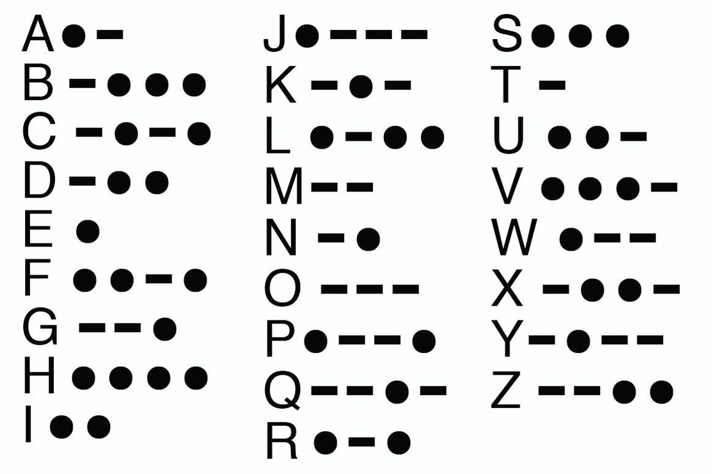

# Cryptography

**Cryptography** is the study and application of techniques to hide the meaning of information.

**Cryptanalysis** is the art of trying to decrypt an encrypted message without the knowledge of the key. 

**Cryptology** is the science of codes, it contains cryptography and cryptanalysis.


## Encoding

Encoding is not really part of cryptography, it is only a representation of information in a given format.  
It is a format conversion used to transmit a message efficiently.  
Its content is not secret, and anyone understanding the encoding logic can decode an encoded message.

### Morse Code

Morse code is the encoding of the alphabet in sequences of short and long signals (sound, light, ...).  
It was invented in 1833 by Samuel Morse for the first telegraphs when all we could transmit was electric pulses.  
A pause is added between letters, and a longer pause between words.

<p align="center">

</p>

The SOS distress signal `... --- ...` was chosen in Morse for its transmission simplicity.  
It was later associated with expressions like `Save Our Ship` or `Save Our Souls`. 

### ASCII (American Standard Code for Information Interexchange)

ASCII is an encoding method to represent each letter and number by a 7-bit number.  
Each letter or number actually uses a byte (8-bit) but one bit is not used.  
There are multiple supersets of ASCII making use of the 8th bit to encode more characters.

### Base64

Base64 is a binary to text encoding representing any sequence of bytes by an alphanumeric string.  
Unlike hexadecimal that represents each block of 4 bits by a character (0 to f), Base64 uses blocks of 6 bits.  
Each 6-bit block is represented by a given character, there are 64 possible 6-bit blocks, hence the encoding name.  
Some `0` bits are added at the end of the binary message if needed to fill the last 6-bit block.  
Some `=` characters are added at the end of the string if needed to have a multiple of 4 6-bit blocks.  

```commandline
Message         : AB
ASCII           : 01000001 01000010
Base-64 blocks  : 010000 010100 001000      // added 00 at the end for padding the last 6-bit block
Base-64 string  : QUI=                      // added a = at the end for a 4th 6-bit block
```

### Barcode

The barcode encoding is the encoding of a number by a sequence of white and black bars that can be scanned by optical readers.  
There are many norms for the barcode encoding, like the **UPC** (Universal Product Code) in the US and the **EAN**
(European Article Numbering) in Europe.  
Barcodes can be in 1D or in 2D, like **DataMatrix** or **QR Code** (Quick Response) created in Japan.  
The barcode encoding was first used in 1974 on a chewing-gum pack.

### Huffman's compression

Huffman's compression is a variable-size representation of characters using shorter length for most frequent characters.  
It allows using less than 8 bits for frequent characters (where ASCII uses 8 bits for each character).  
It is efficient when the frequency of characters is known in advance.  

To decide the binary representation of each character, we create a tree :
- create a leaf for each character with its weight (frequency indicator)
- create a node with the 2 lowest weight nodes, and assign it the sum of the weights
- repeat the previous step until we get no more nodes (so we create the root)
- each character is encoded by the path to its leaf in the tree from the root (0 for left, 1 for right)

```commandline
Weighted characters :  (A, 4)   (B, 3)  (C, 1)  (D, 2)
Binary tree :   
                         (10)
                        /    \
                      (6)    (A, 4)
                     /   \  
                   (3)   (B, 3)   
                  /   \   
             (C, 1)   (D, 2)
            
 Encoding :   (A, 1)  (B, 01)  (C, 000)  (D, 001)
```

## Encryption

The encryption of a message is the transformation of a message to hide its true meaning.  
It is the process of converting ordinary information (plaintext) into an unintelligible text (ciphertext).  
The conversion function is called a **cipher**.  
It can be decrypted using a key, which is a secret required to transform the ciphertext back into the plaintext.

The encryption can be **symmetric** (same key for encryption/decryption) or **asymmetric** (public/private key pair).  
Symmetric algorithms are fast, but they require the distribution of the secret key between all people involved in the communication.  
Asymmetric algorithms are 100/1000 times slower, but offer scalability, easy key distribution and non-repudiation.  
Most implementations are hybrid, using asymmetric encryption to securely transfer a private key that is then used for symmetric encryption.

There are 2 types of encryption algorithms :
- **stream cipher** : utilize a keystream generator to encrypt data bit by bit using a mathematical XOR function to create ciphertext.  
Very adapted to encrypt real-time communication data stream (audio or video)  
- **block cipher** : break the input into fixed length blocks of data and perform the encryption on each block


Asymmetric encryption provides **confidentiality** (by encrypting with the recipient's public key) and **non-repudiation**
(by encrypting with the sender's private key).  

In real life, we use a **digital signature**, which is a hash of the message encrypted with the sender's private key.  
This encrypted hash is added to the message, and the (message, hash) pair is encrypted with the recipient's public key.  
The recipient can decrypt it and check that the hash matches the hash calculated from the received message.  
This confirms that the message was not altered in transit, since only the sender could have encrypted the hash with his private key.

There are multiple possible modes for encryption :
- **ECB** (Electronic CodeBook) : only use the plaintext and the key for encryption, so 2 similar blocks in plaintext are encoded the same way
- **CBC** (Cipher Block Chaining) : perform a XOR of the plaintext with the previous encrypted ciphertext before encrypting
- **CTR** (Counter) : instead of encrypting the plaintext, encrypt a counter and XOR the result with 8-bit of the plaintext, then increment the counter
- **GCM** (Galois/Counter Mode) : combine CTR with the Galois authentication


### Scytale (404 BC)

The scytale is regarded as the oldest form of military cryptography device.  
It is a wooden stick of a given diameter used to wound a strip of parchment with a sequence of letters, to align
the letters and form the message.  
It is a transposition cipher (same letters in a different order) using the scytale diameter as a key.

### Caesar cipher / ROT-13

Simple cipher shifting the alphabet by K positions.  
K is the secret key required to encrypt/decrypt the message (ROT-13 is the Caesar cipher with K=13).  
It only has 25 possibilities so it is easy to bruteforce, and it is sensitive to frequency analysis.

### Trithemius cipher (1508)

The Trithemius cipher is an improvement of the Caesar cipher.  
Instead of shifting all letters of the message by K, it shifts each letter by its position in the message.  
The first letter is not shifted, the second is shifted by 1, the third by 2...  
It is a Caesar cipher with K = position of each letter in the message. 

```commandline
message   : HELLO
encrypted : HFNOS
```

### Vigenere cipher

Vigenere cipher is a generalization of the Trithemius cipher.  
Each letter of the message is shifted with a different K, but instead of using the position of the letter, we use a secret key.  
If the key is ACB, the first letter is shifted by 0, the second by 2, the third by 1, and then it loops...  
The Trithemius cipher is a Vigenere cipher with a key of ABCD...XYZ.

```commandline
message   : HELLO
key       : ABC
encrypted : HFNLP
```

### Autokey cipher

The Vigenere cipher is vulnerable to frequency analysis if a short key is repeated.  
To avoid this weakness, the Autokey cipher appends the plaintext to the key to not repeat the key.  

When we decrypt it, we use the key to decrypt the first letters, and we use the decrypted letters to decrypt the rest.

```commandline
message   : HELLO
key       : ABC
autokey   : ABCHE
encrypted : HFNSS
```

### Bacon cipher

The Bacon cipher is a type of **steganographic** message, hiding a secret message in a non-suspicious plain text.  
The secret message is hidden in the message's presentation instead of its content.  

Each letter of the secret is replaced by a group of 5 `a` or `b` characters (A = `aaaaa` to Z = `bbaab`).  
This gives a representation of the secret as a five times longer string of `a` and `b`.  
We use a **carrier** message to carry the secret, by using 2 styles for letters (upper/lower, italic, bold, font...).  
We use one style for letters in the carrier corresponding to positions of `a`, and the other style for positions of `b`.  

```commandline
message   : ABC
a/b       : aaaaa aaaab aaaba
carrier   : how are you today my friend ?
styles    : lower case (a) / upper case (b)
encrypted : how are you TodaY my friend ?
```

### ADFGVX cipher (1918)

The ADFGVX cipher was used by the Germans at the end of WW1 to secure the communication during the attack of Paris.  
It was cracked by the French army in June 1918.  

It is a 2-steps code, using a **substitution**, followed by a **transposition**.  

The substitution uses a 6x6 table with all letters and digits, with rows and columns indexed with A, D, F, G, V and X letters.  
These 6 letters were chosen because their Morse code is very different.  
The substitution step replaces each letter or digit in the original message by a 2 letters position in the 6x6 table.  
The positions of characters in the 6x6 table was changed daily.

The transposition step uses a secret key.  
The substitution result is written under the secret key (one column per letter in the key).  
The columns are then re-ordered alphabetically.  
The final encrypted message is the concatenation of successive columns.

```commandline
Substitution table :   
              | A | D | F | G | V | X |
          +---+---+---+---+---+---+---+
          | A | 8 | s | b | w | r | q |
          | D | p | 4 | c | g | 2 | 9 |
          | F | 3 | o | 5 | m | x | e |
          | G | d | a | z | j | f | y |
          | V | l | h | 7 | u | v | 0 |
          | X | n | 1 | k | 6 | i | t | 
          
Transposition Key : TONIGHT

Message : happy birthday

Substitution  : VD GD DA DA GX AF XV AV XX VD GA GD GX

Transposition :     T O N I G H T                         G H I N O T T
                    -------------          order          -------------
                    V D G D D A D         columns         D A D G D V D
                    A G X A F X V      alphabetically     F X A X G A V
                    A V X X V D G            =>           V D X X V A G
                    A G D G X                             X   G D G A 
 
 Encrypted : DF VX AX DD AX GG XX DD GV GV AA AD VG
```

### Enigma

Enigma is the encryption machine that was used by the Germans during WW2 to send encrypted messages.  
It looks like a typewriter, when a key is pressed on the keyboard, a light appears on the corresponding encrypted letter.  

The Enigma machine contains 3 rotors, each with 26 possible positions and letters in a fixed order.  
When a key is pressed, the rotor 1 encrypts it into an output letter that is passed to rotor 2, that also encrypts it
and passes it to rotor 3, that encrypts it as well and returns its result.  
After a letter is encrypted, rotor 1 will turn by 1 position.  
When rotor 1 did a full rotation, rotor 2 turns by one position.  
When rotor 2 did a full rotation, rotor 3 turns by one position.  
This mechanism protects against frequency analysis by representing occurrences of a given letter by different output letters.

The communication is possible between 2 people if they both have an Enigma machine and have it setup the same way
(order and initial position of the rotor).


### Hill cipher

Hill cipher was created in 1929 and was the first cipher based purely on mathematics.  
It operates on blocks of letters to reduce the efficiency of frequency analysis (still possible on blocks though).  
It uses a square matrix of size N as a key, where N is the block size.  
All letters of the message are mapped to an integer, for example from 0 to 25 in alphabetical order.  
The message is split into column vectors of size N, that are multiplied by the key matrix.  
The key matrix must have an inverse modulo 26 (if using a 26-letters alphabet) for decryption.  

```commandline
                  | 22  3 |
Key matrix :  M = |  9  6 |     detM = 22 * 6 - 3 * 9 = 105

For M to have a modular inverse modulo 26, its determinant must be non-zero modulo all prime divisors of 26 (2 and 13).   
detM = 1 [2] and detM = 1 [13] so M is inversible modulo 26.

                                      |  6  23 |
Its modular inverse modulo 26 is M' = | 17  22 | since MM' = M'M = I [26]

Message  : SECRET = 18 4 2 17 4 19

            | 18 |   |  2 |   |  4 |
            |  4 |   | 17 |   | 19 |
            
 | 22  3 |  | 18 |   | 17 |   | 15 |
 |  9  6 |  |  4 |   | 16 |   | 20 |   so encrypted = 18 4 17 16 15 20 = SERQPU
 
To decrypt :
            | 18 |   | 17 |   | 15 |
            |  4 |   | 16 |   | 20 |
            
 |  6 23 |  | 18 |   |  2 |   |  4 |
 | 17 22 |  |  4 |   | 17 |   | 19 |    so  message = 18 4 2 17 4 19 = SECRET  
```

### DES (Data Encryption Standard)

DES is a symmetric-key encryption algorithm developed at IBM in the early 1970s, and published in 1977.  
It breaks the input into 64-bit blocks, and uses transposition and substitution to create the ciphertext.  
It uses an effective key of 56 bits (8 bytes, with a parity control bit in each byte).  
It was used a lot until early 2000, but now the key is too short to resist modern computing power brute-force.  

**Triple DES** (or **3DES**) is an improvement of DES using 3 separate symmetric keys to encrypt/decrypt the plaintext.  
It increases the strength of DES, but makes it 3 times slower.  

### IDEA (International Data Encryption Algorithm)

IDEA is a symmetric block cipher using 64-bit blocks and a key size of 128 bits.  
It is faster and harder to break than DES, and is used in the Pretty Good Privacy Suite.  
It was one of the candidates to be the successor of DES, but lost to AES.

### AES (Advanced Encryption Algorithm)

AES is a symmetric block cipher using 128-bit, 192-bit or 256-bit blocks, and a matching encryption key size.  
It was chosen in 2001 as the successor of DES by the US government to encrypt most sensitive data.  

### Blowfish 

Blowfish is a symmetric block cipher using 64-bit blocks and a variable length encryption key (32 to 448-bit).  
It was developed as a successor to DES but was not widely used.


### Rivest ciphers

Rivest ciphers were developed by Ron Rivest, one of the creators of RSA.

**RC4** (Rivest Cipher 4) is a symmetric **stream** cipher developed in 1987.  
It uses a variable key size (40 to 2048-bit) and is used for encryption in SSL and WEP.  
RC4 is a generator of a pseudo-random stream of bytes, used with XOR on the message to encrypt/decrypt it.  
Since XOR is used with the stream of bytes, the encryption and decryption process is identical.  
RC4 has multiple vulnerabilities and is considered no longer secure.

**RC5** is a symmetric **block** cipher using a variable key size (40 to 2048-bit).  
**RC6** is a symmetric block cipher based on RC5, candidate for the replacement of DES but AES was chosen instead.

### RSA (Rivest - Shamir - Adleman)

RSA is an asymmetric public/private key algorithm, still in used a lot today.  
It is used to securely exchange a symmetric key and switch to a symmetric encryption.  
Its name is based on the initials of its 3 creators.  
It is used by RSA tokens that provide a one-time token for MFA.

RSA supports key sizes from 1024-bits to 4096-bits.  
It relies on the difficulty to factorize the product of 2 big prime numbers.

Some tools can break weak RSA keys, for example [RsaCtfTool](https://github.com/RsaCtfTool/RsaCtfTool).

#### RSA logic

We choose 2 prime numbers p and q, usually each with 300+ digits.  
We calculate `n = p * q`.  
We calculate `phi = n - p - q + 1`.  
We choose a number e that is relatively prime to phi.  
We choose a number d so that `e * d = 1 modulo phi`.  

The public key is `(n, e)` and the private key is `(n, d)`.  

Encryption of a number x :  `y = x^e modulo n`  
Decryption of a number y :  `x = y^d modulo n`

For example, if we choose p = 157 and q = 199, we have `n = p * q = 31243` and `phi = n - p - q + 1 = 30888`   
We can choose `e = 163` (relatively prime with 30888) and `d = 379` that verifies e * d = 1 modulo phi.  
The public key is `(31243, 163)` and the private key is `(31243, 379)`.  
To encrypt x = 13 : `y = 13^163 modulo 31243 = 16341`  
To decrypt y = 16341 : `x = 16341^379 modulo 31243 = 13`


### DH (Diffie - Hellman)

Diffie-Hellman is an asymmetric public/private key algorithm used to secure symmetric key exchange.  
It is used for the establishment of a VPN Tunnel when using the IPsec protocols suite.

DH is a bit different from RSA, as it does not require both parties to have a public and private key.  
Both parties choose a **private key** A and B, and they agree on some **common public variables**.  
Both parties infer their **public key** from their private key and the common public variables.  
When talking to each other, they send their public key.  
They both need to combine the received public key with their private key to obtain a **shared secret**.  
This shared secret can be used for symmetric encryption, as it was agreed without ever sharing it over the network.  

#### DH logic

Both parties agree on public variables (p, g) where p is a large prime number and g a generator smaller than p.  
Then each party chooses a secret integer key a and b.  
Then each party infers its public key from its private key and the common variables : `A = g^a mod p and B = g^b mod p`   
Both parties can exchange their public keys, and infer the same shared secret : `S = B^a mod p = A^b mod p`

For example, we can choose the common public variables (p, g) = (29, 3).  
The secret keys can be a = 13 and b = 15.  
The public keys are A = 3^13 mod 29 = 19 and B = 3^15 mod 29 = 26.  
These public keys are exchanged, and both parties can calculate the shared secret S = 26^13 mod 29 = 19^15 mod 29 = 10.


### ECC (Elliptic Curve Cryptography)

ECC is an asymmetric public/private key algorithm used a lot in mobile devices.  
It is based on the algebraic structure of elliptic curves over finite fields.  
ECC provides better security than an equivalent size RSA key (a 256-bit ECC key is as secure as a RSA 2048-bit key).  

### PGP (Pretty Good Privacy) and GPG (GNU Privacy Guard)

**PGP** is an encryption program used for signing, encrypting and decrypting emails.  
PGP uses the IDEA symmetric encryption algorithm for encryption and RSA for digital signature.  
Symmetric functions use key sizes of 128-bit or more, and asymmetric functions use key size of 512 to 2048 bits.

**GPG** (or GnuPG) is a fork of the PGP suite using AES for its encryption algorithm (instead of IDEA).  
It is more modern, open-source and cross-platform.  

```shell
gpg --full-gen-key                         # generate a private/public GPG key pair
gpg --import aaa.key                       # import a private key into GPG (required to encrypt/decrypt)
gpg --decrypt message.gpg                  # decrypt a message
```
A GPG private key can be protected with a passphrase.  
A GPG private key passphrase can be broken offline with `gpg2john` and John the Ripper.


## Hashing

Hashing is the representation of a message as a fixed-length sequence of bytes called a **hash** or a **digest**.  
The hash is a digital fingerprint of the initial message or file.  
Unlike encryption, it is a destructive operation, and the original message cannot be obtained from the hash.  

Hashing is used for password management, where the hash of the password is stored in DB instead of the password itself.  
Not storing the password makes it more difficult for hackers stealing the hashes in the DB to get the password.  
The service does not need to know the actual password, only if the password provided by the user is the same as the one registered.  
For this use, comparing the password hash is sufficient.

Hashing is also used to ensure authenticity of messages exchanged over a network.  
A hash of the message is calculated, encrypted with the sender's private key and added at the end of the message.  
This way, to check authenticity, the recipient can decrypt the hash, and confirm it matches the hash of the received message.

To increase the security of hashing algorithms even when the provided value is weak (like a common password), we can perform **key stretching**.  
It aims at making it harder to bruteforce the password, for example by waiting a short time.  
We can also use **salting** by adding a prefix to the password to avoid rainbow tables attacks.

### MD5 (Message Digest 5)

MD5 is a hashing function created in 1991 giving a 128-bit hash for a message.  
It is no longer secure, since a vulnerability was discovered in 1996 to create hash collisions easily.

We can get the MD5 hash of a file with the `md5sum` command.

### RIPEMD (RIPE Message Digest)

RIPEMD is a family of cryptographic hash functions (RIPEMD-128, RIPEMD-160, RIPEMD-256, RIPEMD-320).  
The most popular is **RIPEMD-160** generating a 160-bit hash output.  
It is less popular than MD5 and SHA, but is used for Bitcoin and other crypto-currencies. 

### SHA (Secure Hash Algorithm)

SHA is a suite of hashing functions replacing MD5 for hash calculation.  
- **SHA-0** was developed by the NSA in 1993 based on MD5, generating 160-bit hashes.
- **SHA-1** was developed by the NSA in 1995 to improve SHA-0, also generating 160-bit hashes.
- **SHA-2** was developed by the NSA in 2002 and includes multiple functions generating hashes of different size
(SHA-224, SHA-256, SHA-384, SHA-512).  
  There is no efficient attack so far on SHA-2, but some attacks reduce the number of attempts to brute-force.
- **SHA-3** was originally called Keccak and won a contest in 2015 for the next SHA hashing function.  
  It is very different from previous SHA functions, and can also generate hashes of size 224, 256, 384 and 512 bits. 

The SHA hashes of a file can be calculated with the `sha1sum`, `sha256sum` and `sha512sum` commands.

### DSS (Digital Signature Standard)

DSS is a standard for digital signatures that was developed by the NIST.  
It specifies how to create digital signatures to verify the authenticity and integrity of digital messages or documents.

DSS uses SHA-2 and SHA-3 digest functions.

DSS works in conjunction with one of these 3 encryption algorithms :
- DSA (Digital Signature Algorithm)
- ECDSA (Elliptic Curve DSA)
- RSA


## PKI (Public Key Infrastructure)

PKI is an entire system of hardware, software, policies, procedures and people based on the asymmetric encryption.  

A browser uses the PKI when connecting in SSL/TLS to any website using HTTPS.  
It requests to a CA (Certificate Authority) the public key of the target website.  
It then chooses a random secret key, encrypts it with the website's public key and sends it to the website.  
The website receives it, decrypts it with its private key, and now both the browser and the server know the secret key.  
From then, they can open a secure tunnel using SSL or TLS and continue their exchange with symmetric encryption.

### Certificate Authority

PKI requires an external trusted 3rd-party to provide the website public key.  
Certificate Authorities (CA) issue digital certificates.  
A digital certificate is a digitally signed document binding a public key with a user's identity (person or server).

Standard **X.509** is used for digital certificates in PKI.  
It contains the user's information and the certificate authority's information.

Digital certificates must be purchased at certificate authorities.  
By default, they include only one domain (like www.example.com) but we can buy a **wildcard certificate** to include all subdomains.  

We can also buy a **SAN** (Subject Alternative Name) that is a certificate covering multiple domains.

Digital certificates can be **single-sided** (only the server has a certificate) or **dual-sided** (both client and server need a certificate).

Certificates must be encoded under the **X.690** standard before they can be used, the common encodings are :
- **BER** (Basic Encoding Rule) : original ruleset for the encoding of data, allowing multiple encoding types
- **CER** (Canonical Encoding Rule) : restricted version of BER allowing a single encoding type
- **DER** (Distinguished Encoding Rule) : more restrictive than CER, used in practice for X.509 certificates
  - **PEM** (Privacy Enhanced Mail) is a Base64 encoded DER certificate to represent the binary as readable ASCII (can include the private key)
  - **PKCS #7** (Public Key Cryptography Standards #12) used to share the public key, never contains the private key (.p7b)  
  - **PKCS #12** (Public Key Cryptography Standards #12) is a binary file used to store private and public key (.pf2 or .p12)
    - PFX is the precursor of P12 (.pfx)

To obtain a certificate, we must first request it to a **RA** (Registration Authority) by sending a **CSR** (Certificate Signing Request).  
The RA will verify user information, and forward them to the **CA** (Certificate Authority) that generates the certificate.  
The CA maintains the **CRL** (Certificate Revocation List) of all certificates revoked because they got compromised.  
Clients can query the CRL using **OCSP** (Online Certificate Status Protocol).  
Some popular root CAs are **Verisign** and **Digisign**.  

A certificate is valid at most 13 months, then it expires and is no longer valid.  
To renew it, we need to send a new **CSR** to the CA, that will create a new certificate that needs to be deployed.  
Once a certificate is issued, its expiry is hardcoded and cannot be modified, so "renewal" is just creating a new one.

Instead of paying a CA to issue a certificate, we can create a **self-signed certificate** for our web server.  
Private CAs can be setup using **Windows Certificate Services** (Windows) or **OpenCA** (Linux).  
Browsers need to be updated to trust this private CA, otherwise they would show a popup saying it is an insecure website.

The **Web of Trust** is a decentralized trust model addressing the issues of public key authentication in a CA-based PKI system.  
An example of Web of Trust is PGP (Pretty Good Privacy) and its open-source implementation GPG (GNU PGP Guard).  

### Certificate Transparency (CT)

Certificate Transparency is an open framework developed by Google that provides a publicly auditable record of all issued digital certificates.  
All issued SSL/TLS certificates must be submitted to the CT logs, an append-only record of certificates.  
The CT logs can be monitored for any suspicious certificates on a given domain.  

CT logs help avoiding maliciously or mistakenly issued certificates to go unnoticed.  
A hacked or negligent CA can issue certificates for any websites and create a risk of MitM attack.  
CT logs simplify the detection of such malicious certificates.

CT logs can be used by attackers to identify some subdomains of their target.


## Quantum Cryptography

Quantum computers are starting to appear, and they have much higher computing power than modern computers.  
This will change the current cryptography, since algorithms that are unbreakable today could be brute-forced by quantum computers.  
Symmetric algorithms would resist pretty well, but asymmetric algorithms are more at risk (relying on factoring or discrete logarithm).

**Post-quantum cryptography** is the modification of modern cryptography to make it resistant to brute-force,
even with quantum computers.
