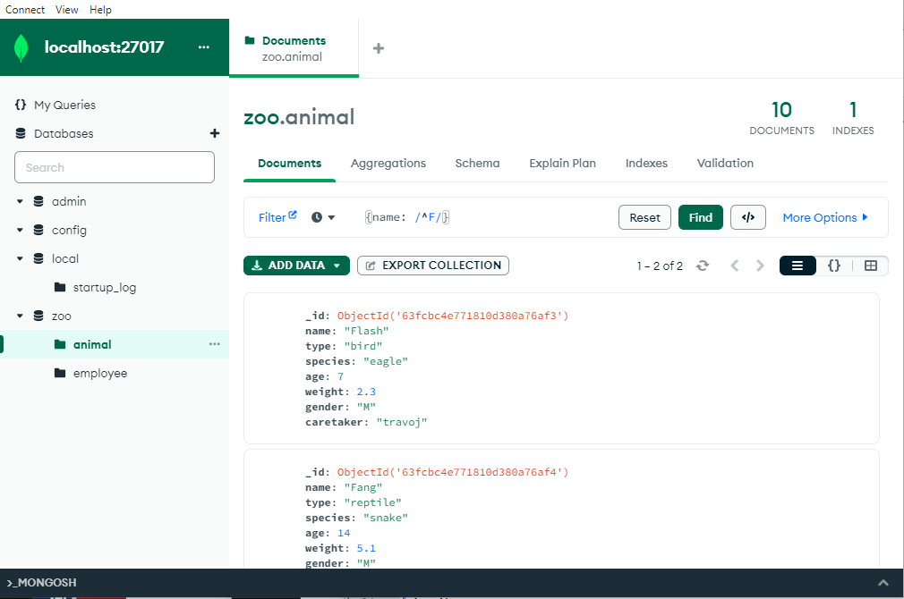

# MongoDB Tutorial


## MongoDB Overview

- MongoDB is a noSQL, open source, distributed DB system
- A mongoDB server can contain multiple mongoDB databases
- MongoDB databases contain collections (noSQL equivalent of tables)
- MongoDB collections contain documents (noSQL equivalent of rows)
- MongoDB documents are JSON objects 
- MongoDB supports nested documents
- Unlike relational DBs using joins to combine data, MongoDB stores all together in a document
- More flexible and performant than relational SQL databases
- Atlas : : MongoDB databases on the cloud
- Compass : MongoDB GUI
- Stitch : Serverless MongoDB query API and functions


## MongoDB Installation and setup

From the [MongoDB website](https://www.mongodb.com/), download the Community Server.  
It offers a MongoDB database binary for Windows, MacOS, Ubuntu, Debian...  
Detailed documentation on the installation for each OS is available under : Resources > Server

we must install 2 components :
- `mongod` : binary to start a MongoDB server  
- `mongosh` : shell client to execute commands on a MongoDB database  

#### Local MongoDB server on Windows

Install the community server using the MSI wizard.  
This lets us create MondoDB as a service, so it starts `mongod` automatically at machine startup.  
MongoDB appears in the services screen (Launcher > Services) and can be started / stopped with :

```commandline
net start MongoDB
net stop MongoDB
```

The default MongoDB installation folder is `C:\Program Files\MongoDB\Server\6.0`  
This folder contains a `bin` folder containing `mongod`, a `data` folder where the DB will be created and a `log` folder to store MongoDB application logs.

To start the MongoDB server, double-click on the `mongod.exe` binary.  

To start a shell client on the running MongoDB server, download the Mongo Shell from their website (zip folder).  
Extract the `mongosh.exe` binary to the above `bin` folder and double-click on it.

The Windows installer also lets us install the MongoDB Compass GUI to monitor MongoDB.

#### Local MongoDB server on MacOS

We can install MongoDB using homebrew :

```commandline
brew tap mongodb/brew
brew update
brew install mongodb-community@6.0
```

The MongoDB server can be started either manually with the `mongod` command, or as a homebrew service :

```commandline
brew services start mongodb-community@6.0
```

Then run a MongoDB shell client on the MongoDB server with the `mongosh` command.

#### MongoDB drivers

MongoDB offers drivers for most programming languages (Python, Node.js, Java, C++, ...).  
All available drivers are listed on the MongoDB website under : Resources > Drivers  

These driver allow programs to instantiate a MongoDB client to communicate with a running MongoDB server.  
They can perform the same actions as the `mongosh` shell client.


## MongoDB Commands

#### Databases and Collections

A MongoDB server contains multiple databases.  
Each database contains some collections.  
Databases and collections don't need to be explicitly created, they are created when they get used.

```commandline
show dbs                          Display all existing DBs
db                                Display the current DB
use zoo                           Use a DB (create it if not existing)
show collections                  Display all collections in the current DB
db.dropDatabase()                 Drop the current DB
db.animal.drop()                  Drop a collection in the current DB
db.stats()                        Display stats about the DB (# of collections and docus, size...)
db.createCollection('animal')     Create a collection in current DB
db.shutdownServer()               Shutdown the running MongoDB server
```

Collections are automatically created when used (for example when creating a document), but the `createCollection()` method lets us specify some options, for example giving it a validator to control the documents's structure.


#### Create documents

MongoDB documents must have a unique `_id` field.  
We can set it to a custom number or a string, as long as it is unique.   
When not provided, a default one of type `ObjectId` is generated automatically.

The `insertXxx()` methods take the data to insert, and an optional options parameter.

```commandline
db.animal.insertOne({name: 'Tom', age: 7})     Insert a document in a collection
                                               Create the collection if not existing
                                               Create a default _id field of type ObjectID
db.animal.insertMany([{a: 1}, {a: 2}])         Insert several documents in a collection

db.animal.insert({name: 'Jim'})               Deprecated - use insertOne() or insertMany() instead
```

MongoDB supports documents up to 16mb size, and up to 100 levels of nesting.  

```commandline
db.animal.insertOne({name: 'Tom', stats: {dex: 2, str: 3}})   Insert a document containing a nested document
```
`insertMany()` performs **ordered insertions**, that means that if one document fails to be inserted, the command will throw an error and not insert the next documents, but the documents before the failing one are inserted and not reverted.    
We can pass `{ordered: false}` in the 2nd parameter to insert all succeeding documents (even after the 1st failure).  
To rollback everything on failure, we can use MongoDB transactions.

MongoDB guarantees atomicity at document level : a document cannot be partially inserted.  
However there is no atomicity across documents by default, as montionned above with `insertMany()`.

#### Get documents

Documents from a collection are retrieved with the `find()` method.  
It takes an optional filter parameter, and an optional options parameter. 

````commandline
db.animal.find()                       Get all documents in a collection
db.animal.find().pretty()              Get all documents in a collection and display indented JSON
db.animal.find({name:'Tom'})           Get all documents in a collection matching a filter
db.animal.findOne({name:'Tom'})        Get the first document in a collection matching a filter
db.animal.find({"stats.str": 3})       Filter on a nested field (require the double quotes)
````

We can use more complex filters by using MongoDB built-in operators.

- comparison operators : `$lt`, `$lte`, `$gt`, `$gte`, `$ne`
- logical operators : `$and`, `$or`
- other operators : `$in`, `$exists`

```commandline
db.animal.find({age: {$lt: 13}})                    Find all documents with age < 13
db.animal.find({name:'Tom', age:12})                Find with multiple conditions (AND operator)
db.animal.find({$and:[{name:"Tom"}, {age:13}]})     AND operator (alternative syntax)
db.animal.find({$or:[{name:"Tom"}, {age:13}]})      OR operator
db.animal.find({name:{$in:["Tom", "Coco"]}})        IN operator
db.animal.find({name: /^Zu/})                       Find all documents with name starting with "Zu" (regex)
db.animal.find({weight:{$exists:1}})                Field existence
```

The `find()` method does not return an array of documents, but a `Cursor` on the matching documents.  
If there are many documents in the result, only the first part will be included in the result, and we can type the `it` shell command to get the next part.  
When using a driver, we also get a cursor when querying data from the DB to avoid long wait and heavy network traffic.

We can call the `forEach()` method on the cursor to exhaust it and apply a function on each element :

```commandline
db.animal.find().forEach(
    (document) => { print(document.name + " is " + document.age + " years old") }
)
```

The 2nd argument of the `find()` method lets us specify a projection, i.e. the list of fields to retrieve.  
Only requested fields are sent by the MongoDB server, to avoid unnecessary data sent over the network.  
The `_id` field is included in every projection by default, but it can be explicitly excluded.

```commandline
db.animal.find({}, {name: 1, type: 1})            Get the name, type and ID of every document in the collection
db.animal.find({}, {name: 1, type: 1, _id: 0})    Get the name and type of every document in the collection
```


#### Update documents

The `updateOne()` and `updateMany()` methods let us modify one or several columns of the documents.  
Those methods take a filter parameter, an update parameter and an optional options parameter.  
The update parameter must contain the `$set` operator and the key/value objects to set.  

The `replaceOne()` method let us overwrite an entire document.  
It takes a filter parameter, the new document to use and an optional options parameter.  

```commandline
db.animal.updateOne({'name':'Tim'},{$set:{age:4}})     Set age=4 for the first document with name Tim
db.animal.updateMany({'name':'Tim'},{$set:{age:4}})    Set age=4 for all documents with name Tim

db.animal.replaceOne({name:'Tom'},{name:'Tim'})        Replace a document with a new one

db.animal.update({'name':'Tim'},{$set:{age:4}})        Deprecated - use updateOne() or updateMany() instead
```

#### Delete documents

```commandline
db.animal.deleteOne({type: "Monkey"})   Delete at most one document matching a filter 
db.animal.deleteMany({type: "Monkey"})  Delete all documents matching a filter
db.animal.deleteMany({})                Delete all documents in the collection

db.animal.remove()                      Deprecated - use deleteOne() or deleteMany() instead
```


## MongoDB Schemas and Structure

MongoDB is schemaless and does not enforce any common structure between documents within a collection.  
However, we often want to enforce a common structure to all documents in a collection.  
For example, all animals in a collection should have a `name` and a `type`, and optionally an `age` and a `subtype` fields.

#### MongoDB data types

- String
- Boolean
- Numbers : NumberInt (int32), NumberLong (int64), NumberDecimal
- ObjectID (Mongo ID, guaranteed to be ordered)
- ISODate (date)
- Timestamp : unique number, used to generate the ObjectID, can be called with `new Timestamp()`
- Object (for nested documents)
- Array
- Null
- Binary Data
- Code (JS)

We can get the type of a field with the `typeof` operator :

```commandline
typeof db.animal.findOne().name                Get the type of the name property of the document
```

#### Relations between MongoDB documents

The ways to represent relations between MongoDB documents are :

- **Nested documents**  
  This makes sense when the nested object is tightly related to the parent object.  
  That is often a good approach for 1-to-1 or 1-to-N relations.  
  For example, an address could be represented as a nested document inside a person document. 


- **ID reference**  
  A different collection is used to store the other document, and its `_id` field is stored by the parent.  
  This is the best approach for N-to-N relations, as it avoid unnecessary duplication.  
  For example, favorite books could be stored as an ID array in a person documents.


- **Dedicated collection for the relation**  
  When the relation itself does represent something useful for the business, it can have its own collection.  
  This is useful for some N-to-N relations.  
  For example, if we have a `customers` collection and a `products` collection, we may want to store the orders in a dedicated `orders` collection referencing both a customer and a product by their `_id` field.  

#### Aggregate

When data are split across multiple collections, we can use the `aggregate()` method when we query the data to enrich the documents with the data from the referenced collection (equivalent to JOIN in SQL) :

```commandline
db.animal.aggregate([{
    $lookup: {                                Lookup operator to join collections
        from: "employee",                     Name of the other collection to join
        localField: "caretaker",              Name of the reference field in the current collection
        foreignField: "_id",                  Name of the reference field in the joined collection
        as: "caretakerInfo"                   Nmae of the field to store the result into
    }
}])
```

#### Schema Validation

We can create a schema validation for a given collection.  
This validation specify a validation level (`strict` for all insert/update, `moderate` for insert and valid document update).  
It also specifies a validation action (`error` to prevent the insert/update, `warn` to log a warning message).

For example, we can create an `employee` collection with a custom JSON schema.  
That schema forces to have a `name` and a `job` field of type string.

```commandline
db.createCollection("employee", {
  validator: {
    $jsonSchema: {
      bsonType: "object",
      required: ["name", "job"],
      properties: {
        name: { bsonType: "string", description: "employee's full name" },
        job: { bsonType: "string", description: "employee's official job title" },
      }
    }
  }
})
```

When trying to insert a document missing the `job` field for example, a `MongoServerError` is thrown and the document is not inserted.

We can update the collection's configuration once it is already created with the `runCommand()` method.  
We can for example change the validation action to `warn` (it is `error` by default).  
In that case, invalid insert/update operations are accepted, but they are logged in the MongoDB log file.

```commandline
db.runCommand({
  collMod: "employee",
  validator: {
    $jsonSchema: {
      bsonType: "object",
      required: ["name", "job"],
      properties: {
        name: { bsonType: "string", description: "employee's full name" },
        job: { bsonType: "string", description: "employee's official job title" },
      }
    }
  },
  validationAction: "warn"
})
```

## MongoDB Compass GUI

The MongoDB Compass GUI lets us visualize the data in the DB, and interact with it graphically.  
We can have multiple connections in Compass, it will open one window per connection.  
By default, it connects to `localhost` on port `27017`, the default configuration of the MongoDB server.  

Most actions that can be performed in the MongoDB shell can also be performed in Compass, for example :

- create / delete a database
- create / delete a collection
- create schema, validations, aggregations, indexes for a collection
- Run a query in a collection
- insert documents in a collection (manual or file import)
- edit or delete existing documents




## MongoDB Command-line Database Tools

From MongoDB website, we can install MongoDB Command-line tools.  
On Windows for example, we can downmload the ZIP and copy all binaries to the main MongoDB bin folder.

#### mongoimport

This is a binary to import data from a JSON file into a collection of a MongoDB database.  
It will create the database and/or the collection if needed.

```commandline
$>  mongoimport.exe ./food.json -d zoo -c food --jsonArray --drop

2023-02-28T23:16:46.848+0900    connected to: mongodb://localhost/
2023-02-28T23:16:46.850+0900    dropping: zoo.food
2023-02-28T23:16:46.866+0900    3 document(s) imported successfully. 0 document(s) failed to import.
```
- `--jsonArray` : insert multiple values as an array
- `--drop` : drop the current content of the collection if any
